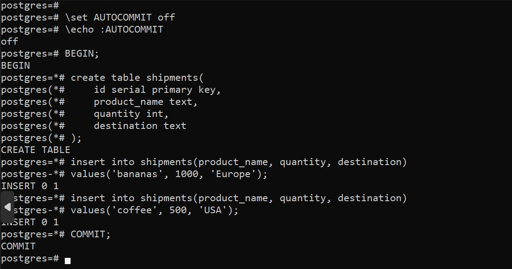
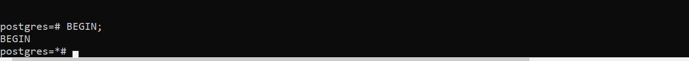
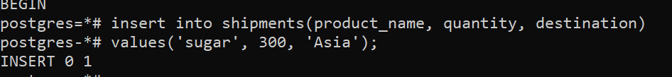
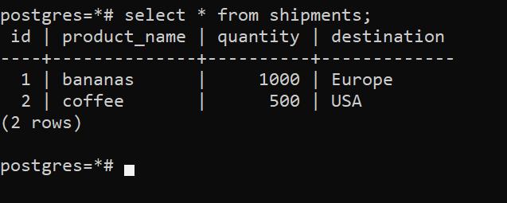
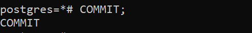
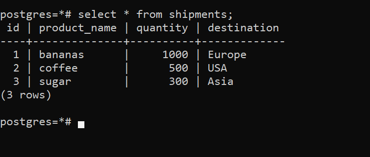
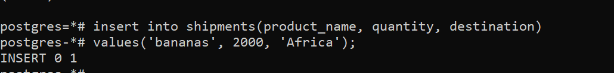
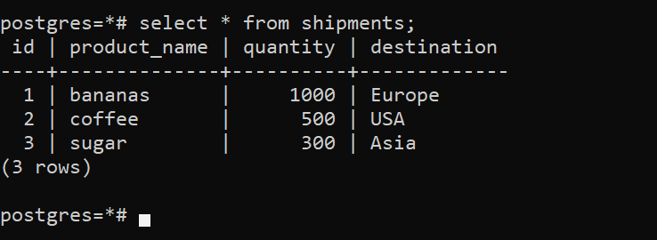
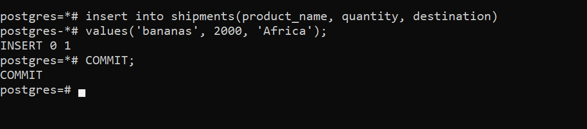
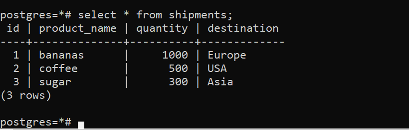

# Домашнее задание N1: Работа с уровнями изоляции транзакций в PostgreSQL

## Информация о проекте
- **Название ВМ:** bananaflow-30081986
- **Дата выполнения:** 2026-05-04
- **Версия PostgreSQL:** 17

---

## 1. Установка PostgreSQL

```bash
dnf install postgresql18 postgresql-17-contrib
postgresql-17-setup initdb
systemctl enable postgresql-17.service --now
systemctl status postgresql-17.service
```

## 2. Подключение к postgresql
```bash
sudo -i -u postgres psql
```

## 3. Работа с транзакциями: создание таблицы shipments
##### Действия в первой сессии
```sql
\set AUTOCOMMIT off
\echo :AUTOCOMMIT
BEGIN;

create table shipments(
    id serial primary key, 
    product_name text, 
    quantity int, 
    destination text
);

insert into shipments(product_name, quantity, destination) 
values('bananas', 1000, 'Europe');

insert into shipments(product_name, quantity, destination) 
values('coffee', 500, 'USA');

COMMIT;
```

###### Пояснения
```sql
\set AUTOCOMMIT off   -- отключаем автоматическую фиксацию транзакции
BEGIN;                -- начало транзакции
COMMIT;               -- фиксация изменений
```

## 4. Эксперимент с уровнем изоляции READ COMMITTED
##### 4.1 Проверка текущего уровня изоляции (в обеих сессиях)
```sql
show transaction isolation level;
```
##### 4.2 Начало транзакций в обеих сессиях
```sql
BEGIN;
```


##### 4.3 В первой сессии добавляем новую запись
```sql
insert into shipments(product_name, quantity, destination) 
values('sugar', 300, 'Asia');
```


###### Команда COMMIT не выполнялась.

##### 4.4 Во второй сессии читаем все записи
```sql
select * from shipments;
```


###### Результат:
Новая запись о сахаре не видна. Видны только bananas и coffee.
Уровень READ COMMITTED защищает от "грязного чтения" он показывает только те данные, которые были зафиксированы на момент выполнения команды SELECT. Поскольку первая транзакция ещё не завершена (COMMIT не было), её изменения считаются "грязными" и не показываются.

##### 4.5 Фиксируем первую транзакцию
```sql
-- В первой сессии
COMMIT;
```


##### 4.6 Повторно читаем во второй сессии
```sql
select * from shipments;
```


###### Результат:
Теперь запись о сахаре видна.
######
После COMMIT изменения стали постоянными. Когда во второй сессии выполнился SELECT, он создал новый "снимок" данных, который включил все закоммиченные изменения, включая поставку сахара в Азию.

##### 4.6 Вывод для READ COMMITTED
Уровень по умолчанию хорошо защищает от грязного чтения, но допускает неповторяемое чтение: если в рамках одной транзакции выполнить SELECT дважды, можно получить разные результаты, если между этими запросами другая транзакция успеет закоммитить изменения.

## Шаг 5. Эксперимент с уровнем изоляции REPEATABLE READ
##### 5.1 Начало новых транзакций с уровнем repeatable read (в обеих сессиях)
```sql
BEGIN;
SET TRANSACTION ISOLATION LEVEL REPEATABLE READ;
```

##### 5.1 В первой сессии добавляем новую запись
```sql
insert into shipments(product_name, quantity, destination) 
values('bananas', 2000, 'Africa');
```


###### COMMIT пока не выполняем.

##### 5.2 Во второй сессии читаем все записи
```sql
select * from shipments;
```


###### Результат:
Новая запись (бананы в Африку) не видна.
###### Почему?
Уровень REPEATABLE READ создаёт "снимок" данных в момент начала транзакции (точнее, при выполнении первой команды в транзакции). Вторая сессия видит данные так, как они выглядели до начала её транзакции. Пока транзакция не завершится, снимок не меняется.

##### 5.4 Фиксируем первую транзакцию
```sql
COMMIT;
```


##### 5.3 Повторно читаем во второй сессии (без завершения её транзакции)
```sql
select * from shipments;
```


###### Результат:
Запись по-прежнему не видна.
###### Почему?
Вторая транзакция всё ещё использует свой старый "снимок". Изменение из первой транзакции уже закоммичено, но для второй транзакции его не существует, потому что она продолжает работать с данными на момент своего начала. Это и есть "повторяемое чтение"  повторный SELECT показывает те же данные, что и первый.

##### 5.4 Завершаем вторую транзакцию и читаем снова
```sql
-- Во второй сессии
COMMIT;   -- или ROLLBACK, транзакция завершается

-- Теперь начинаем новую транзакцию (или работаем без неё)
BEGIN;
select * from shipments;
```


###### Результат
Теперь запись о бананах в Африку видна.
###### Почему?
Старая транзакция завершилась, её "снимок" уничтожен. Новая транзакция создаёт свежий "снимок", который уже включает все изменения, закоммиченные к моменту её начала.

##### 5.5 Вывод для REPEATABLE READ
Этот уровень гарантирует, что в рамках одной транзакции все SELECT видят одни и те же данные. Он предотвращает как грязное чтение, так и неповторяемое чтение. Однако если две транзакции попытаются изменить одни и те же данные, PostgreSQL может выдать ошибку сериализации, и одну из транзакций придётся перезапустить.

## Сравнение уровней изоляции

| Уровень изоляции | Грязное чтение | Неповторяемое чтение | Когда использовать |
|-----------------|----------------|---------------------|-------------------|
| READ COMMITTED | Защищён | Возможно | Повседневные операции, где важна скорость и актуальность |
| REPEATABLE READ | Защищён | Защищён | Аналитические отчёты, финансы, где важна согласованность данных в рамках одной операции |
