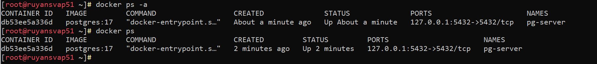
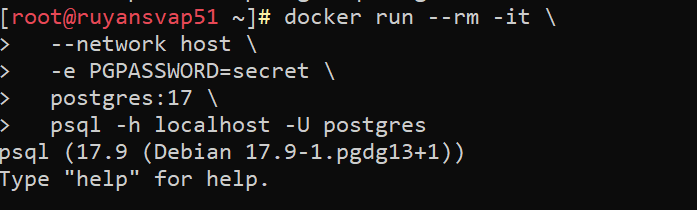
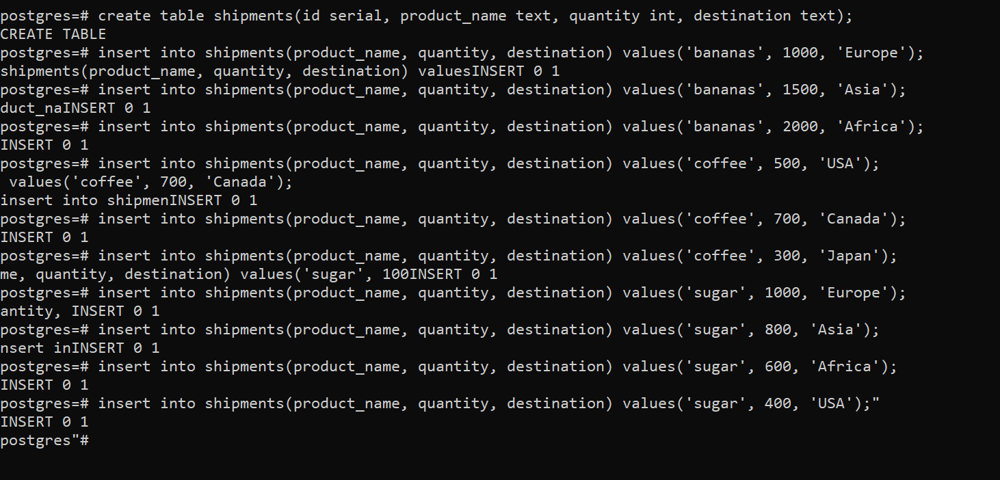
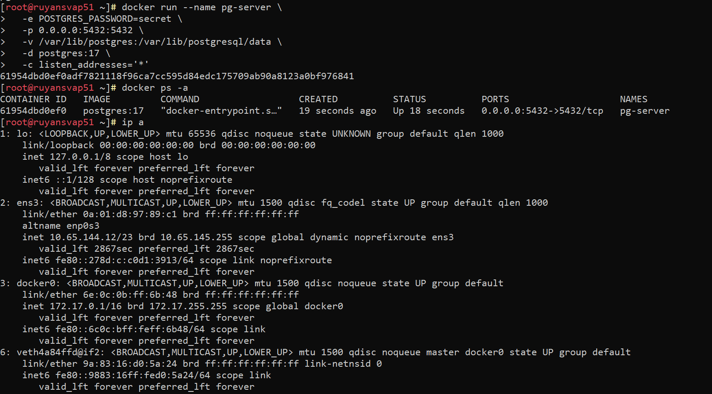
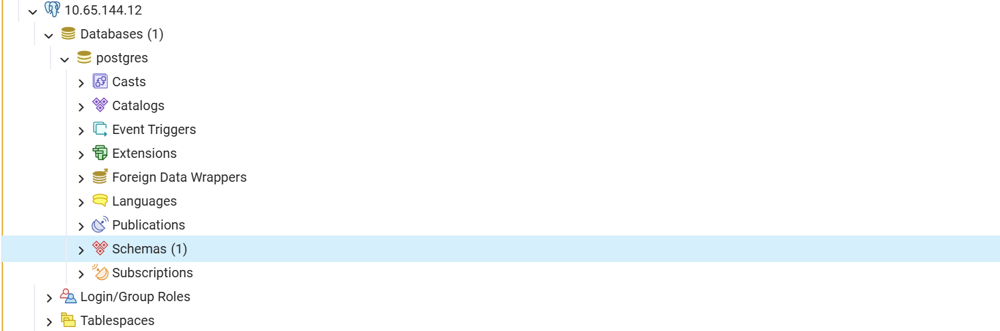
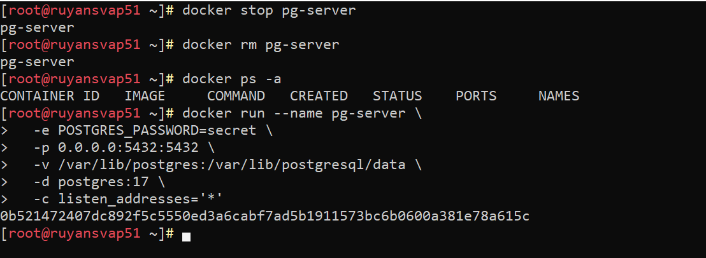
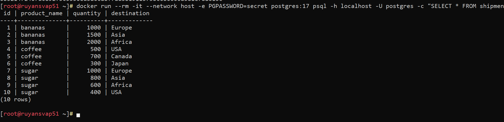

# Домашнее задание N2: Установка и настройка PostgteSQL в контейнере Docker.md

## Информация о проекте
- **Название ВМ:** bananaflow-30081986
- **Дата выполнения:** 2026-05-07
- **Версия PostgreSQL:** 17

## 1. Подключаемся к серверу и устанавливаем Docker
```bash
sudo -i
dnf install docker-ce docker-ce-cli -y
systemctl enable docker --now
systemctl status docker
docker info
```

## 2. Подготовка каталога для данных и запуск сервера

#### 2.1 Создаем каталог на ВМ
```bash
mkdir -p /var/lib/postgres
```

#### 2.2 Запускаем контейнер с PostgreSQL
```bash
docker run --name pg-server \
  -e POSTGRES_PASSWORD=secret \
  -p 127.0.0.1:5432:5432 \
  -v /var/lib/postgres:/var/lib/postgresql/data \
  -d postgres:17
```
### Описание
`--name pg-server` --> имя контейнера
`-e POSTGRES_PASSWORD=secret` --> пароль для пользователя postgres
`-p 127.0.0.1:5432:5432` --> пробрас порта из контейнера в хост (чтобы подключиться снаружи)
`-v /var/lib/postgres:/var/lib/postgresql/data` --> монтируем наш каталог в контейнер (здесь будет находиться БД)
`-d postgres:17` --> запускаем в фоне версию 17

#### 2.3 Смотрим, что контейнер запустился
```bash
docker ps -a
```


## 3. Создание и наполнение таблицы (через клиент)

#### 3.1 Выполняем SQL скрипт через временный контейнер
```bash
docker run --rm -it \
  --network host \
  -e PGPASSWORD=secret \
  postgres:17 \
  psql -h localhost -U postgres
```
### Описание  
флаг `--network host`: Этот флаг заставляет контейнер-клиент использовать сеть сервера напрямую. Это самый простой способ для временного клиента обратиться к серверу через localhost



```sql
create table shipments(id serial, product_name text, quantity int, destination text);

insert into shipments(product_name, quantity, destination) values('bananas', 1000, 'Europe');
insert into shipments(product_name, quantity, destination) values('bananas', 1500, 'Asia');
insert into shipments(product_name, quantity, destination) values('bananas', 2000, 'Africa');
insert into shipments(product_name, quantity, destination) values('coffee', 500, 'USA');
insert into shipments(product_name, quantity, destination) values('coffee', 700, 'Canada');
insert into shipments(product_name, quantity, destination) values('coffee', 300, 'Japan');
insert into shipments(product_name, quantity, destination) values('sugar', 1000, 'Europe');
insert into shipments(product_name, quantity, destination) values('sugar', 800, 'Asia');
insert into shipments(product_name, quantity, destination) values('sugar', 600, 'Africa');
insert into shipments(product_name, quantity, destination) values('sugar', 400, 'USA');"
```



## 4. Подключение с ноутбука

#### 4.1 Изменяем конфигурацию в контейнере
Нужно попросить PostgreSQL слушать не только localhost, а все интерфейсы. Для этого нужно добавить параметр -c listen_addresses='*' при запуске

#### 4.2 даляем старый контейнер и создаем новый данные должны сохраниться
```bash
# Останавливаем и удаляем старый контейнер

docker stop pg-server
docker rm pg-server

# Запускаем новый контейнер с разрешением слушать все интерфейсы
docker run --name pg-server \
  -e POSTGRES_PASSWORD=secret \
  -p 0.0.0.0:5432:5432 \
  -v /var/lib/postgres:/var/lib/postgresql/data \
  -d postgres:17 \
  -c listen_addresses='*'
```


#### 4.3 Подключаемся с ноутбука



## 5. Проверка сохранности данных

#### 5.1 Останавливаем и удаляем контейнер-сервер
```bash
docker stop pg-server
docker rm pg-server
```

#### 5.2 Создаем контейнер заново
```bash
docker run --name pg-server \
  -e POSTGRES_PASSWORD=secret \
  -p 0.0.0.0:5432:5432 \
  -v /var/lib/postgres:/var/lib/postgresql/data \
  -d postgres:17 \
  -c listen_addresses='*'
```



#### 5.3 Проверяем данные
```bash
docker run --rm -it --network host -e PGPASSWORD=secret postgres:17 psql -h localhost -U postgres -c "SELECT * FROM shipments;"
```



### Проблемы с которыми столкнулся

- **`permission denied` при запуске Docker**  
  → Нужно было добавить пользователя в группу `docker`: ` usermod -aG docker $USER`

- **Не мог подключиться с ноутбука**  
  → Нужно было открыть порт на fw чтоб  `listen_addresses='*'` и порт `5432` были открыты


