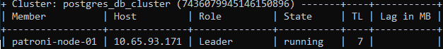
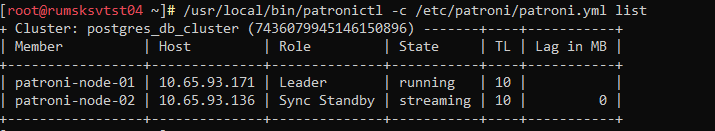
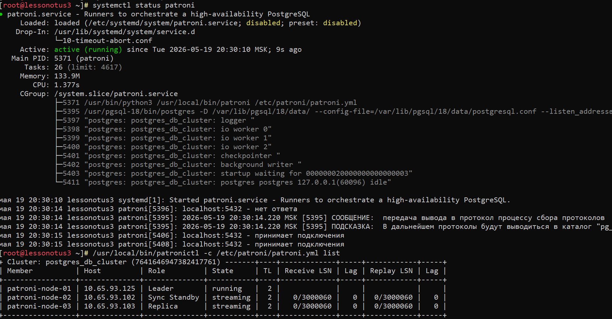
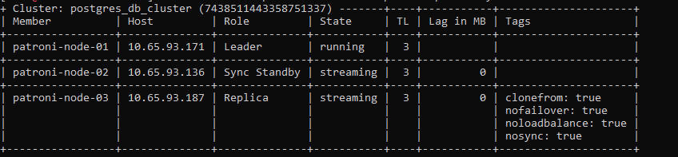
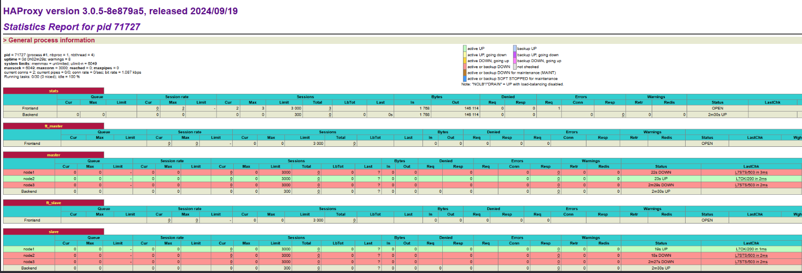

# Домашнее задание N4: Высокая доступность развертывание Patroni

## Информация о проекте
- **Название ВМ:** bananaflow-30081986
- **Дата выполнения:** 2026-05-19
- **Версия PostgreSQL:** 18

### Установка и настройка etcd на сервере (etcd)

* Устанавливаем etcd:

```
dnf install etcd
```

* Настраиваем конфигурацию etcd:

```
nano /etc/etcd/etcd.conf
```

* Изменяем конфигурацию следующим образом

```
# [member]
ETCD_NAME=etcd-03
ETCD_DATA_DIR="/var/lib/etcd/default.etcd"
#ETCD_WAL_DIR=""
#ETCD_SNAPSHOT_COUNT="10000"
ETCD_HEARTBEAT_INTERVAL="1000"
ETCD_ELECTION_TIMEOUT="5000"
ETCD_LISTEN_PEER_URLS="http://0.0.0.0:2380"
ETCD_LISTEN_CLIENT_URLS="http://0.0.0.0:2379"
#ETCD_MAX_SNAPSHOTS="5"
#ETCD_MAX_WALS="5"
#ETCD_CORS=""
#
#[cluster]
ETCD_INITIAL_ADVERTISE_PEER_URLS="http://10.65.93.187:2380"
# if you use different ETCD_NAME (e.g. test), set ETCD_INITIAL_CLUSTER value for this name, i.e. "test=http://..."
ETCD_INITIAL_CLUSTER="etcd-03=http://10.65.93.187:2380"
ETCD_INITIAL_CLUSTER_STATE="new"
ETCD_INITIAL_CLUSTER_TOKEN="etcd-cluster"
ETCD_ADVERTISE_CLIENT_URLS="http://10.65.93.187:2379"
#ETCD_ENABLE_V2="true"
#ETCD_DISCOVERY=""
#ETCD_DISCOVERY_SRV=""
#ETCD_DISCOVERY_FALLBACK="proxy"
#ETCD_DISCOVERY_PROXY=""
#ETCD_STRICT_RECONFIG_CHECK="false"
#ETCD_AUTO_COMPACTION_RETENTION="0"
#
#[proxy]
#ETCD_PROXY="off"
#ETCD_PROXY_FAILURE_WAIT="5000"
#ETCD_PROXY_REFRESH_INTERVAL="30000"
#ETCD_PROXY_DIAL_TIMEOUT="1000"
#ETCD_PROXY_WRITE_TIMEOUT="5000"
#ETCD_PROXY_READ_TIMEOUT="0"
#
#[security]
#ETCD_CERT_FILE=""
#ETCD_KEY_FILE=""
#ETCD_CLIENT_CERT_AUTH="false"
#ETCD_TRUSTED_CA_FILE=""
#ETCD_AUTO_TLS="false"
#ETCD_PEER_CERT_FILE=""
#ETCD_PEER_KEY_FILE=""
#ETCD_PEER_CLIENT_CERT_AUTH="false"
#ETCD_PEER_TRUSTED_CA_FILE=""
#ETCD_PEER_AUTO_TLS="false"
#
#[logging]
#ETCD_DEBUG="false"
# examples for -log-package-levels etcdserver=WARNING,security=DEBUG
#ETCD_LOG_PACKAGE_LEVELS=""
```

* Запускаем службу etcd:

```
systemctl start etcd.service
```

### Установка PostgreSQL (на node1)

* Устанавливаем PostgreSQL и модули:

```
dnf install postgresql8 postgresql18-contrib
```

#### *Внимание!!! После установки Postgresql не нужно запускать и инициализировать БД, также нужно отключить автозапуск службы:*

```
systemctl disable postgresql-18.service
```

### Установка Python (node1)

* Устанавливаем Python с необходимыми зависимостями:

```
dnf install python3-pip python3-devel libpq-devel gcc
```

* Обновляем pip:

```
pip3 install --upgrade pip
```

### Установка Patroni (node1)

* Установка Patroni и библиотек

```
/usr/local/bin/pip install patroni
/usr/local/bin/pip install python-etcd
/usr/local/bin/pip install psycopg2
```

### Настройка Patroni (node1)

* Создаем каталог для конфигурации Patroni и файл patroni.yml:

```
mkdir /etc/patroni/
nano /etc/patroni/patroni.yml
```

* Вставляем следующую конфигурацию (ip address будет у вас свой), Конфигурация patroni.yml может отличаться в зависимости от настроек postgres.

```
scope: postgres_db_cluster
namespace: /db/
name: patroni-node-01

log:
  level: WARNING
  format: '%(asctime)s %(levelname)s: %(message)s'
  dateformat: ''
  max_queue_size: 1000
  dir: /var/log/patroni
  file_num: 4
  file_size: 25000000
  loggers:
    postgres.postmaster: WARNING
    urllib3: DEBUG

restapi:
  listen: 0.0.0.0:8008
  connect_address: 10.65.93.171:8008

etcd3:
  hosts:
#  - 10.65.93.171:2379
#  - 10.65.93.136:2379
  - 10.65.93.187:2379

bootstrap:
  dcs:
    ttl: 30
    loop_wait: 10
    retry_timeout: 10
    maximum_lag_on_failover: 0
    synchronous_mode: true
    synchronous_mode_strict: false
    postgresql:
#      recovery_conf:
#        restore_command: /usr/local/bin/restore_wal.sh %p %f
#        recovery_target_time: '2021-06-11 13:20:00'
#        recovery_target_action: promote
      use_pg_rewind: true
      use_slots: true
      parameters:
        max_connections: 200
        shared_buffers: 2GB
        effective_cache_size: 6GB
        maintenance_work_mem: 512MB
        checkpoint_completion_target: 0.7
        wal_buffers: 16MB
        default_statistics_target: 100
        random_page_cost: 1.1
        effective_io_concurrency: 200
        work_mem: 2621kB
        min_wal_size: 1GB
        max_wal_size: 4GB
        max_worker_processes: 40
        max_parallel_workers_per_gather: 4
        max_parallel_workers: 40
        max_parallel_maintenance_workers: 4

        max_locks_per_transaction: 64
        max_prepared_transactions: 0
        wal_level: replica
        wal_log_hints: on
        track_commit_timestamp: off
        max_wal_senders: 10
        max_replication_slots: 10
        wal_keep_segments: 8
        logging_collector: on
        log_destination: csvlog
        log_directory: pg_log
        log_min_messages: warning
        log_min_error_statement: error
        log_min_duration_statement: 1000
        log_duration: off
        log_statement: all
        log_timezone: 'Europe/Moscow'
        lc_messages: 'ru_RU.UTF-8'
        lc_monetary: 'ru_RU.UTF-8'
        lc_numeric: 'ru_RU.UTF-8'
        lc_time: 'ru_RU.UTF-8'
        bgwriter_delay: 20ms
        bgwriter_lru_maxpages: 400
        bgwriter_lru_multiplier: 4.0
        commit_delay: 1000
        commit_siblings: 5
        temp_tablespaces: temptable


  initdb:
  - auth-host: md5
  - auth-local: peer
  - encoding: UTF8
  - data-checksums
  - locale: ru_RU.UTF8
  pg_hba:
  - host all postgres all md5
  - host replication replication all md5
users:
    postgres:
      password: 1qaz!QAZ
      options:
        - createrole
        - createdb
    repl:
      password: 1qaz!QAZ
      options:
        - replication

postgresql:
  listen: 0.0.0.0:5432
  connect_address: 10.65.93.171:5432
  data_dir: /var/lib/pgsql/18/data/
  bin_dir: /usr/pgsql-18/bin/
  config_dir: /var/lib/pgsql/18/data/
  pgpass: /var/lib/pgsql/18/.pgpass
  pg_hba:
    - host all all 0.0.0.0/0 md5
    - host replication replication 127.0.0.1/32 md5
    - host replication replication 10.65.0.0/16 md5
  authentication:
    replication:
      username: replication
      password: 1qaz!QAZ
    superuser:
      username: postgres
      password: 1qaz!QAZ
  parameters:
    #archive_mode: on
    #archive_command: /usr/local/bin/copy_wal.sh %p %f
    #archive_timeout: 600
    unix_socket_directories: '/var/run/postgresql'
    port: 5432

tags:
    nofailover: false
    noloadbalance: false
    clonefrom: false
    nosync: false

```

* Создаем каталог для логирования patroni

```
mkdir /var/log/patroni
```

* Назначаем права на каталог

```
chown -R postgres: /var/log/patroni
```

### Создаем сервис patroni (node1)

* Создаем файл сервиса systemd для Patroni:

```
nano /etc/systemd/system/patroni.service
```

* Добавьте следующую запись:

```
[Unit]
Description=Runners to orchestrate a high-availability PostgreSQL
After=syslog.target network.target

[Service]
Type=simple
User=postgres
Group=postgres
ExecStart=/usr/local/bin/patroni /etc/patroni/patroni.yml
KillMode=process
TimeoutSec=30
Restart=no

[Install]
WantedBy=multi-user.target

```

* Перезагружаем демона systemd:

```
systemctl daemon-reload
```

* Запускаем Patroni:

```
systemctl start patroni
```

* Проверяем состояние кластера

```
/usr/local/bin/patronictl -c /etc/patroni/patroni.yml list
```

* Должно быть примерно как на картинке:



### Установка PostgreSQL (на node2)

* Устанавливаем PostgreSQL и модули:

```
dnf install postgresql8 postgresql18-contrib
```

#### *Внимание!!! После установки Postgresql не нужно запускать и инициализировать БД, также нужно отключить автозапуск службы:*

```
systemctl disable postgresql-18.service
```

### Установка Python (node2)

* Устанавливаем Python с необходимыми зависимостями:

```
dnf install python3-pip python3-devel libpq-devel gcc
```

* Обновляем pip:

```
pip3 install --upgrade pip
```

### Установка Patroni (node2)

* Установка Patroni и библиотек:

```
/usr/local/bin/pip install patroni
/usr/local/bin/pip install python-etcd
/usr/local/bin/pip install psycopg2
```

### Настройка Patroni (node2)

* Создаем каталог для конфигурации Patroni и файл patroni.yml:

```
mkdir /etc/patroni/
nano /etc/patroni/patroni.yml
```

* Вставляем следующую конфигурацию, Конфигурация patroni.yml может отличаться в зависимости от настроек postgres.

```
scope: postgres_db_cluster
namespace: /db/
name: patroni-node-02

log:
  level: WARNING
  format: '%(asctime)s %(levelname)s: %(message)s'
  dateformat: ''
  max_queue_size: 1000
  dir: /var/log/patroni
  file_num: 4
  file_size: 25000000
  loggers:
    postgres.postmaster: WARNING
    urllib3: DEBUG

restapi:
  listen: 0.0.0.0:8008
  connect_address: 10.65.93.136:8008

etcd3:
  hosts:
#  - 10.65.93.171:2379
#  - 10.65.93.136:2379
  - 10.65.93.187:2379

bootstrap:
  dcs:
    ttl: 30
    loop_wait: 10
    retry_timeout: 10
    maximum_lag_on_failover: 0
    synchronous_mode: true
    synchronous_mode_strict: false
    postgresql:
#      recovery_conf:
#        restore_command: /usr/local/bin/restore_wal.sh %p %f
#        recovery_target_time: '2026-05-19 13:20:00'
#        recovery_target_action: promote
      use_pg_rewind: true
      use_slots: true
      parameters:
        max_connections: 200
        shared_buffers: 2GB
        effective_cache_size: 6GB
        maintenance_work_mem: 512MB
        checkpoint_completion_target: 0.7
        wal_buffers: 16MB
        default_statistics_target: 100
        random_page_cost: 1.1
        effective_io_concurrency: 200
        work_mem: 2621kB
        min_wal_size: 1GB
        max_wal_size: 4GB
        max_worker_processes: 40
        max_parallel_workers_per_gather: 4
        max_parallel_workers: 40
        max_parallel_maintenance_workers: 4

        max_locks_per_transaction: 64
        max_prepared_transactions: 0
        wal_level: replica
        wal_log_hints: on
        track_commit_timestamp: off
        max_wal_senders: 10
        max_replication_slots: 10
        wal_keep_segments: 8
        logging_collector: on
        log_destination: csvlog
        log_directory: pg_log
        log_min_messages: warning
        log_min_error_statement: error
        log_min_duration_statement: 1000
        log_duration: off
        log_statement: all
        log_timezone: 'Europe/Moscow'
        lc_messages: 'ru_RU.UTF-8'
        lc_monetary: 'ru_RU.UTF-8'
        lc_numeric: 'ru_RU.UTF-8'
        lc_time: 'ru_RU.UTF-8'
        bgwriter_delay: 20ms
        bgwriter_lru_maxpages: 400
        bgwriter_lru_multiplier: 4.0
        commit_delay: 1000
        commit_siblings: 5
        temp_tablespaces: temptable


  initdb:
  - auth-host: md5
  - auth-local: peer
  - encoding: UTF8
  - data-checksums
  - locale: ru_RU.UTF8
  pg_hba:
  - host all postgres all md5
  - host replication replication all md5
users:
    postgres:
      password: 1qaz!QAZ
      options:
        - createrole
        - createdb
    repl:
      password: 1qaz!QAZ
      options:
        - replication

postgresql:
  listen: 0.0.0.0:5432
  connect_address: 10.65.93.136:5432
  data_dir: /var/lib/pgsql/18/data/
  bin_dir: /usr/pgsql-18/bin/
  config_dir: /var/lib/pgsql/18/data/
  pgpass: /var/lib/pgsql/18/.pgpass
  pg_hba:
    - host all all 0.0.0.0/0 md5
    - host replication replication 127.0.0.1/32 md5
    - host replication replication 10.65.0.0/16 md5
  authentication:
    replication:
      username: replication
      password: 1qaz!QAZ
    superuser:
      username: postgres
      password: 1qaz!QAZ
  parameters:
    #archive_mode: on
    #archive_command: /usr/local/bin/copy_wal.sh %p %f
    #archive_timeout: 600
    unix_socket_directories: '/var/run/postgresql'
    port: 5432

tags:
    nofailover: false
    noloadbalance: false
    clonefrom: false
    nosync: false
```

* Создаем каталог для логирования patroni

```
mkdir /var/log/patroni
```

* Назначаем права на каталог

```
chown -R postgres: /var/log/patroni
```

### Создаем сервис patroni (node2)

* Создаем файл сервиса systemd для Patroni:

```
nano /etc/systemd/system/patroni.service
```

* Добавьте следующую запись:

```
[Unit]
Description=Runners to orchestrate a high-availability PostgreSQL
After=syslog.target network.target

[Service]
Type=simple
User=postgres
Group=postgres
ExecStart=/usr/local/bin/patroni /etc/patroni/patroni.yml
KillMode=process
TimeoutSec=30
Restart=no

[Install]
WantedBy=multi-user.target
```

* Перезагружаем демона systemd:

```
systemctl daemon-reload
```

* Запускаем Patroni:

```
systemctl start patroni
```

* Проверяем состояние кластера

```
/usr/local/bin/patronictl -c /etc/patroni/patroni.yml list
```

* Должно быть примерно как на картинке:



#### *Отлично, все работает как нужно, но нет отказоустойчивости, если сервер etcd будет не доступен, кластер не поймет на кого переключаться. Проверим (отключим сервер etcd)*

* Для теста отключим сервис etcd

```
systemctl stop etcd.service
```

* Теперь когда мы запросим список серверов

```
/usr/local/bin/patronictl -c /etc/patroni/patroni.yml list
```

* Мы получим такую картину (пример)



### Поднимем отказоустойчивый кластер

### На сервере etcd добавляем новый узел (etcd):

* Добавляем новый узел в etcd:

```
etcdctl member add etcd-01 --peer-urls=http://10.65.93.171:2380
```

### Поднимаем etcd на (node1):

* Устанавливаем etcd:

```
dnf install etcd
```

* Настраиваем конфигурацию etcd:

```
nano /etc/etcd/etcd.conf
```

* Изменяем конфигурацию следующим образом

```
# [member]
ETCD_NAME=etcd-01
ETCD_DATA_DIR="/var/lib/etcd/default.etcd"
#ETCD_WAL_DIR=""
#ETCD_SNAPSHOT_COUNT="10000"
ETCD_HEARTBEAT_INTERVAL="2000"
ETCD_ELECTION_TIMEOUT="10000"
ETCD_LISTEN_PEER_URLS="http://0.0.0.0:2380"
ETCD_LISTEN_CLIENT_URLS="http://0.0.0.0:2379"
#ETCD_MAX_SNAPSHOTS="5"
#ETCD_MAX_WALS="5"
#ETCD_CORS=""
#
#[cluster]
ETCD_INITIAL_ADVERTISE_PEER_URLS="http://10.65.93.171:2380"
# if you use different ETCD_NAME (e.g. test), set ETCD_INITIAL_CLUSTER value for this name, i.e. "test=http://..."
ETCD_INITIAL_CLUSTER="etcd-01=http://10.65.93.171:2380,etcd-03=http://10.65.93.187:2380"
ETCD_INITIAL_CLUSTER_STATE="existing"
ETCD_INITIAL_CLUSTER_TOKEN="etcd-cluster"
ETCD_ADVERTISE_CLIENT_URLS="http://10.65.93.171:2379"
#ETCD_ENABLE_V2="true"
#ETCD_DISCOVERY=""
#ETCD_DISCOVERY_SRV=""
#ETCD_DISCOVERY_FALLBACK="proxy"
#ETCD_DISCOVERY_PROXY=""
#ETCD_STRICT_RECONFIG_CHECK="false"
#ETCD_AUTO_COMPACTION_RETENTION="0"
#
#[proxy]
#ETCD_PROXY="off"
#ETCD_PROXY_FAILURE_WAIT="5000"
#ETCD_PROXY_REFRESH_INTERVAL="30000"
#ETCD_PROXY_DIAL_TIMEOUT="1000"
#ETCD_PROXY_WRITE_TIMEOUT="5000"
#ETCD_PROXY_READ_TIMEOUT="0"
#
#[security]
#ETCD_CERT_FILE=""
#ETCD_KEY_FILE=""
#ETCD_CLIENT_CERT_AUTH="false"
#ETCD_TRUSTED_CA_FILE=""
#ETCD_AUTO_TLS="false"
#ETCD_PEER_CERT_FILE=""
#ETCD_PEER_KEY_FILE=""
#ETCD_PEER_CLIENT_CERT_AUTH="false"
#ETCD_PEER_TRUSTED_CA_FILE=""
#ETCD_PEER_AUTO_TLS="false"
#
#[logging]
#ETCD_DEBUG="false"
# examples for -log-package-levels etcdserver=WARNING,security=DEBUG
#ETCD_LOG_PACKAGE_LEVELS=""
```

* Запускаем службу etcd

```
systemctl start etcd.service
```

* Добавляем в автозагрузку службу

```
systemctl enable etcd.service
```

### Настраиваем Patroni (node1)

* Раскомментируем строчки в patroni.yml:

```
nano /etc/patroni/patroni.yml
```

* В блоке etcd раскомментируем строчки:

```
etcd:
  hosts:
  - 10.65.93.171:2379 # раскомментировали
  - 10.65.93.136:2379 # раскомментировали
  - 10.65.93.187:2379
```

#### *Службу patroni пока не запускаем!*

### На сервере etcd добавляем новый узел (etcd):

* Добавляем новый узел в etcd:

```
etcdctl member add etcd-02 --peer-urls=http://10.65.93.136:2380
```

### Поднимаем etcd на (node2):

* Устанавливаем etcd:

```
dnf install etcd
```

* Настраиваем конфигурацию etcd:

```
nano /etc/etcd/etcd.conf
```

* Изменяем конфигурацию следующим образом (как пример взят из тестового контура (ip address у вас свой))

```
# [member]
ETCD_NAME=etcd-02
ETCD_DATA_DIR="/var/lib/etcd/default.etcd"
#ETCD_WAL_DIR=""
#ETCD_SNAPSHOT_COUNT="10000"
ETCD_HEARTBEAT_INTERVAL="2000"
ETCD_ELECTION_TIMEOUT="10000"
ETCD_LISTEN_PEER_URLS="http://0.0.0.0:2380"
ETCD_LISTEN_CLIENT_URLS="http://0.0.0.0:2379"
#ETCD_MAX_SNAPSHOTS="5"
#ETCD_MAX_WALS="5"
#ETCD_CORS=""
#
#[cluster]
ETCD_INITIAL_ADVERTISE_PEER_URLS="http://10.65.93.136:2380"
# if you use different ETCD_NAME (e.g. test), set ETCD_INITIAL_CLUSTER value for this name, i.e. "test=http://..."
ETCD_INITIAL_CLUSTER="etcd-01=http://10.65.93.171:2380,etcd-02=http://10.65.93.136:2380,etcd-03=http://10.65.93.187:2380"
ETCD_INITIAL_CLUSTER_STATE="existing"
ETCD_INITIAL_CLUSTER_TOKEN="etcd-cluster"
ETCD_ADVERTISE_CLIENT_URLS="http://10.65.93.136:2379"
#ETCD_ENABLE_V2="true"
#ETCD_DISCOVERY=""
#ETCD_DISCOVERY_SRV=""
#ETCD_DISCOVERY_FALLBACK="proxy"
#ETCD_DISCOVERY_PROXY=""
#ETCD_STRICT_RECONFIG_CHECK="false"
#ETCD_AUTO_COMPACTION_RETENTION="0"
#
#[proxy]
#ETCD_PROXY="off"
#ETCD_PROXY_FAILURE_WAIT="5000"
#ETCD_PROXY_REFRESH_INTERVAL="30000"
#ETCD_PROXY_DIAL_TIMEOUT="1000"
#ETCD_PROXY_WRITE_TIMEOUT="5000"
#ETCD_PROXY_READ_TIMEOUT="0"
#
#[security]
#ETCD_CERT_FILE=""
#ETCD_KEY_FILE=""
#ETCD_CLIENT_CERT_AUTH="false"
#ETCD_TRUSTED_CA_FILE=""
#ETCD_AUTO_TLS="false"
#ETCD_PEER_CERT_FILE=""
#ETCD_PEER_KEY_FILE=""
#ETCD_PEER_CLIENT_CERT_AUTH="false"
#ETCD_PEER_TRUSTED_CA_FILE=""
#ETCD_PEER_AUTO_TLS="false"
#
#[logging]
#ETCD_DEBUG="false"
# examples for -log-package-levels etcdserver=WARNING,security=DEBUG
#ETCD_LOG_PACKAGE_LEVELS=""
```

* Запускаем службу etcd

```
systemctl start etcd.service
```

* Добавляем в автозагрузку службу

```
systemctl enable etcd.service
```

### Настраиваем Patroni (node2)

* Раскомментируем строчки в patroni.yml:

```
nano /etc/patroni/patroni.yml
```

* В блоке etcd раскомментируем строчки:

```
etcd:
  hosts:
  - 10.65.93.171:2379 # раскомментировали
  - 10.65.93.136:2379 # раскомментировали
  - 10.65.93.187:2379
```

#### *Службу patroni пока не запускаем!*

### На на сервере etcd (etcd):

* конфигурацию etcd:

```
# [member]
ETCD_NAME=etcd-03
ETCD_DATA_DIR="/var/lib/etcd/default.etcd"
#ETCD_WAL_DIR=""
#ETCD_SNAPSHOT_COUNT="10000"
ETCD_HEARTBEAT_INTERVAL="2000"
ETCD_ELECTION_TIMEOUT="10000"
ETCD_LISTEN_PEER_URLS="http://0.0.0.0:2380"
ETCD_LISTEN_CLIENT_URLS="http://0.0.0.0:2379"
#ETCD_MAX_SNAPSHOTS="5"
#ETCD_MAX_WALS="5"
#ETCD_CORS=""
#
#[cluster]
ETCD_INITIAL_ADVERTISE_PEER_URLS="http://10.65.93.187:2380"
# if you use different ETCD_NAME (e.g. test), set ETCD_INITIAL_CLUSTER value for this name, i.e. "test=http://..."
ETCD_INITIAL_CLUSTER="etcd-01=http://10.65.93.171:2380,etcd-02=http://10.65.93.136:2380,etcd-03=http://10.65.93.187:2380"
ETCD_INITIAL_CLUSTER_STATE="existing"
ETCD_INITIAL_CLUSTER_TOKEN="etcd-cluster"
ETCD_ADVERTISE_CLIENT_URLS="http://10.65.93.187:2379"
ETCD_ENABLE_V2="true"
#ETCD_DISCOVERY=""
#ETCD_DISCOVERY_SRV=""
#ETCD_DISCOVERY_FALLBACK="proxy"
#ETCD_DISCOVERY_PROXY=""
#ETCD_STRICT_RECONFIG_CHECK="false"
#ETCD_AUTO_COMPACTION_RETENTION="0"
#
#[proxy]
#ETCD_PROXY="off"
#ETCD_PROXY_FAILURE_WAIT="5000"
#ETCD_PROXY_REFRESH_INTERVAL="30000"
#ETCD_PROXY_DIAL_TIMEOUT="1000"
#ETCD_PROXY_WRITE_TIMEOUT="5000"
#ETCD_PROXY_READ_TIMEOUT="0"
#
#[security]
#ETCD_CERT_FILE=""
#ETCD_KEY_FILE=""
#ETCD_CLIENT_CERT_AUTH="false"
#ETCD_TRUSTED_CA_FILE=""
#ETCD_AUTO_TLS="false"
#ETCD_PEER_CERT_FILE=""
#ETCD_PEER_KEY_FILE=""
#ETCD_PEER_CLIENT_CERT_AUTH="false"
#ETCD_PEER_TRUSTED_CA_FILE=""
#ETCD_PEER_AUTO_TLS="false"
#
#[logging]
#ETCD_DEBUG="false"
# examples for -log-package-levels etcdserver=WARNING,security=DEBUG
#ETCD_LOG_PACKAGE_LEVELS=""
```

* Запускаем службу etcd

```
systemctl start etcd.service
```

* Добавляем в автозагрузку службу

```
systemctl enable etcd.service
```

* На  сервер node 1 добавляем запись в etcd.conf:

```
ETCD_INITIAL_CLUSTER="etcd-01=http://10.65.93.171:2380,etcd-02=http://10.65.93.136:2380,etcd-03=http://10.65.93.187:2380"
```

* перезапускаем службу etcd на node 1

```
systemctl restart etcd.service
```

#### Теперь можно запускать Patroni на node1 и node2 *(Внимание, сначала нужно запускать ту node где он был leader !!!)*

```
systemctl start patroni.service
```

#### И после выше описанных действий у нас есть отказоустойчивый кластер на patroni и etcd

### Бонус !!!  Добавление ноды patroni (node) в кластер (чтоб она никогда не была *master*)

### На сервере node3 устанавливаем PostgreSQL

* Устанавливаем PostgreSQL и модули:

```
dnf install postgresql18 postgresql18-contrib
```

#### *Внимание!!! После установки Postgresql не нужно запускать и инициализировать БД, также нужно отключить автозапуск службы:*

```
systemctl disable postgresql-18.service
```

### На сервере etcd устанавливаем Python

* Устанавливаем Python с необходимыми зависимостями:

```
dnf install python3-pip python3-devel libpq-devel gcc
```

* Обновляем pip:

```
pip3 install --upgrade pip
```

### На сервере etcd устанавливаем Patroni

* Установка Patroni и библиотек:

```
/usr/local/bin/pip install patroni
/usr/local/bin/pip install python-etcd
/usr/local/bin/pip install psycopg2
```

### Настройка Patroni (etcd)

* Создаем каталог для конфигурации Patroni и файл patroni.yml:

```
mkdir /etc/patroni/
nano /etc/patroni/patroni.yml
```

* Вставляем следующую конфигурацию

```
scope: postgres_db_cluster
namespace: /db/
name: patroni-node-03

log:
  level: WARNING
  format: '%(asctime)s %(levelname)s: %(message)s'
  dateformat: ''
  max_queue_size: 1000
  dir: /var/log/patroni
  file_num: 4
  file_size: 25000000
  loggers:
    postgres.postmaster: WARNING
    urllib3: DEBUG

restapi:
  listen: 0.0.0.0:8008
  connect_address: 10.65.93.187:8008

etcd3:
  hosts:
  - 10.65.93.171:2379
  - 10.65.93.136:2379
  - 10.65.93.187:2379

bootstrap:
  dcs:
    ttl: 30
    loop_wait: 10
    retry_timeout: 10
    maximum_lag_on_failover: 0
    synchronous_mode: true
    synchronous_mode_strict: false
    postgresql:
#      recovery_conf:
#        restore_command: /usr/local/bin/restore_wal.sh %p %f
#        recovery_target_time: '2021-06-11 13:20:00'
#        recovery_target_action: promote
      use_pg_rewind: true
      use_slots: true
      parameters:
        max_connections: 200
        shared_buffers: 2GB
        effective_cache_size: 6GB
        maintenance_work_mem: 512MB
        checkpoint_completion_target: 0.7
        wal_buffers: 16MB
        default_statistics_target: 100
        random_page_cost: 1.1
        effective_io_concurrency: 200
        work_mem: 2621kB
        min_wal_size: 1GB
        max_wal_size: 4GB
        max_worker_processes: 40
        max_parallel_workers_per_gather: 4
        max_parallel_workers: 40
        max_parallel_maintenance_workers: 4

        max_locks_per_transaction: 64
        max_prepared_transactions: 0
        wal_level: replica
        wal_log_hints: on
        track_commit_timestamp: off
        max_wal_senders: 10
        max_replication_slots: 10
        wal_keep_segments: 8
        logging_collector: on
        log_destination: csvlog
        log_directory: pg_log
        log_min_messages: warning
        log_min_error_statement: error
        log_min_duration_statement: 1000
        log_duration: off
        log_statement: all
        log_timezone: 'Europe/Moscow'
        lc_messages: 'ru_RU.UTF-8'
        lc_monetary: 'ru_RU.UTF-8'
        lc_numeric: 'ru_RU.UTF-8'
        lc_time: 'ru_RU.UTF-8'
        bgwriter_delay: 20ms
        bgwriter_lru_maxpages: 400
        bgwriter_lru_multiplier: 4.0
        commit_delay: 1000
        commit_siblings: 5
        temp_tablespaces: temptable


  initdb:
  - auth-host: md5
  - auth-local: peer
  - encoding: UTF8
  - data-checksums
  - locale: ru_RU.UTF8
  pg_hba:
  - host all postgres all md5
  - host replication replication all md5
users:
    postgres:
      password: 1qaz!QAZ
      options:
        - createrole
        - createdb
    repl:
      password: 1qaz!QAZ
      options:
        - replication

postgresql:
  listen: 0.0.0.0:5432
  connect_address: 10.65.93.187:5432
  data_dir: /var/lib/pgsql/18/data/
  bin_dir: /usr/pgsql-18/bin/
  config_dir: /var/lib/pgsql/18/data/
  pgpass: /var/lib/pgsql/18/.pgpass
  pg_hba:
    - host all all 0.0.0.0/0 md5
    - host replication replication 127.0.0.1/32 md5    
    - host replication replication 10.65.0.0/16 md5
  authentication:
    replication:
      username: replication
      password: 1qaz!QAZ
    superuser:
      username: postgres
      password: 1qaz!QAZ
  parameters:
    #archive_mode: on
    #archive_command: /usr/local/bin/copy_wal.sh %p %f
    #archive_timeout: 600
    unix_socket_directories: '/var/run/postgresql'
    port: 5432

tags:
    nofailover: true
    noloadbalance: true
    clonefrom: true
    nosync: true
```

* Создаем каталог для логирования patroni

```
mkdir /var/log/patroni
```

* Назначаем права на каталог

```
chown -R postgres: /var/log/patroni
```

### Создаем сервис patroni (etcd)

* Создаем файл сервиса systemd для Patroni:

```
nano /etc/systemd/system/patroni.service
```

* Добавьте следующую запись:

```
[Unit]
Description=Runners to orchestrate a high-availability PostgreSQL
After=syslog.target network.target

[Service]
Type=simple
User=postgres
Group=postgres
ExecStart=/usr/local/bin/patroni /etc/patroni/patroni.yml
KillMode=process
TimeoutSec=30
Restart=no

[Install]
WantedBy=multi-user.target
```

* Перезагружаем демона systemd:

```
systemctl daemon-reload
```

* Запускаем Patroni:

```
systemctl start patroni
```

* Проверяем состояние кластера

```
/usr/local/bin/patronictl -c /etc/patroni/patroni.yml list
```

* Должно быть примерно как на картинке:



#### *Отлично, все работает как нужно.*

### Полезные команды

rm -rf /var/lib/etcd/\* --\> удалить старую базу данных etcd
etcdctl endpoint status --write-out=table --\> проверка лидера кластера
etcdctl endpoint health --\> проверка целостности кластера
etcdctl member list

/usr/local/bin/patronictl -c /etc/patroni/patroni.yml switchover postgres-db-cluster --leader patroni-node-01 --candidate patroni-node-02 --force  переключение лидера

/usr/local/bin/patronictl -c /etc/patroni/patroni.yml reinit postgres-db-cluster patroni-node-03 переинициализация БД

### Установка haproxy на сервере (etcd)

* Устанавливаем Haproxy

```
dnf isntall haproxy
```

* Редактируем конфигурационный файл haproxy.cfg

```
nano /etc/haproxy/haproxy.cfg
```

* Приводим его к такому виду

```
global
    log         127.0.0.1 local0
    maxconn     3000
    stats socket /var/lib/haproxy/stats level admin

defaults
    mode                    tcp
    log                     global
    retries                 2
    timeout queue           1m
    timeout connect         5s
    timeout client          30m
    timeout server          30m
    timeout check           5s
    maxconn                 3000

listen stats
    mode http
    bind *:17000
    stats enable
    stats uri /
    stats refresh 10s

frontend postgres_write
    bind *:15433
    default_backend master_nodes

frontend postgres_read
    bind *:25433
    default_backend replica_nodes

backend master_nodes
    mode tcp
    option httpchk GET /master
    http-check expect status 200
    balance first
    default-server inter 3s fall 3 rise 2 on-marked-down shutdown-sessions
    server node3 10.65.200.53:5432 maxconn 3000 check port 8008
    server node1 10.65.184.53:5432 maxconn 3000 check port 8008
    server node2 10.65.192.53:5432 maxconn 3000 check port 8008

backend replica_nodes
    mode tcp
    option httpchk GET /replica
    http-check expect status 200
    balance roundrobin
    default-server inter 3s fall 3 rise 2 on-marked-down shutdown-sessions
    server node1 10.65.184.53:5432 maxconn 3000 check port 8008
    server node2 10.65.192.53:5432 maxconn 3000 check port 8008
    server node3 10.65.200.53:5432 maxconn 3000 check port 8008
```

* Генерируем исключения для selinux

```
ausearch -m avc -ts recent | audit2allow -M haproxy_shm
semodule -i haproxy_shm.pp
semanage port -a -t http_port_t -p tcp 17000
semanage port -a -t http_port_t -p tcp 15433
semanage port -a -t http_port_t -p tcp 25433
```

* Запускаем службу haproxy

```
systemctl start haproxy.service
```

* Теперь нам доступна статистика кластера по адресу http:/ip:17000


