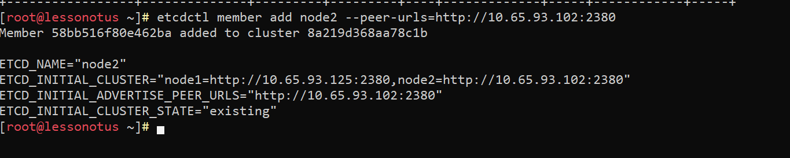
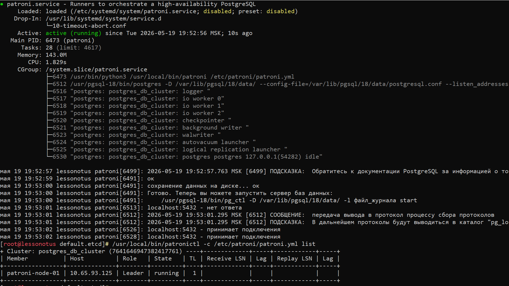
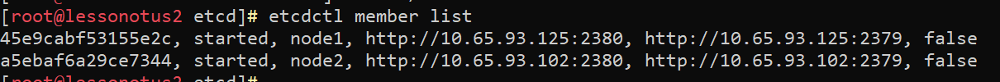
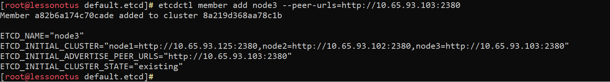
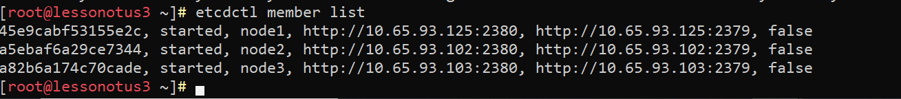
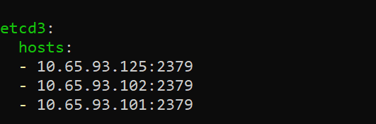
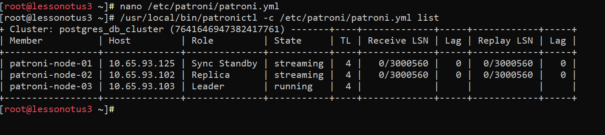

# Домашнее задание N4: Высокая доступность развертывание Patroni

## Информация о проекте
- **Название ВМ:** bananaflow-30081986
- **Дата выполнения:** 2026-05-19
- **Версия PostgreSQL:** 18

### 1. Установка и настройка etcd и patroni на node1

#### 1.1 Устанавливаем etcd:

```
dnf install etcd
```

* Создаем каталоги для запуска etcd:
```
mkdir -p /etc/etcd
chown -R etcd: /etc/etcd/
touch /var/log/etcd.log
chown etcd: /var/log/etcd.log
mkdir -p /var/lib/etcd/default.etcd/
chown -R etcd: /var/lib/etcd/
```

* Настраиваем конфигурацию etcd:

```
nano /etc/etcd/etcd.yaml
```

* Изменяем конфигурацию следующим образом

```
# /etc/etcd/etcd.yaml

name: node1
data-dir: /var/lib/etcd/default.etcd
heartbeat-interval: 1000
election-timeout: 5000

listen-peer-urls: http://0.0.0.0:2380
listen-client-urls: http://0.0.0.0:2379

initial-advertise-peer-urls: http://10.65.93.125:2380
advertise-client-urls: http://10.65.93.125:2379

initial-cluster: "node1=http://10.65.93.125:2380"
initial-cluster-state: new
initial-cluster-token: pg_cluster

# Логирование
log-level: info
log-outputs: ["/var/log/etcd.log"]
```

* Вносим корректировки в службу службу etcd:

```
nano /usr/lib/systemd/system/etcd.service
```

```
# /usr/lib/systemd/system/etcd.service

[Unit]
Description=etcd
After=network.target

[Service]
Type=exec
ExecStart=/usr/bin/etcd --config-file=/etc/etcd/etcd.yaml
Restart=always
RestartSec=5
User=etcd
LimitNOFILE=65536

[Install]
WantedBy=multi-user.target
```
```

systemctl daemon-reload
```

* Запускаем службу etcd:

```
systemctl start etcd.service
systemctl enable etcd
```

#### 1.2 Установка PostgreSQL

* Устанавливаем PostgreSQL и модули:

```
dnf install postgresql18 postgresql18-contrib
```

#### *Внимание!!! После установки Postgresql не нужно запускать и инициализировать БД, также нужно отключить автозапуск службы:*

```
systemctl disable postgresql-18.service
```

#### 1.3 Установка Python

* Устанавливаем Python с необходимыми зависимостями:

```
dnf install python3-pip python3-devel libpq-devel gcc
```

* Обновляем pip:

```
pip3 install --upgrade pip
```

#### 1.4 Установка Patroni 

* Установка Patroni и библиотек

```
/usr/local/bin/pip install patroni
/usr/local/bin/pip install python-etcd
/usr/local/bin/pip install psycopg2
```

#### 1.5 Настройка Patroni

* Создаем каталог для конфигурации Patroni и файл patroni.yml:

```
mkdir /etc/patroni/
nano /etc/patroni/patroni.yml
```

* Вставляем следующую конфигурацию. Конфигурация patroni.yml может отличаться в зависимости от настроек postgres.

```
scope: postgres_db_cluster
namespace: /db/
name: patroni-node-01

log:
  level: WARNING
  format: '%(asctime)s %(levelname)s: %(message)s'
  dateformat: ''
  max_queue_size: 1000
  dir: /var/log/patroni
  file_num: 4
  file_size: 25000000
  loggers:
    postgres.postmaster: WARNING
    urllib3: DEBUG

restapi:
  listen: 0.0.0.0:8008
  connect_address: 10.65.93.125:8008

etcd3:
  hosts:
  - 10.65.93.125:2379
#  - 10.65.93.102:2379
#  - 10.65.93.103:2379

bootstrap:
  dcs:
    ttl: 30
    loop_wait: 10
    retry_timeout: 10
    maximum_lag_on_failover: 0
    synchronous_mode: true
    synchronous_mode_strict: false
    postgresql:
      use_pg_rewind: true
      use_slots: true
      parameters:
        max_connections: 200
        shared_buffers: 1GB
        effective_cache_size: 3GB
        maintenance_work_mem: 256MB
        checkpoint_completion_target: 0.7
        wal_buffers: 16MB
        default_statistics_target: 100
        random_page_cost: 1.1
        effective_io_concurrency: 200
        work_mem: 2621kB
        min_wal_size: 1GB
        max_worker_processes: 40
        max_parallel_workers_per_gather: 4
        max_parallel_workers: 40
        max_parallel_maintenance_workers: 4
        max_locks_per_transaction: 64
        max_prepared_transactions: 0
        wal_level: replica
        wal_log_hints: on
        track_commit_timestamp: off
        max_wal_senders: 10
        max_replication_slots: 10
        wal_keep_segments: 8
        logging_collector: on
        log_destination: csvlog
        log_directory: pg_log
        log_min_messages: warning
        log_min_error_statement: error
        log_min_duration_statement: 1000
        log_duration: off
        log_statement: all
        log_timezone: 'Europe/Moscow'
        lc_messages: 'ru_RU.UTF-8'
        lc_monetary: 'ru_RU.UTF-8'
        lc_numeric: 'ru_RU.UTF-8'
        lc_time: 'ru_RU.UTF-8'
        bgwriter_delay: 20ms
        bgwriter_lru_maxpages: 400
        bgwriter_lru_multiplier: 4.0
        commit_delay: 1000
        commit_siblings: 5
        temp_tablespaces: temptable


  initdb:
  - auth-host: md5
  - auth-local: peer
  - encoding: UTF8
  - data-checksums
  - locale: ru_RU.UTF8
  pg_hba:
  - host all postgres all md5
  - host replication replication all md5
users:
    postgres:
      password: 1qaz!QAZ
      options:
        - createrole
        - createdb
    repl:
      password: 1qaz!QAZ
      options:
        - replication

postgresql:
  listen: 0.0.0.0:5432
  connect_address: 10.65.93.125:5432
  data_dir: /var/lib/pgsql/18/data/
  bin_dir: /usr/pgsql-18/bin/
  config_dir: /var/lib/pgsql/18/data/
  pgpass: /var/lib/pgsql/18/.pgpass
  pg_hba:
    - host all all 0.0.0.0/0 md5
    - host replication replication 127.0.0.1/32 md5
    - host replication replication 10.65.0.0/16 md5
  authentication:
    replication:
      username: replication
      password: 1qaz!QAZ
    superuser:
      username: postgres
      password: 1qaz!QAZ
  parameters:
    unix_socket_directories: '/var/run/postgresql'
    port: 5432

tags:
    nofailover: false
    noloadbalance: false
    clonefrom: false
    nosync: false

```

* Создаем каталог для логирования patroni

```
mkdir /var/log/patroni
```

* Назначаем права на каталог

```
chown -R postgres: /var/log/patroni
```

#### 1.6 Добавляем в кворум (etcd) нового члена
```
etcdctl member add node2 --peer-urls=http://10.65.93.102:2380
```


#### 1.7 Создаем сервис patroni

* Создаем файл сервиса systemd для Patroni:

```
nano /etc/systemd/system/patroni.service
```

* Добавьте следующую запись:

```
[Unit]
Description=Runners to orchestrate a high-availability PostgreSQL
After=syslog.target network.target

[Service]
Type=simple
User=postgres
Group=postgres
ExecStart=/usr/local/bin/patroni /etc/patroni/patroni.yml
KillMode=process
TimeoutSec=30
Restart=no

[Install]
WantedBy=multi-user.target

```

* Перезагружаем демона systemd:

```
systemctl daemon-reload
```

* Запускаем Patroni:

```
systemctl start patroni
```

* Проверяем состояние кластера

```
/usr/local/bin/patronictl -c /etc/patroni/patroni.yml list
```

* Должно быть примерно как на картинке:



### 2. Установка и настройка etcd и patroni на node2

#### 2.1 Устанавливаем etcd:

```
dnf install etcd
```

* Создаем каталоги для запуска etcd:
```
mkdir -p /etc/etcd
chown -R etcd: /etc/etcd/
touch /var/log/etcd.log
chown etcd: /var/log/etcd.log
mkdir -p /var/lib/etcd/default.etcd/
chown -R etcd: /var/lib/etcd/
```

* Настраиваем конфигурацию etcd:

```
nano /etc/etcd/etcd.yaml
```

* Изменяем конфигурацию следующим образом

```
# /etc/etcd/etcd.yaml

name: node2
data-dir: /var/lib/etcd/default.etcd
heartbeat-interval: 1000
election-timeout: 5000

listen-peer-urls: http://0.0.0.0:2380
listen-client-urls: http://0.0.0.0:2379

initial-advertise-peer-urls: http://10.65.93.102:2380
advertise-client-urls: http://10.65.93.102:2379

initial-cluster: ""node1=http://10.65.93.125:2380,node2=http://10.65.93.102:2380""
initial-cluster-state: existing
initial-cluster-token: pg_cluster

# Логирование
log-level: info
log-outputs: ["/var/log/etcd.log"]
```

* Вносим корректировки в службу службу etcd:

```
nano /usr/lib/systemd/system/etcd.service
```

```
# /usr/lib/systemd/system/etcd.service

[Unit]
Description=etcd
After=network.target

[Service]
Type=exec
ExecStart=/usr/bin/etcd --config-file=/etc/etcd/etcd.yaml
Restart=always
RestartSec=5
User=etcd
LimitNOFILE=65536

[Install]
WantedBy=multi-user.target
```
```

systemctl daemon-reload
```

* Запускаем службу etcd:

```
systemctl start etcd.service
systemctl enable etcd 
etcdctl member list --> # Посмотреть членов кворума
```



#### 2.2 Установка PostgreSQL

* Устанавливаем PostgreSQL и модули:

```
dnf install postgresql18 postgresql18-contrib
```

#### *Внимание!!! После установки Postgresql не нужно запускать и инициализировать БД, также нужно отключить автозапуск службы:*

```
systemctl disable postgresql-18.service
```

#### 2.3 Установка Python

* Устанавливаем Python с необходимыми зависимостями:

```
dnf install python3-pip python3-devel libpq-devel gcc
```

* Обновляем pip:

```
pip3 install --upgrade pip
```

#### 2.4 Установка Patroni 

* Установка Patroni и библиотек

```
/usr/local/bin/pip install patroni
/usr/local/bin/pip install python-etcd
/usr/local/bin/pip install psycopg2
```

#### 2.5 Настройка Patroni

* Создаем каталог для конфигурации Patroni и файл patroni.yml:

```
mkdir /etc/patroni/
nano /etc/patroni/patroni.yml
```

* Вставляем следующую конфигурацию. Конфигурация patroni.yml может отличаться в зависимости от настроек postgres.

```
scope: postgres_db_cluster
namespace: /db/
name: patroni-node-02

log:
  level: WARNING
  format: '%(asctime)s %(levelname)s: %(message)s'
  dateformat: ''
  max_queue_size: 1000
  dir: /var/log/patroni
  file_num: 4
  file_size: 25000000
  loggers:
    postgres.postmaster: WARNING
    urllib3: DEBUG

restapi:
  listen: 0.0.0.0:8008
  connect_address: 10.65.93.102:8008

etcd3:
  hosts:
  - 10.65.93.102:2379
  - 10.65.93.125:2379
#  - 10.65.93.103:2379

bootstrap:
  dcs:
    ttl: 30
    loop_wait: 10
    retry_timeout: 10
    maximum_lag_on_failover: 0
    synchronous_mode: true
    synchronous_mode_strict: false
    postgresql:
      use_pg_rewind: true
      use_slots: true
      parameters:
        max_connections: 200
        shared_buffers: 1GB
        effective_cache_size: 3GB
        maintenance_work_mem: 256MB
        checkpoint_completion_target: 0.7
        wal_buffers: 16MB
        default_statistics_target: 100
        random_page_cost: 1.1
        effective_io_concurrency: 200
        work_mem: 2621kB
        min_wal_size: 1GB
        max_worker_processes: 40
        max_parallel_workers_per_gather: 4
        max_parallel_workers: 40
        max_parallel_maintenance_workers: 4
        max_locks_per_transaction: 64
        max_prepared_transactions: 0
        wal_level: replica
        wal_log_hints: on
        track_commit_timestamp: off
        max_wal_senders: 10
        max_replication_slots: 10
        wal_keep_segments: 8
        logging_collector: on
        log_destination: csvlog
        log_directory: pg_log
        log_min_messages: warning
        log_min_error_statement: error
        log_min_duration_statement: 1000
        log_duration: off
        log_statement: all
        log_timezone: 'Europe/Moscow'
        lc_messages: 'ru_RU.UTF-8'
        lc_monetary: 'ru_RU.UTF-8'
        lc_numeric: 'ru_RU.UTF-8'
        lc_time: 'ru_RU.UTF-8'
        bgwriter_delay: 20ms
        bgwriter_lru_maxpages: 400
        bgwriter_lru_multiplier: 4.0
        commit_delay: 1000
        commit_siblings: 5
        temp_tablespaces: temptable


  initdb:
  - auth-host: md5
  - auth-local: peer
  - encoding: UTF8
  - data-checksums
  - locale: ru_RU.UTF8
  pg_hba:
  - host all postgres all md5
  - host replication replication all md5
users:
    postgres:
      password: 1qaz!QAZ
      options:
        - createrole
        - createdb
    repl:
      password: 1qaz!QAZ
      options:
        - replication

postgresql:
  listen: 0.0.0.0:5432
  connect_address: 10.65.93.102:5432
  data_dir: /var/lib/pgsql/18/data/
  bin_dir: /usr/pgsql-18/bin/
  config_dir: /var/lib/pgsql/18/data/
  pgpass: /var/lib/pgsql/18/.pgpass
  pg_hba:
    - host all all 0.0.0.0/0 md5
    - host replication replication 127.0.0.1/32 md5
    - host replication replication 10.65.0.0/16 md5
  authentication:
    replication:
      username: replication
      password: 1qaz!QAZ
    superuser:
      username: postgres
      password: 1qaz!QAZ
  parameters:
    unix_socket_directories: '/var/run/postgresql'
    port: 5432

tags:
    nofailover: false
    noloadbalance: false
    clonefrom: false
    nosync: false

```

* Создаем каталог для логирования patroni

```
mkdir /var/log/patroni
```

* Назначаем права на каталог

```
chown -R postgres: /var/log/patroni
```

#### 2.6 Добавляем в кворум (etcd) нового члена
```
etcdctl member add node3 --peer-urls=http://10.65.93.103:2380
```


#### 2.7 Создаем сервис patroni

* Создаем файл сервиса systemd для Patroni:

```
nano /etc/systemd/system/patroni.service
```

* Добавьте следующую запись:

```
[Unit]
Description=Runners to orchestrate a high-availability PostgreSQL
After=syslog.target network.target

[Service]
Type=simple
User=postgres
Group=postgres
ExecStart=/usr/local/bin/patroni /etc/patroni/patroni.yml
KillMode=process
TimeoutSec=30
Restart=no

[Install]
WantedBy=multi-user.target

```

* Перезагружаем демона systemd:

```
systemctl daemon-reload
```

* Запускаем Patroni:

```
systemctl start patroni
```

* Проверяем состояние кластера

```
/usr/local/bin/patronictl -c /etc/patroni/patroni.yml list
```

* Должно быть примерно как на картинке:


### 3. Установка и настройка etcd и patroni на node3

#### 3.1 Устанавливаем etcd:

```
dnf install etcd
```

* Создаем каталоги для запуска etcd:
```
mkdir -p /etc/etcd
chown -R etcd: /etc/etcd/
touch /var/log/etcd.log
chown etcd: /var/log/etcd.log
mkdir -p /var/lib/etcd/default.etcd/
chown -R etcd: /var/lib/etcd/
```

* Настраиваем конфигурацию etcd:

```
nano /etc/etcd/etcd.yaml
```

* Изменяем конфигурацию следующим образом

```
# /etc/etcd/etcd.yaml

name: node3
data-dir: /var/lib/etcd/default.etcd
heartbeat-interval: 1000
election-timeout: 5000

listen-peer-urls: http://0.0.0.0:2380
listen-client-urls: http://0.0.0.0:2379

initial-advertise-peer-urls: http://10.65.93.103:2380
advertise-client-urls: http://10.65.93.103:2379

initial-cluster: "node1=http://10.65.93.125:2380,node2=http://10.65.93.102:2380,node3=http://10.65.93.103:2380"
initial-cluster-state: existing
initial-cluster-token: pg_cluster

# Логирование
log-level: info
log-outputs: ["/var/log/etcd.log"]
```

* Вносим корректировки в службу службу etcd:

```
nano /usr/lib/systemd/system/etcd.service
```

```
# /usr/lib/systemd/system/etcd.service

[Unit]
Description=etcd
After=network.target

[Service]
Type=exec
ExecStart=/usr/bin/etcd --config-file=/etc/etcd/etcd.yaml
Restart=always
RestartSec=5
User=etcd
LimitNOFILE=65536

[Install]
WantedBy=multi-user.target
```
```

systemctl daemon-reload
```

* Запускаем службу etcd:

```
systemctl start etcd.service
systemctl enable etcd 
etcdctl member list --> # Посмотреть членов кворума
```



#### 3.2 Установка PostgreSQL

* Устанавливаем PostgreSQL и модули:

```
dnf install postgresql18 postgresql18-contrib
```

#### *Внимание!!! После установки Postgresql не нужно запускать и инициализировать БД, также нужно отключить автозапуск службы:*

```
systemctl disable postgresql-18.service
```

#### 3.3 Установка Python

* Устанавливаем Python с необходимыми зависимостями:

```
dnf install python3-pip python3-devel libpq-devel gcc
```

* Обновляем pip:

```
pip3 install --upgrade pip
```

#### 3.4 Установка Patroni 

* Установка Patroni и библиотек

```
/usr/local/bin/pip install patroni
/usr/local/bin/pip install python-etcd
/usr/local/bin/pip install psycopg2
```

#### 3.5 Настройка Patroni

* Создаем каталог для конфигурации Patroni и файл patroni.yml:

```
mkdir /etc/patroni/
nano /etc/patroni/patroni.yml
```

* Вставляем следующую конфигурацию. Конфигурация patroni.yml может отличаться в зависимости от настроек postgres.

```
scope: postgres_db_cluster
namespace: /db/
name: patroni-node-03

log:
  level: WARNING
  format: '%(asctime)s %(levelname)s: %(message)s'
  dateformat: ''
  max_queue_size: 1000
  dir: /var/log/patroni
  file_num: 4
  file_size: 25000000
  loggers:
    postgres.postmaster: WARNING
    urllib3: DEBUG

restapi:
  listen: 0.0.0.0:8008
  connect_address: 10.65.93.103:8008

etcd3:
  hosts:
  - 10.65.93.102:2379
  - 10.65.93.125:2379
  - 10.65.93.103:2379

bootstrap:
  dcs:
    ttl: 30
    loop_wait: 10
    retry_timeout: 10
    maximum_lag_on_failover: 0
    synchronous_mode: true
    synchronous_mode_strict: false
    postgresql:
      use_pg_rewind: true
      use_slots: true
      parameters:
        max_connections: 200
        shared_buffers: 1GB
        effective_cache_size: 3GB
        maintenance_work_mem: 256MB
        checkpoint_completion_target: 0.7
        wal_buffers: 16MB
        default_statistics_target: 100
        random_page_cost: 1.1
        effective_io_concurrency: 200
        work_mem: 2621kB
        min_wal_size: 1GB
        max_worker_processes: 40
        max_parallel_workers_per_gather: 4
        max_parallel_workers: 40
        max_parallel_maintenance_workers: 4
        max_locks_per_transaction: 64
        max_prepared_transactions: 0
        wal_level: replica
        wal_log_hints: on
        track_commit_timestamp: off
        max_wal_senders: 10
        max_replication_slots: 10
        wal_keep_segments: 8
        logging_collector: on
        log_destination: csvlog
        log_directory: pg_log
        log_min_messages: warning
        log_min_error_statement: error
        log_min_duration_statement: 1000
        log_duration: off
        log_statement: all
        log_timezone: 'Europe/Moscow'
        lc_messages: 'ru_RU.UTF-8'
        lc_monetary: 'ru_RU.UTF-8'
        lc_numeric: 'ru_RU.UTF-8'
        lc_time: 'ru_RU.UTF-8'
        bgwriter_delay: 20ms
        bgwriter_lru_maxpages: 400
        bgwriter_lru_multiplier: 4.0
        commit_delay: 1000
        commit_siblings: 5
        temp_tablespaces: temptable


  initdb:
  - auth-host: md5
  - auth-local: peer
  - encoding: UTF8
  - data-checksums
  - locale: ru_RU.UTF8
  pg_hba:
  - host all postgres all md5
  - host replication replication all md5
users:
    postgres:
      password: 1qaz!QAZ
      options:
        - createrole
        - createdb
    repl:
      password: 1qaz!QAZ
      options:
        - replication

postgresql:
  listen: 0.0.0.0:5432
  connect_address: 10.65.93.103:5432
  data_dir: /var/lib/pgsql/18/data/
  bin_dir: /usr/pgsql-18/bin/
  config_dir: /var/lib/pgsql/18/data/
  pgpass: /var/lib/pgsql/18/.pgpass
  pg_hba:
    - host all all 0.0.0.0/0 md5
    - host replication replication 127.0.0.1/32 md5
    - host replication replication 10.65.0.0/16 md5
  authentication:
    replication:
      username: replication
      password: 1qaz!QAZ
    superuser:
      username: postgres
      password: 1qaz!QAZ
  parameters:
    unix_socket_directories: '/var/run/postgresql'
    port: 5432

tags:
    nofailover: false
    noloadbalance: false
    clonefrom: false
    nosync: false

```

* Создаем каталог для логирования patroni

```
mkdir /var/log/patroni
```

* Назначаем права на каталог

```
chown -R postgres: /var/log/patroni
```
#### 3.6 Добавляем в кворум (etcd) нового члена
```
etcdctl member add node3 --peer-urls=http://10.65.93.103:2380
```


#### 3.7 Создаем сервис patroni

* Создаем файл сервиса systemd для Patroni:

```
nano /etc/systemd/system/patroni.service
```

* Добавьте следующую запись:

```
[Unit]
Description=Runners to orchestrate a high-availability PostgreSQL
After=syslog.target network.target

[Service]
Type=simple
User=postgres
Group=postgres
ExecStart=/usr/local/bin/patroni /etc/patroni/patroni.yml
KillMode=process
TimeoutSec=30
Restart=no

[Install]
WantedBy=multi-user.target

```

* Перезагружаем демона systemd:

```
systemctl daemon-reload
```

* Запускаем Patroni:

```
systemctl start patroni
```

* Проверяем состояние кластера

```
/usr/local/bin/patronictl -c /etc/patroni/patroni.yml list
```

* Должно быть примерно как на картинке:


### 4. На всех кластерах в конфиге patroni нужно расскоментировать секцию etcd3 (hosts) и перезапустить службу patroni



```
systemctl restart patroni
```

* Отказоустойчивость работает



### 5. Установка и настройка haproxy на всех node

#### 5.1 Устанавливаем haproxy
```
dnf install haproxy -y
dnf install policycoreutils-python -y
```

#### 5.2 Приводим конфигрурационный файл к виду 
```
nano /etc/haproxy/haproxy.cfg
```
```
# /etc/haproxy/haproxy.cfg
global
    log         127.0.0.1 local0
    maxconn     3000
    stats socket /var/lib/haproxy/stats level admin

defaults
    mode                    tcp
    log                     global
    retries                 2
    timeout queue           1m
    timeout connect         4s
    timeout client          3m      # 180000 мс
    timeout server          3m      # 180000 мс
    timeout check           5s
    maxconn                 3000

# --- ЕДИНАЯ ТОЧКА ВХОДА ДЛЯ ПРИЛОЖЕНИЯ ---
listen postgres_cluster
    bind *:6432
    mode tcp
    # Проверяем API Patroni, чтобы найти мастера
    option httpchk GET /master
    http-check expect status 200
    # Балансировка: первый живой сервер, прошедший проверку (то есть Мастер)
    balance first
    # Параметры проверки серверов
    default-server inter 3s fall 3 rise 2 on-marked-down shutdown-sessions

    # Серверы кластера (порт 5432 для данных, проверка через порт 8008)
    server node1 10.65.93.125:5432 maxconn 3000 check port 8008
    server node2 10.65.93.102:5432 maxconn 3000 check port 8008
    server node3 10.65.93.103:5432 maxconn 3000 check port 8008

# --- СТРАНИЦА СТАТИСТИКИ (для админа) ---
listen stats
    mode http
	bind *:17000
    stats enable
    stats uri /
    stats refresh 5s

# --- ДОСТУП К API PATRONI (для утилит, не для приложения) ---
listen patroni_api
    bind *:8888
    mode tcp
    balance roundrobin
    server node1 10.65.93.125:8008 check
    server node2 10.65.93.102:8008 check
    server node3 10.65.93.103:8008 check
```

#### 5.3 Генерируем исключения для selinux
```
ausearch -m avc -ts recent | audit2allow -M haproxy_shm
semodule -i haproxy_shm.pp
semanage port -a -t http_port_t -p tcp 6432
semanage port -a -t http_port_t -p tcp 8888
semanage port -a -t http_port_t -p tcp 17000
semanage port -l | grep http_port_t
```
* Запускаем службу haproxy
```
systemctl start haproxy
```


