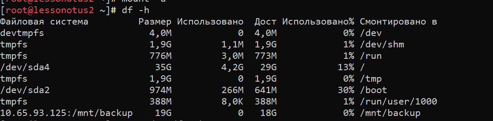
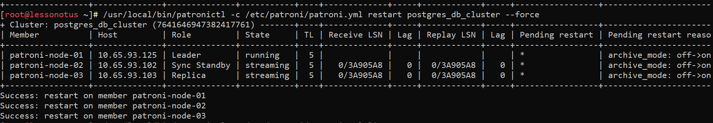
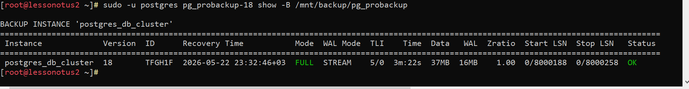
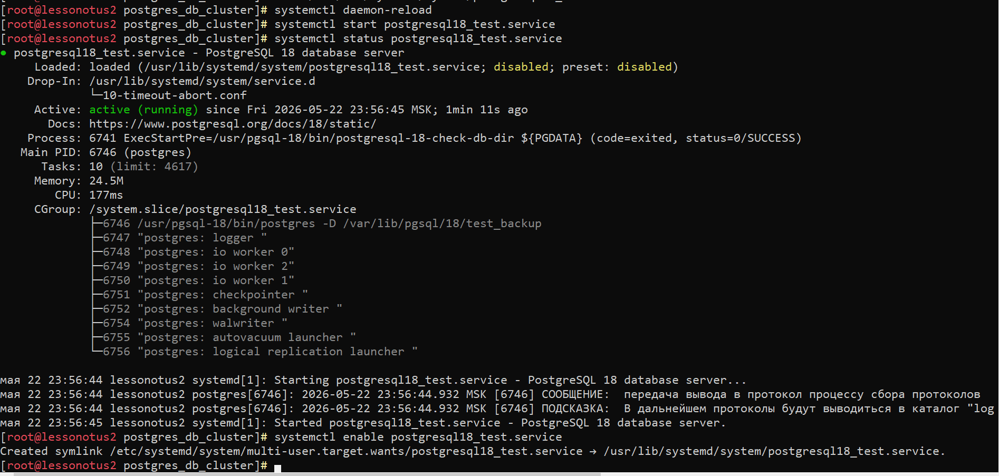
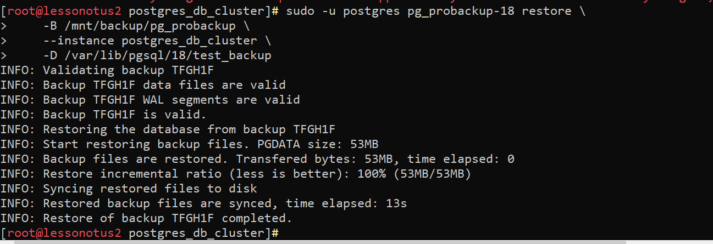
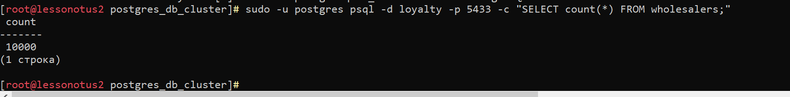

# Домашнее задание N5: Бэкапы

## Информация о проекте
- **Название ВМ:** bananaflow-30081986
- **Дата выполнения:** 2026-05-22
- **Версия PostgreSQL:** 18

### 1. Подключаем диск, куда будем складывать бэкапы и после расшарим его на все сервера

#### 1.1 Создаем раздел и подключаем диск:
```
parted -s /dev/vdb mklabel gpt mkpart primary 0% 100% set 1 lvm on
pvcreate /dev/vdb1 && sudo vgcreate vg_db /dev/vdb1 && sudo lvcreate -l 100%FREE -n lv_db vg_db
mkfs.ext4 /dev/vg_db/lv_backup
mkdir- p /mnt/backup
"UUID=$(sudo blkid -s UUID -o value /dev/mapper/vg_db-lv_backup) /mnt/backup ext4 defaults 1 2" | sudo tee -a /etc/fstab
systemctl daemon-reload
mount -a
```
#### 1.2 Дедаем раздел доступным по ntfs
```
dnf install nfs-utils -y
# Вносим запись в /etc/etc/exports и перезапускаем сервер 
# /etc/etc/exports
/mnt/backup 10.65.93.0/24(rw,sync,no_subtree_check)
exportfs -ra
systemctl restart nfs-server
systemctl enable nfs-server
showmount -e localhost
```


### 2. Создаем тестовую базы и данные Лояльность оптовиков на клаcтере patroni 
```sql
CREATE DATABASE loyalty;
\c

CREATE TABLE wholesalers (
    id SERIAL PRIMARY KEY,
    name TEXT NOT NULL,
    bonus_balance NUMERIC DEFAULT 0
);

-- Наполняем данными
INSERT INTO wholesalers (name, bonus_balance) 
SELECT 'Company_' || generate_series(1, 10000), random() * 10000;
```

### 3. Устанавливаем pg_probackup на всех нодах
```
dnf install pg_probackup-18 -y
```
### 4. К реплике подключаем диск и инициализируем катол с бэкапом
```
mkdir -p /mnt/backup
sh -c 'echo -e "10.65.93.125:/mnt/backup\t/mnt/backup/\tnfs\tdefaults\t0\t0" >> /etc/fstab'
systemctl daemon-reload
mount -a
mkdir -p /mnt/backup/pg_probackup
chown -R postgres: /mnt/backup
chmod -R 755 /mnt/backup

# инициализируем каталог с бэкапом
sudo -u postgres pg_probackup-18 init -B /mnt/backup/pg_probackup
sudo -u postgres pg_probackup-18 add-instance \
    -B /mnt/backup/pg_probackup \
    --instance postgres_db_cluster \
    -D /var/lib/pgsql/18/data/ \
    --remote-proto=ssh
```



#### 4.1 Настраиваем файл с паролем для подключения
```
sudo -u postgres nano ~/.pgpass
#
localhost:5432:loyalty:backup:1qaz!QAZ
sudo -u postgres chmod 600 ~/.pgpass
```

### 5. Настраиваем WAL архивацию
```
/usr/local/bin/patronictl -c /etc/patroni/patroni.yml edit-config
# Добавляем параметры
archive_mode: on
archive_command: 'pg_probackup archive-push -B /mnt/backup/pg_probackup  --instance postgres_db_cluster --wal-file-name=%f'
 max_wal_senders: 10
```
#### 5.1 Перезагружаем весь кластер patroni
```
/usr/local/bin/patronictl -c /etc/patroni/patroni.yml restart postgres_db_cluster --force
```



### 6. Запускаем бэкап на реплике
```
sudo -u postgres pg_probackup-18 backup \
    -B /mnt/backup/pg_probackup \
    --instance postgres_db_cluster \
    -U postgres \
    -d loyalty \
    -h localhost \
    --backup-mode FULL \
    --stream \
    --temp-slot
```

### 7. Проверяем, что бэкап создался
```
sudo -u postgres pg_probackup-18 show -B /mnt/backup/pg_probackup
```



### 8. Создаем отдельный инстанс Postgresql18
```
nano /usr/lib/systemd/system/postgresql18_test.service
```

#### 8.1 Приводим его к следующему виду
```
#/usr/lib/systemd/system/postgresql18_test.service
[Unit]
Description=PostgreSQL 18 database server
Documentation=https://www.postgresql.org/docs/18/static/
After=syslog.target
After=network.target

[Service]
Type=notify

User=postgres
Group=postgres
Environment=PGDATA=/var/lib/pgsql/18/test_backup
OOMScoreAdjust=-1000
Environment=PG_OOM_ADJUST_FILE=/proc/self/oom_score_adj
Environment=PG_OOM_ADJUST_VALUE=0
ExecStartPre=/usr/pgsql-18/bin/postgresql-18-check-db-dir ${PGDATA}
ExecStart=/usr/pgsql-18/bin/postgres -D ${PGDATA}
ExecReload=/bin/kill -HUP $MAINPID
KillMode=mixed
KillSignal=SIGINT
TimeoutSec=0
TimeoutStartSec=0
TimeoutStopSec=1h

[Install]
WantedBy=multi-user.target
```

#### 8.2 Инициализируем Базу данных
```
su - postgres -c '/usr/pgsql-18/bin/initdb -D /var/lib/pgsql/18/test_backup'
```

#### 8.4 Запускаем службу postgresql
```
systemctl daemon-reload
systemctl start postgresql18_test.service
systemctl status postgresql18_test.service
systemctl enable postgresql18_test.service
```



### 9. Восстанавливаем данные из бэкапа
```
systemctl stop postgresql18_test.service
rm -rf /var/lib/pgsql/18/test_backup
sudo -u postgres pg_probackup-18 restore \
    -B /mnt/backup/pg_probackup \
    --instance postgres_db_cluster \
    -D /var/lib/pgsql/18/test_backup
```


#### 9.1 Проверяем что данные восстановились
```
sudo -u postgres psql -d loyalty -p 5433 -c "SELECT count(*) FROM wholesalers;"
```

