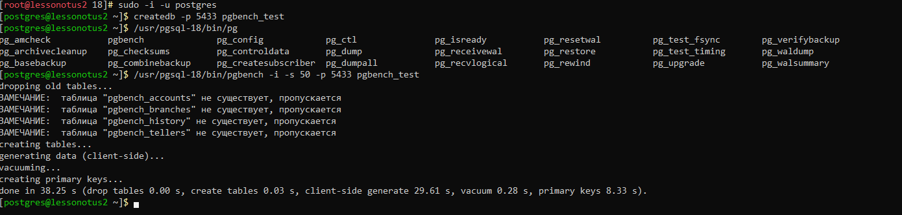
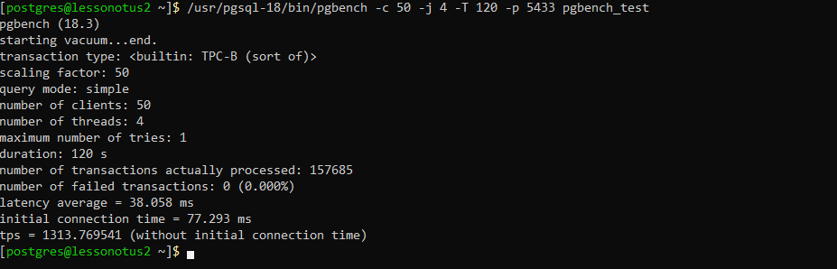
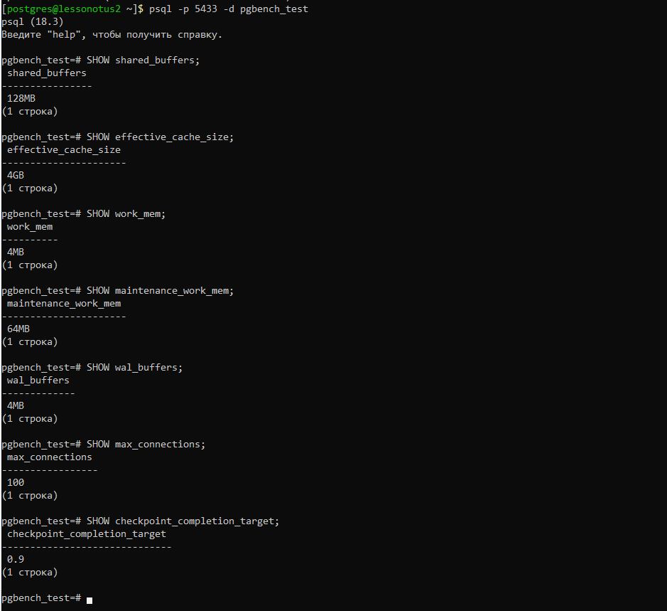
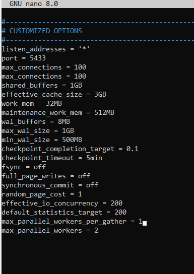
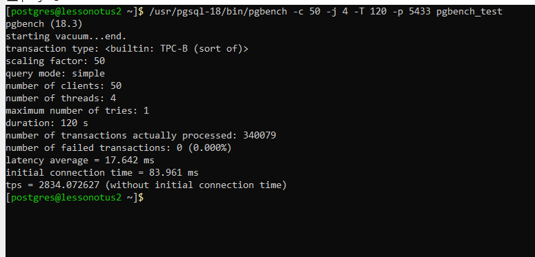

# Домашнее задание N6: Гонка за производительностью

## Информация о проекте
- **Название ВМ:** bananaflow-30081986
- **Дата выполнения:** 2026-05-27
- **Версия PostgreSQL:** 18

### 1. Инициализация тестовой БД для pgbench
```
# Переключение на пользователя postgres
sudo -i -u postgres

# Создание тестовой БД
createdb -p 5433 pgbench_test

# Инициализация с масштабным фактором 50 (~5 млн строк в accounts)
/usr/pgsql-18/bin/pgbench -i -s 50 -p 5433 pgbench_test
```



### 2. Запуск теста без оптимизации конфигурации СУБД
```
/usr/pgsql-18/bin/pgbench -c 50 -j 4 -T 120 -p 5433 pgbench_test
```



* Базовый TPS: ~1314 транзакций в секунду

### 3. Производим оптимизацию конфигурации СУБД

#### 3.1 Смотри текущие настройки БД
```
psql -p 5433 -d pgbench_test
```
```sql
SHOW shared_buffers;
SHOW effective_cache_size;
SHOW work_mem;
SHOW maintenance_work_mem;
SHOW wal_buffers;
SHOW max_connections;
SHOW checkpoint_completion_target;
```



#### 3.2 Расчитываем оптимальные параметры (хар-ки сервер 2CPU 4RAM)
| Параметр | Значение | Назначение |
|----------|----------|------------|
| **Память и кэширование** |
| `shared_buffers` | 1GB | Этот параметр рекомендуется рассчитывать как 25% от RAM, доступной серверу СУБД. |
| `effective_cache_size` | 3GB | Этот параметр рекомендуется рассчитывать как 75% от RAM, доступной серверу СУБД. |
| `work_mem` | 32MB | Память для операций сортировки, хэш-таблиц и объединений (JOIN) **внутри одного запроса**. Увеличение ускоряет сложные запросы. |
| `maintenance_work_mem` | 512MB | Лимит памяти для AutoVacuum, Vacuum. |
| `wal_buffers` | 8MB | Буфер для WAL (журнала предзаписи) в памяти. Увеличение снижает количество операций записи на диск. |
| **Дисковый ввод-вывод** |
| `random_page_cost` | 1.0 | Стоимость случайного доступа к диску. На HDD стандарт = 4, но снижено до 1.0 потому что `fsync=off` и кэширование ОС минимизируют реальные чтения. |
| `effective_io_concurrency` | 200 | Количество одновременных операций ввода-вывода, которое может выполнять дисковая система. 200 подходит для быстрых SSD/NVMe накопителей. |
| **Надёжность (экстремальная оптимизация)** |
| `fsync` | off | **ОТКЛЮЧЕНО** PostgreSQL не принуждает ОС сбрасывать данные на диск. ОГРОМНЫЙ РИСК ПОТЕРИ ДАННЫХ при сбое. Максимальная скорость записи. |
| `full_page_writes` | off | **ОТКЛЮЧЕНО** не записывать полные страницы в WAL после чекпоинта. Экономит WAL, но делает восстановление невозможным при повреждении страницы. |
| `synchronous_commit` | off | **АСИНХРОННАЯ ФИКСАЦИЯ** транзакция считается успешной до реальной записи на диск. Повышает производительность, но риск потери последних транзакций. |
| **Контрольные точки (Checkpoint)** |
| `checkpoint_completion_target` | 0.1 | Параметр checkpoint_completion_target в PostgreSQL управляет тем, как быстро должны завершаться контрольные точки. Этот параметр играет ключевую роль в распределении нагрузки на диск во время выполнения контрольных точек и помогает минимизировать пики операций ввода-вывода. |
| `checkpoint_timeout` | 5min | Максимальное время между чекпоинтами. Чаще чекпоинты = меньше WAL для восстановления, но больше нагрузка. |
| `max_wal_size` | 1GB | Максимальный размер WAL перед принудительным чекпоинтом. Меньший размер быстрее заполняется, вызывая частые чекпоинты. |
| `min_wal_size` | 500MB | Минимальный размер WAL для автоматической очистки. Устаревшие сегменты WAL удаляются при превышении этого порога. |
| **Параллелизм** |
| `max_parallel_workers_per_gather` | 1 | Максимум параллельных рабочих для одного узла сбора (Gather). 1 означает, что параллельные планы запросов ОТКЛЮЧЕНЫ. |
| `max_parallel_workers` | 2 | Общее количество параллельных рабочих во всей системе. Не более числа ядер CPU. |
| **Планировщик запросов** |
| `default_statistics_target` | 200 | Размер выборки для сбора статистики о таблицах. |

#### 3.3 Пример настроек в postgresql.conf
```
nano /var/lib/pgsql/18/test_backup/postgresql.conf
#postgresql.conf
listen_addresses = '*'
port = 5433
max_connections = 100
shared_buffers = 1GB
effective_cache_size = 3GB
work_mem = 32MB
maintenance_work_mem = 512MB
wal_buffers = 8MB
max_wal_size = 1GB
min_wal_size = 500MB
checkpoint_completion_target = 0.1
checkpoint_timeout = 5min
fsync = off
full_page_writes = off
synchronous_commit = off
random_page_cost = 1           
effective_io_concurrency = 200    
default_statistics_target = 200  
```
```
systemctl restart postgresql18_test.service
```


### 4. Повторно тестируем с темиже параметрами
```
/usr/pgsql-18/bin/pgbench -c 50 -j 4 -T 120 -p 5433 pgbench_test
```



* Оптимизированный TPS: ~2834 транзакций в секунду
* Производительность УЛУЧШИЛАСЬ в почти в 2 раза

### 5. Результаты оптимизации производительности

#### 5.1 Сравнение до и после

| Показатель | ДО оптимизации | ПОСЛЕ оптимизации | Изменение |
|------------|----------------|-------------------|-----------|
| **TPS** | 1,314 | 2,834 | *+115%* |
| **Latency** | 38.06 ms | 17.64 ms | *-54%* |
| **Транзакций** | 157,685 | 340,079 | *+116%* |

#### 5.2 Ключевые изменения в конфигурации

| Параметр | Значение | Эффект |
|----------|----------|--------|
| `shared_buffers` | 1 GB | Увеличение кэширования данных |
| `fsync` | off | Отключение синхронной записи (риск) |
| `synchronous_commit` | off | Асинхронная фиксация транзакций |
| `work_mem` | 32 MB | Ускорение сортировок и джойнов |

#### 6. Заключение

| Оптимизация параметров PostgreSQL позволила **увеличить пропускную способность на 115%** и **снизить задержки на 54%**. Максимальная производительность достигнута за счёт отключения механизмов надёжности (`fsync`, `synchronous_commit`), что допустимо только в тестовой среде.

