# Домашнее задание N7: Гонка PostgreSQL в Minikube

## Информация о проекте
- **Название ВМ:** bananaflow-30081986
- **Дата выполнения:** 2026-06-08
- **Версия PostgreSQL:** 18

### 1. Устанавливаем kubectl; minikube, helm, docker, psql
```
cat <<EOF | sudo tee /etc/yum.repos.d/kubernetes.repo
[kubernetes]
name=Kubernetes
baseurl=https://pkgs.k8s.io/core:/stable:/v1.33/rpm/
enabled=1
gpgcheck=1
gpgkey=https://pkgs.k8s.io/core:/stable:/v1.33/rpm/repodata/repomd.xml.key
EOF
dnf install -y kubectl
```

#### 1.1 Устанавливаем minikube (так как сервис у меня заблокирован, пришлось выкачать файл по ВПН и закинуть его локально в иректорию /home/)
```
dnf install -y minikube-latest.x86_64.rpm
```

#### 1.2 Устанавливаем helm
```
dnf install helm -y
```

#### 1.3 Устанавливаем docker
```
dnf install docker -y
```

#### 1.4 Устанавливаем клиент psql (для подключения к базе)
```
dnf install postgresql18 postgresql18-server postgresql18-contrib
```

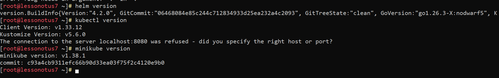

### 2. Запускаем Minikube Dashboard
```
# Даем права локальному пользователю
echo "admin ALL=(ALL) NOPASSWD: /usr/bin/podman" | sudo tee /etc/sudoers.d/minikube-podman
# Запускаем minikube
minikube start --driver=podman
# Включаем адон Dashboard
minikube addons enable dashboard
# Открываем Веб-морду
minikube dashboard
# Делаем чтоб Dashboard слушал все интерфейсы 
kubectl proxy --address='0.0.0.0' --disable-filter=true --port=8001
```
* На компьютере открываем браузер по ссылке http://10.65.93.102:8001/api/v1/namespaces/kubernetes-dashboard/services/http:kubernetes-dashboard:/proxy/

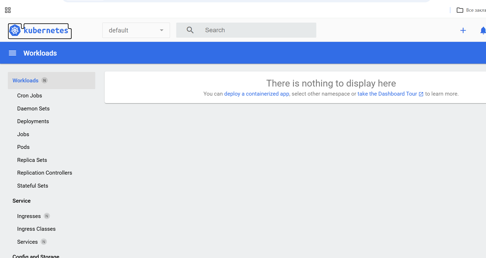

### 3. Разворачиваем postgresql через yaml манифест
```
nano /opt/pg_kuber/postgres-manifest.yaml
```
```yaml
apiVersion: apps/v1
kind: Deployment
metadata:
  name: postgres
  labels:
    app: postgres
spec:
  replicas: 1
  selector:
    matchLabels:
      app: postgres
  template:
    metadata:
      labels:
        app: postgres
    spec:
      containers:
      - name: postgres
        image: postgres:18
        ports:
        - containerPort: 5432
        env:
        - name: POSTGRES_USER
          value: "postgres"
        - name: POSTGRES_PASSWORD
          value: "1qaz!QAZ"
        - name: POSTGRES_DB
          value: "testdb"
        volumeMounts:
        - name: postgres-storage
          mountPath: /var/lib/pgsql/18
      volumes:
      - name: postgres-storage
        emptyDir: {}
---
apiVersion: v1
kind: Service
metadata:
  name: postgres-svc
spec:
  selector:
    app: postgres
  ports:
  - port: 5432
    targetPort: 5432
    nodePort: 30007
  type: NodePort
```

#### 3.1 Запускаем манифест
```
kubectl apply -f postgres-manifest.yaml
```

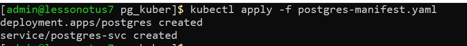
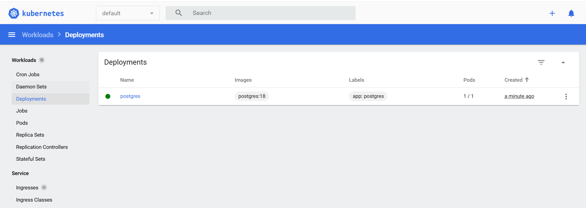

* Открываем новую консоль для проброса порта postgresql
```
kubectl port-forward --address 0.0.0.0 service/postgres-svc 30007:5432
```

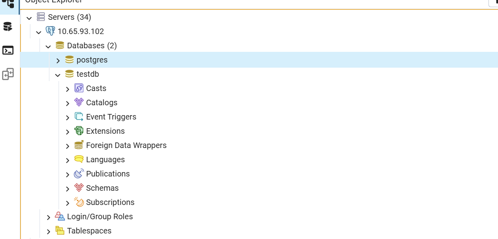

* Проверяем простым Select работу БД
 
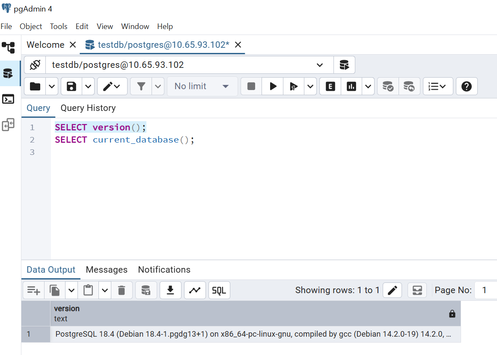
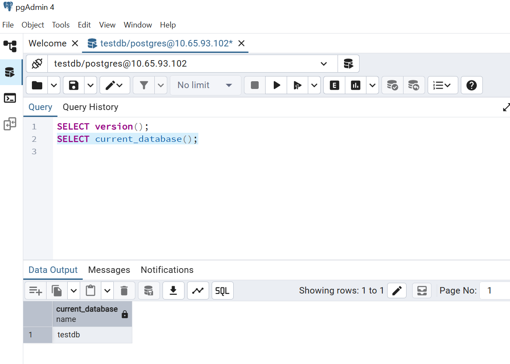


#### 3.1 Маштабируем до 3 pod
```
kubectl scale deployment postgres --replicas=3
```

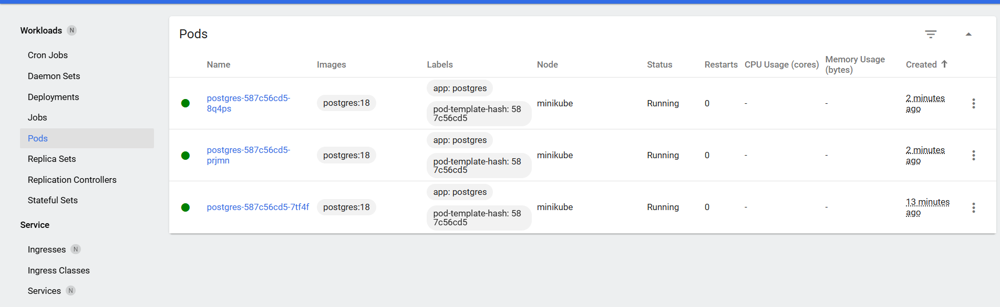
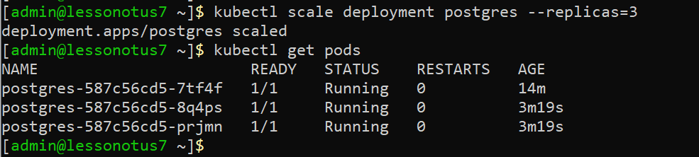

### 4. Разворачиваем через helm

#### 4.1 Удаляем манифест
```
kubectl delete -f postgres-manifest.yaml
```

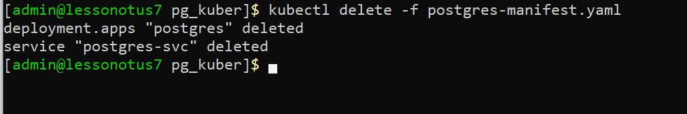

#### 4.2 Создаем файл настроек values.yaml
```
nano /opt/pg_kuber/values.yaml
```
```
#nano /opt/pg_kuber/values.yaml
auth:
  postgresPassword: "1qaz!QAZ"
  database: "testdb"
  username: "postgres"

architecture: replication

primary:
  persistence:
    size: 1Gi

secondary:
  replicaCount: 2
  persistence:
    size: 1Gi
```
	
#### 4.3 Устанавливаем postgres через Helm
```
helm install my-postgres oci://registry-1.docker.io/bitnamicharts/postgresql -f values.yaml
```
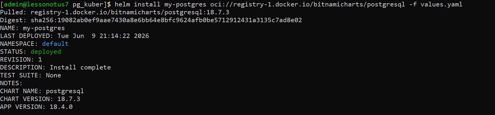
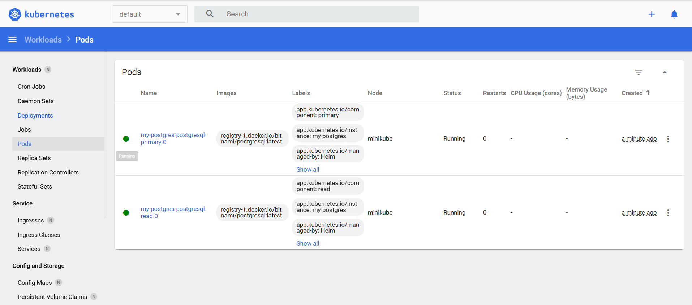
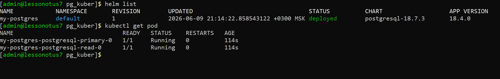

#### 4.4 Пробрасываем порт 
```
kubectl port-forward --address 0.0.0.0 svc/my-postgres-postgresql-primary 30007:5432
```

* Проверяем простым Select работу БД

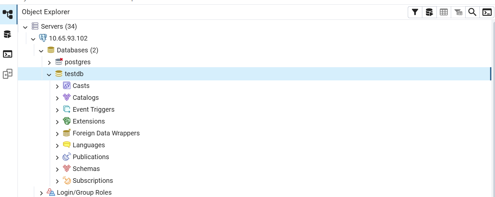

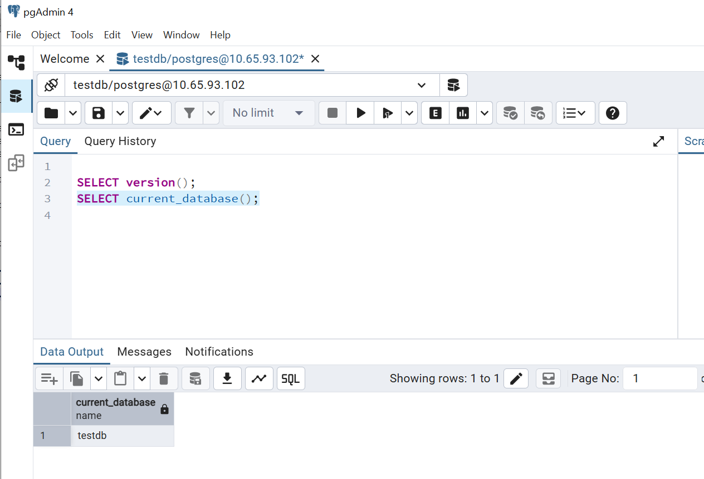
