# Домашнее задание N8: Managed Service for PostgreSQL

## Информация о проекте
- **Название ВМ:** bananaflow-30081986
- **Дата выполнения:** 2026-07-11
- **Версия PostgreSQL:** 18

### 1. Настраиваем terraform
#### 1.1 В каталоге %appdata% создаем файл terraform.rc с содержимым
```
# terraform.rc
terraform {
  required_providers {
    yandex = {
      source  = "yandex-cloud/yandex"
      version = ">= 0.72.0"
    }
  }
}

provider "yandex" {
  folder_id = "b1ggt0b0k4oebaggh3fl" 
  zone      = "ru-central1-a"
}
```

#### 1.2 В директории Terraform создаем файлы providers.tf и main.tf (по умолчанию C:\Terraform
```
# providers.tf
terraform {
  required_providers {
    yandex = {
      source  = "yandex-cloud/yandex"
      version = ">= 0.72.0"
    }
  }
}

provider "yandex" {
  folder_id = "b1ggt0b0k4oebaggh3fl"
  zone      = "ru-central1-a"
  service_account_key_file = "key.json"
}
```
```
# main.tf
# 1. Создаем сеть
resource "yandex_vpc_network" "db_network" {
  name = "postgresql-network"
}

# 2. Создаем подсеть
resource "yandex_vpc_subnet" "db_subnet" {
  name           = "postgresql-subnet"
  zone           = "ru-central1-a"
  network_id     = yandex_vpc_network.db_network.id
  v4_cidr_blocks = ["10.1.0.0/24"]
}

# 3. Создаем группу безопасности для доступа c моего внешнего ip
resource "yandex_vpc_security_group" "db_sg" {
  name        = "postgresql-sg"
  description = "Доступ к PostgreSQL"
  network_id  = yandex_vpc_network.db_network.id

  ingress {
    description    = "Allow PostgreSQL from my IP"
    protocol       = "TCP"
    port           = 6432
    v4_cidr_blocks = ["109.252.181.244/32"]
  }
}

# 4. Создаем кластер PostgreSQL
resource "yandex_mdb_postgresql_cluster" "homework" {
  name                = "homework-db"
  environment         = "PRESTABLE"
  network_id          = yandex_vpc_network.db_network.id
  security_group_ids  = [yandex_vpc_security_group.db_sg.id]
  deletion_protection = false

  config {
    version = "18"
    resources {
      resource_preset_id = "s2.micro"
      disk_type_id       = "network-ssd"
      disk_size          = 10
    }
    postgresql_config = {
      timezone = "UTC"
    }
  }

  host {
    zone             = "ru-central1-a"
    subnet_id        = yandex_vpc_subnet.db_subnet.id
    assign_public_ip = true
  }
}

# 5. Создаем администратора БД
resource "yandex_mdb_postgresql_user" "otus_admin" {
  cluster_id = yandex_mdb_postgresql_cluster.homework.id
  name       = "otus_admin"
  password   = "Ghjcnjgbpltw"
  grants     = ["mdb_admin"]
}

# 6. Создаем базу данных
resource "yandex_mdb_postgresql_database" "otus_lesson" {
  cluster_id = yandex_mdb_postgresql_cluster.homework.id
  name       = "otus_lesson"
  owner      = yandex_mdb_postgresql_user.otus_admin.name
}

# 7. Вывод информации для подключения
output "cluster_fqdn" {
  value = yandex_mdb_postgresql_cluster.homework.host[0].fqdn
}

output "connection_command" {
  value = "psql -h ${yandex_mdb_postgresql_cluster.homework.host[0].fqdn} -U otus_admin -d otus_lesson"
}
```

#### 1.4 Инициализируем Terraform
```
terraform init
```

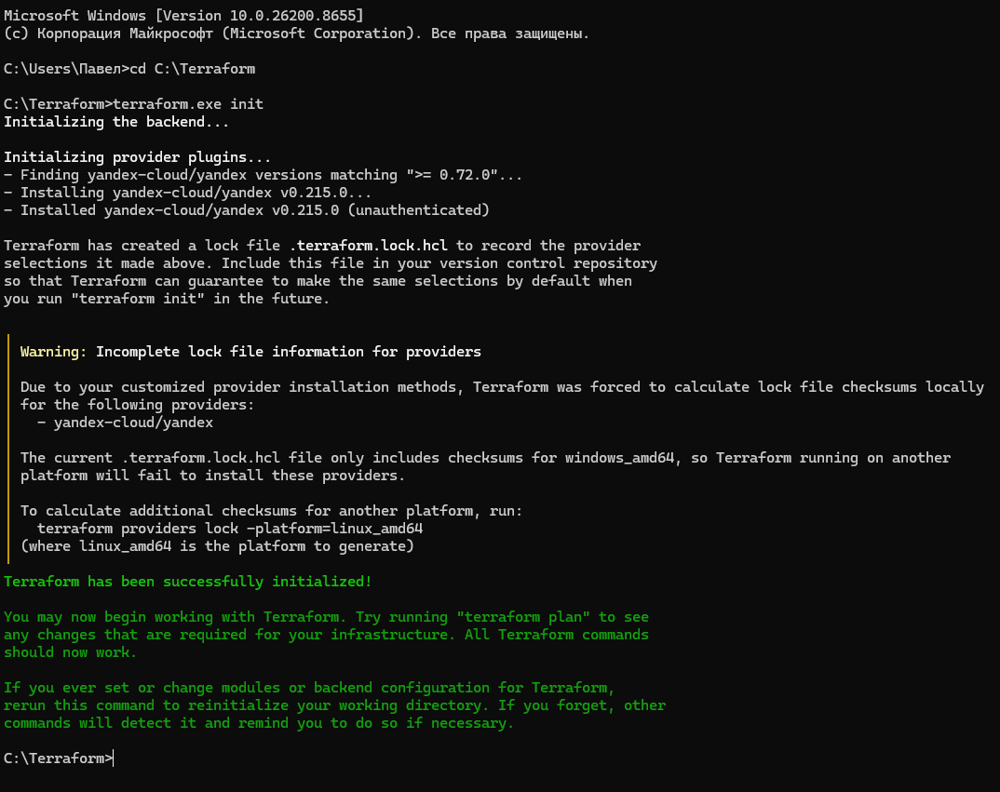

#### 1.5 Смотрим план изменений Terraform
```
terraform plan
```

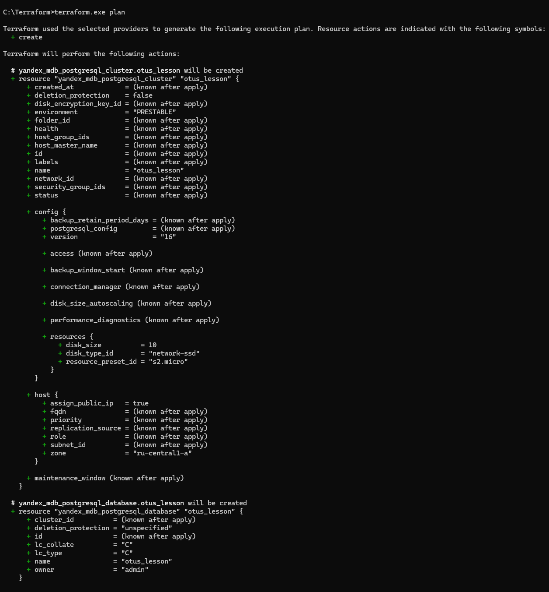

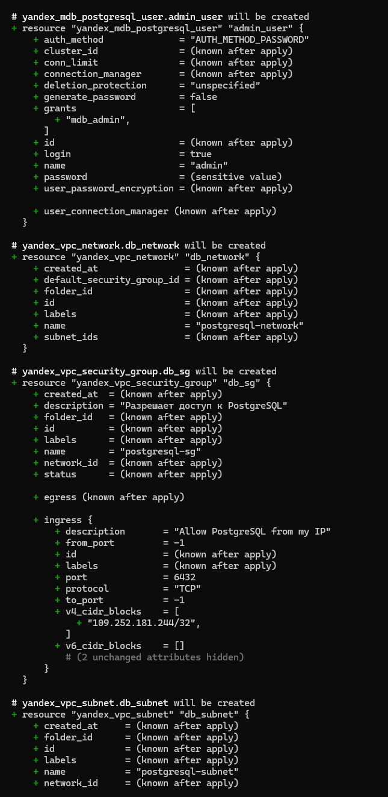

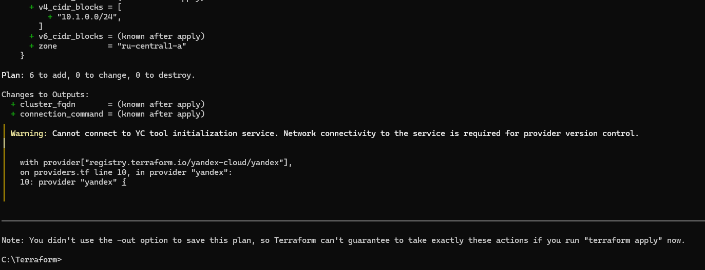

#### 1.6 Применяем изменения Terraform
```
terraform apply
```

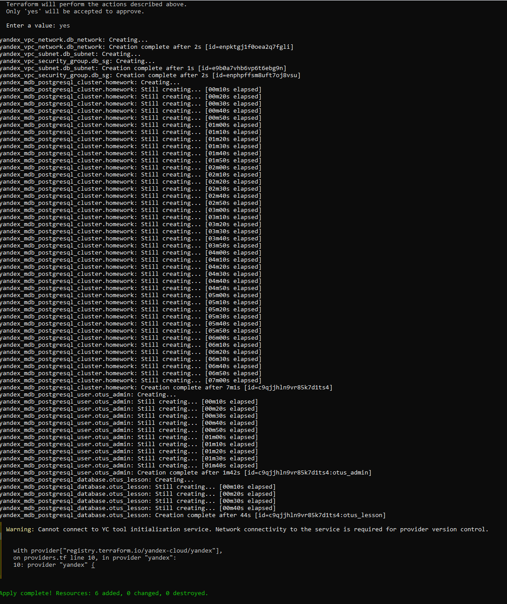


#### 1.7 Смотрим через Terraform fqdn кластера
```
terraform output cluster_fqdn
```

#### 1.8 Подлкючаемся к БД

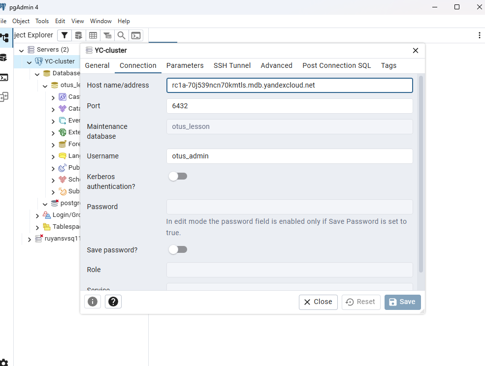

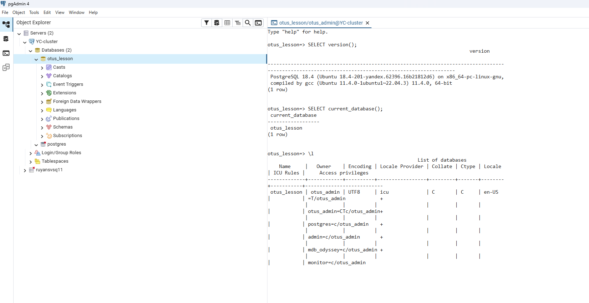

### 2. Задание со здвездочкой
#### 2.1 Добавляем в конфигруационный файл main.tf автомаштабирование для диска
```
# main.tf
 disk_size_autoscaling {
      disk_size_limit = 20
      planned_usage_threshold = 80
    }
  }
  maintenance_window {
    type = "WEEKLY"
    day  = "SAT"   
    hour = 3            
  }
}
```
#### 2.2 Применяем настройки
```
terraform plan
terraform apply
```

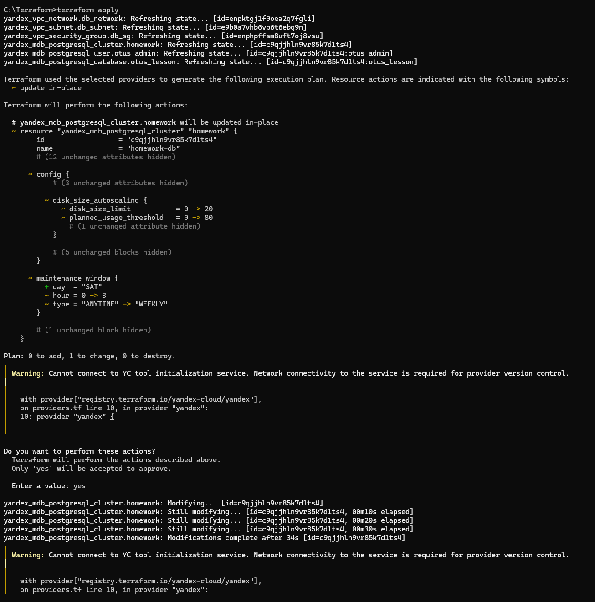

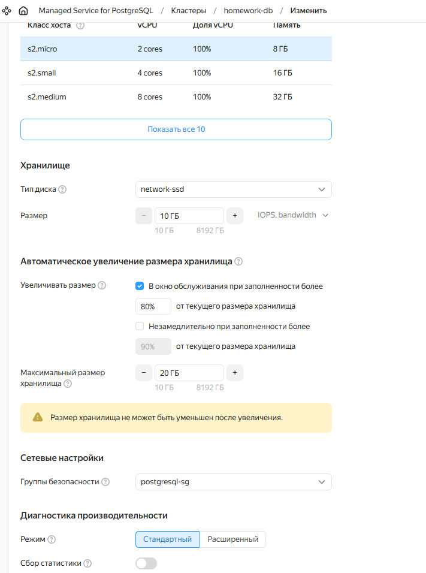

### 3. Даем права коллеге на подключение
#### 3.1 В конфиге main.tf добавляем в секцию ip коллеги
 ```
   ingress {
    description    = "Allow PostgreSQL from my IP"
    protocol       = "TCP"
    port           = 6432
    v4_cidr_blocks = [
	  "109.252.181.244/32",
	  "2.26.16.233/32"
	]  
  }
}
 ```

#### 3.2 Применяем настройки
```
terraform plan
terraform apply
```

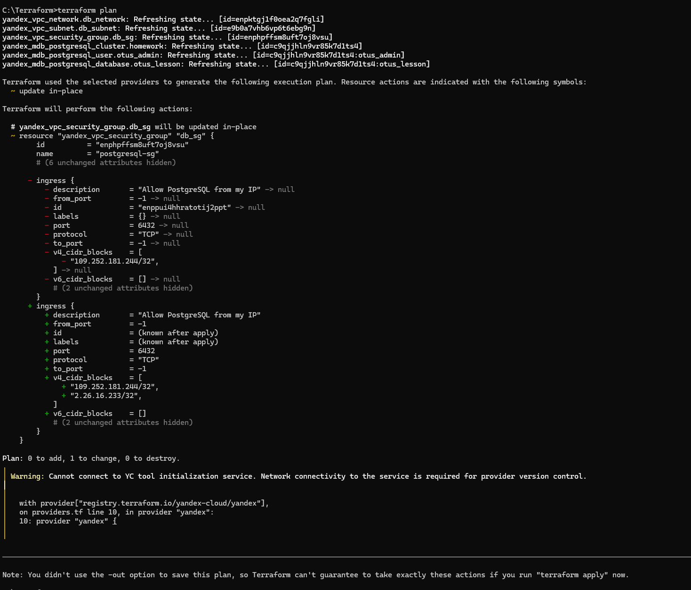

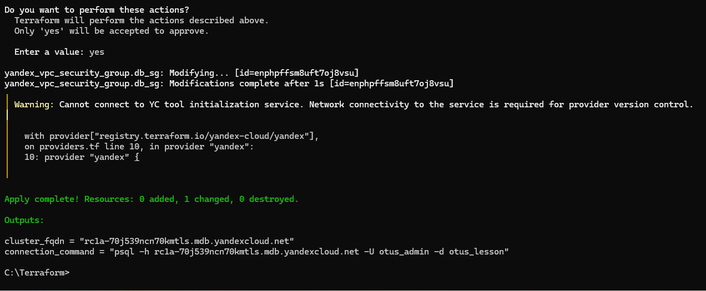