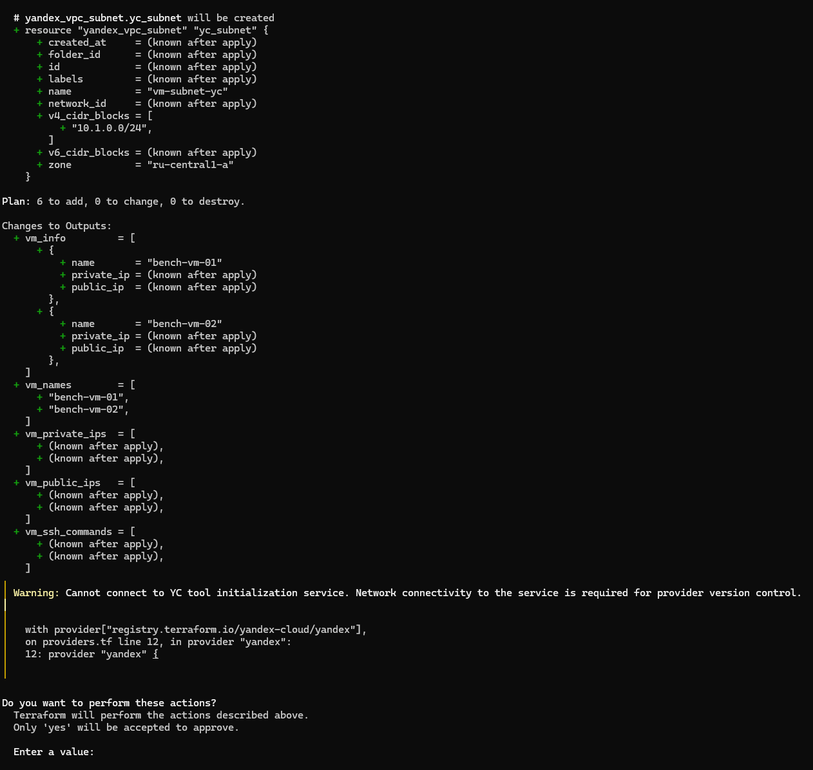
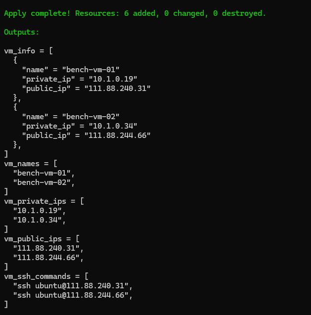
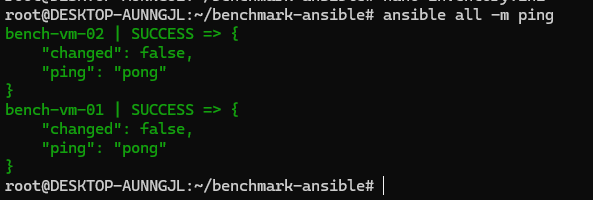
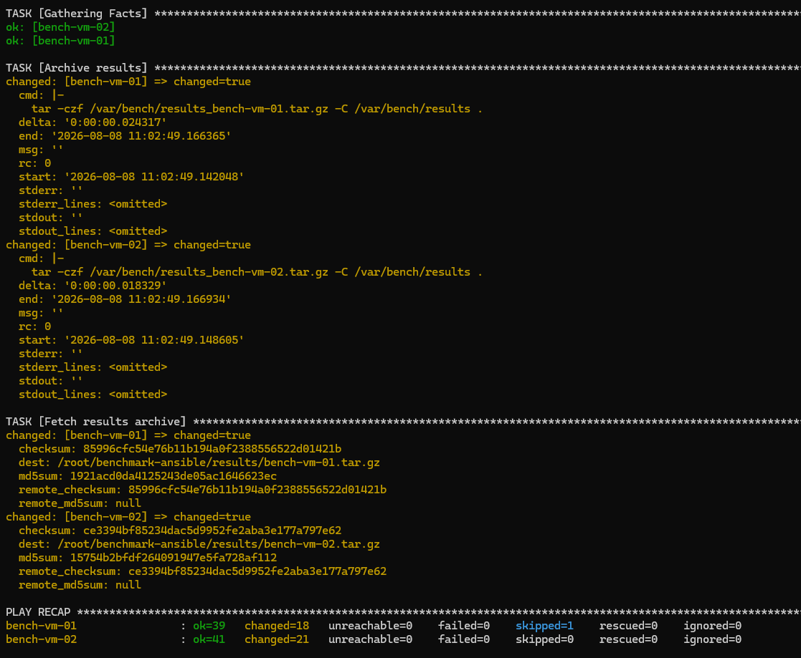
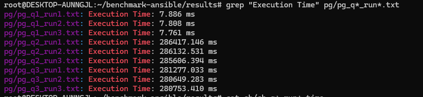
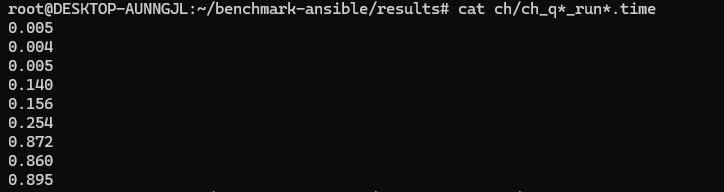

# Домашнее задание N10: Хранилище, которое выстояло

## Информация о проекте
- **Название ВМ:** bananaflow-30081986
- **Дата выполнения:** 2026-08-08
- **Версия PostgreSQL:** 18
- **ClickHouse:** 26.7.3.19

## 1. Цель
Сравнить производительность строковой (PostgreSQL) и колоночной (ClickHouse) СУБД
на аналитических запросах при объёме данных ~12 ГБ (100 млн строк).

## 2. Стенд и системные условия

| Параметр | Значение |
|---|---|
| Облако / зона | Yandex Cloud, `ru-central1-a` |
| ВМ | 2 идентичные: `bench-vm-01` (PostgreSQL), `bench-vm-02` (ClickHouse) |
| CPU / RAM | 4 vCPU / 8 GB RAM (каждая ВМ) |
| Диск | 80 ГБ, network-ssd (каждая ВМ) |
| ОС | Ubuntu 22.04 LTS |
| СУБД-1 | PostgreSQL 18.4 (пакеты PGDG) |
| СУБД-2 | ClickHouse 26.7.3.19 (официальный репозиторий) |
| Инфраструктура | Terraform (Yandex provider 0.215.0) |
| Автоматизация эксперимента | Ansible |
| Сеть | общая подсеть 10.1.0.0/24; SSH  с моего ip |

**Настройки PostgreSQL:** `shared_buffers=2GB`, `effective_cache_size=6GB`, `work_mem=256MB`, `maintenance_work_mem=1GB`, `max_parallel_workers_per_gather=4`, `max_parallel_maintenance_workers=4`, `jit=off`, `random_page_cost=1.1`

**Настройки ClickHouse:** `max_threads=4`, `max_memory_usage=6GB`

**Методика измерений:** перед замерами один прогревочный прогон (warmup), затем 3 измерительных прогона; в таблицу идёт среднее время. Во время замеров посторонней нагрузки на ВМ не было


## 3. Настраиваем terraform для YandexCloud
#### 3.1 В каталоге %appdata% создаем файл terraform.rc с содержимым
```
provider_installation {
  filesystem_mirror {
    path    = "C:/Terraform/terraform.d/plugins"
    include = ["*/*"]
  }
}
```

#### 3.2 В директории Terraform создаем файлы (locals.tf, main.tf, outputs.tf, providers.tf, variables.tf, terraform.tfvars) --> (по умолчанию C:\Terraform)

- [locals.tf](image/locals.tf)
- [main.tf](image/locals.tf)
- [outputs.tf](image/outputs.tf)
- [providers.tf](image/providers.tf)
- [variables.tf](image/variables.tf)
- [terraform.tfvars](image/terraform.tfvars)

[terraform_init](image/terraform_init.png)





#### 3.3 Настраиваем ansible
- [ansible.cfg](image/ansible.cfg)
- [inventory.ini](image/inventory.ini)
- [all](image/all.yml)
- [install_ch.yml](image/install_ch.yml)
- [install_pg.yml](image/install_pg.yml)
- [load_ch.yml](image/load_ch.yml)
- [load_pg.yml](image/load_pg.yml)
- [benchmark_ch.yml](image/benchmark_ch.yml)
- [benchmark_pg.yml](image/benchmark_pg.yml)
- [generate_data.yml](image/generate_data.yml)
- [fetch_results.yml](image/fetch_results.yml)
- [site.yml](image/site.yml)
- [log](image/ansible.log)





## 4. Данные

### 4.1. Схема

```sql
users (
    user_id      INTEGER,   -- 1..1 000 000
    age          SMALLINT,
    country_code CHAR(2),   -- RU/US/DE/FR/CN/IN/BR/TR
    signup_date  DATE
)

events (
    event_id    BIGINT,     -- 0..99 999 999
    user_id     INTEGER,    -- FK-подобная связь с users
    event_time  TIMESTAMP,  -- диапазон ~20 месяцев: 2025-01-01 … 2026-08
    event_type  TEXT,       -- view/search/click/cart/purchase/refund/login/logout
    category_id INTEGER,    -- 1..1000
    price_cents INTEGER,    -- 100..1 000 099
    payload     TEXT        -- 64 символа, балласт для объёма
)
```

### 4.2. Объём

| Объект | Строк | Объём CSV |
|---|---:|---:|
| users | 1 000 000 | ~30 МБ |
| events | 100 000 000 | ~12 ГБ (10 файлов по 10 млн строк) |
| **Итого на каждом узле** | **101 000 000** | **12 ГБ** |

Объём 12 ГБ попадает в требуемый диапазон 10–100 ГБ.

### 4.3. Идентичность данных

Данные генерировались **детерминированным** способом (все поля чистые функции от `event_id`, без ГСЧ), поэтому на обеих ВМ были сгенерированы **побайтово одинаковые** CSV-файлы. Контроль: `count(*)` в обеих СУБД совпал — 100 000 000 событий и 1 000 000 пользователей.

Генерация на каждом узле заняла ~4 минуты (10 партиций по ~20–30 секунд).

### 4.4. Физические схемы хранения

**PostgreSQL** (heap-таблица + индексы, созданные после загрузки):

```sql
ALTER TABLE users ADD PRIMARY KEY (user_id);
CREATE INDEX events_cat_time_idx ON events (category_id, event_time) INCLUDE (price_cents);
CREATE INDEX events_time_brin    ON events USING brin (event_time);
```

**ClickHouse** (MergeTree, партиционирование по месяцу, первичный ключ под аналитику):

```sql
ENGINE = MergeTree
PARTITION BY toYYYYMM(event_time)
ORDER BY (category_id, event_time, event_id)
```

## 5. Механизмы загрузки и их сравнение

| Этап | PostgreSQL | ClickHouse |
|---|---|---|
| Механизм | серверный `COPY` из CSV | `INSERT INTO … FORMAT CSV` |
| users, 1 поток | 1.0 с | 0.6 с |
| events, 100 млн строк | параллельный `COPY`: 4 потока через `xargs -P 4` | параллельный `INSERT FORMAT CSV`: 4 потока через `xargs -P 4` |
| Время загрузки events | **17 мин 59 с** | **5 мин 44 с** |
| Пост-обработка | `PRIMARY KEY` + 2 индекса + `ANALYZE`: **26 мин 07 с** | не требуется (фоновые merge-процессы) |
| Итого подготовка к запросам | **~44 минуты** | **~6 минут** |

Наблюдения:

1. **ClickHouse загрузил тот же объём в ~3.1 раза быстрее** (5 мин 44 с против 17 мин 59 с) при одинаковой схеме параллелизма (4 потока).
2. Для PostgreSQL после загрузки потребовалось **26 минут** на построение индексов и сбор статистики — без них аналитические запросы деградируют до последовательного сканирования. Для ClickHouse отдельная пост-обработка не нужна: порядок данных задаётся ключом `ORDER BY` при вставке.
3. Однопоточная загрузка малой таблицы `users` сопоставима по скорости (1.0 с против 0.6 с) — разница проявляется именно на больших объёмах.

## 6. Тестовые запросы

### Q1 Фильтрация (точечный отчёт)

```sql
-- PostgreSQL
SELECT count(*)
FROM events
WHERE category_id = 42
  AND event_time >= TIMESTAMP '2026-01-01 00:00:00'
  AND event_time <  TIMESTAMP '2026-02-01 00:00:00'
  AND price_cents > 10000;

-- ClickHouse
SELECT count()
FROM events
WHERE category_id = 42
  AND event_time >= toDateTime('2026-01-01 00:00:00')
  AND event_time <  toDateTime('2026-02-01 00:00:00')
  AND price_cents > 10000;
```

### Q2 Агрегация (отчёт по категориям и месяцам)

```sql
-- PostgreSQL
SELECT category_id,
       date_trunc('month', event_time) AS month,
       count(*) AS cnt,
       sum(price_cents) AS sum_cents,
       avg(price_cents)::numeric(12,2) AS avg_cents
FROM events
WHERE event_time >= TIMESTAMP '2026-01-01 00:00:00'
  AND event_time <  TIMESTAMP '2026-04-01 00:00:00'
GROUP BY 1, 2
ORDER BY 1, 2;

-- ClickHouse
SELECT category_id,
       toStartOfMonth(event_time) AS month,
       count() AS cnt,
       sum(price_cents) AS sum_cents,
       avg(price_cents) AS avg_cents
FROM events
WHERE event_time >= toDateTime('2026-01-01 00:00:00')
  AND event_time <  toDateTime('2026-04-01 00:00:00')
GROUP BY category_id, month
ORDER BY category_id, month;
```

### Q3 Соединение + агрегация (отчёт по странам и типам событий)

```sql
-- PostgreSQL
SELECT u.country_code, e.event_type,
       count(*) AS cnt, sum(e.price_cents) AS sum_cents
FROM events e
JOIN users u USING (user_id)
WHERE e.event_time >= TIMESTAMP '2026-01-01 00:00:00'
  AND e.event_time <  TIMESTAMP '2026-04-01 00:00:00'
GROUP BY 1, 2
ORDER BY cnt DESC
LIMIT 20;

-- ClickHouse
SELECT u.country_code, e.event_type,
       count() AS cnt, sum(e.price_cents) AS sum_cents
FROM events AS e
INNER JOIN users AS u ON e.user_id = u.user_id
WHERE e.event_time >= toDateTime('2026-01-01 00:00:00')
  AND e.event_time <  toDateTime('2026-04-01 00:00:00')
GROUP BY u.country_code, e.event_type
ORDER BY cnt DESC
LIMIT 20;
```

## 7. Результаты

### 7.1. Время выполнения запросов (среднее по 3 прогонам после warmup)

| Запрос | PostgreSQL | ClickHouse | Соотношение |
|---|---:|---:|---|
| Q1 фильтрация | **0.05 с** | 0.07 с | PG ≈ CH (PG чуть быстрее) |
| Q2 агрегация | 286 с (4 мин 46 с) | **0.24 с** | **CH быстрее ≈ 1180×** |
| Q3 join + агрегация | 281 с (4 мин 41 с) | **0.93 с** | **CH быстрее ≈ 300×** |

Прогревочные прогоны (холодный старт): PG Q1 — 5.1 с, PG Q2 — 4 мин 45 с, PG Q3 — 4 мин 40 с; CH Q1 — 0.10 с, CH Q2 — 0.49 с, CH Q3 — 1.03 с.

### 7.2. Дополнительное измерение: полный скан таблицы

| Операция | PostgreSQL | ClickHouse | Соотношение |
|---|---:|---:|---|
| `SELECT count(*) FROM events` (вся таблица, 100 млн строк) | 4 мин 37 с | 0.08 с | **CH быстрее ≈ 3600×** |

### 7.3. Сводная таблица всех этапов

| Этап | PostgreSQL | ClickHouse |
|---|---:|---:|
| Генерация CSV (12 ГБ) | ~4 мин | ~4 мин |
| Загрузка users (1 млн) | 1.0 с | 0.6 с |
| Загрузка events (100 млн) | 17 мин 59 с | 5 мин 44 с |
| Индексы + ANALYZE | 26 мин 07 с | - |
| Q1 | 0.05 с | 0.07 с |
| Q2 | 286 с | 0.24 с |
| Q3 | 281 с | 0.93 с |
| count(*) по всей таблице | 277 с | 0.08 с |

## 8. Анализ планов выполнения

Полные планы в файлах результатов 
**PostgreSQL:**
[pg_q1_run1.txt](image/pg_q1_run1.txt)
[pg_q1_run1.txt](image/pg_q1_run2.txt)
[pg_q1_run1.txt](image/pg_q1_run3.txt)
[pg_q1_run2.txt](image/pg_q1_run1.txt)
[pg_q1_run2.txt](image/pg_q1_run2.txt)
[pg_q1_run2.txt](image/pg_q1_run3.txt)
[pg_q1_run3.txt](image/pg_q1_run1.txt)
[pg_q1_run3.txt](image/pg_q1_run2.txt)
[pg_q1_run3.txt](image/pg_q1_run3.txt)



**ClickHouse:**
[ch_q1_plan.txt](image/ch_q1_plan.txt)
[ch_q2_plan.txt](image/ch_q2_plan.txt)
[ch_q3_plan.txt](image/ch_q3_plan.txt)



**PostgreSQL:**

- **Q1** выполняется за доли секунды благодаря покрывающему индексу `events_cat_time_idx (category_id, event_time) INCLUDE (price_cents)` план типа Index Only/Bitmap Index Scan: таблица не читается целиком. Это объясняет, почему на Q1 PostgreSQL не уступает ClickHouse.
- **Q2 и Q3** требуют чтения десятков миллионов строк: планировщик выбирает (Parallel) Seq Scan по heap-таблице, агрегацию и Hash Join. Строковое хранение читает все колонки строки целиком, включая бесполезный для запроса `payload`, поэтому время измеряется минутами.
- Полный `count(*)` по таблице последовательное сканирование 100 млн строк (4 мин 37 с).

**ClickHouse:**

- **Q1** использует разреженный первичный ключ `(category_id, event_time)`: читаются только гранулы, попадающие в диапазон, и только нужные колонки.
- **Q2/Q3** читают лишь необходимые колонки (`event_time`, `category_id`, `price_cents`, `user_id`, `event_type`) в 4 потока, агрегация выполняется векторизованно по колонкам; join с `users` hash join в памяти. Отсутствие чтения `payload` и сжатое колоночное хранение дают ускорение в сотни и тысячи раз.
- `count()` по всей таблице берётся из метаданных/минимальным проходом по одной колонке 0.08 с.

**Главный вывод по планам:** на узкоселективных запросах с правильно подобранным индексом строковая СУБД конкурентна; на широких сканированиях и агрегациях колоночное хранение безальтернативно быстрее.

## 9. Проблемы, с которыми столкнулcя

1. **Ansible + `become_user: postgres`** на Ubuntu 22.04 падал с ошибкой `chmod: invalid mode: 'A+user:postgres:rx:allow'` - в образе не было пакета `acl`. Решено установкой `acl` и переходом на схему `root + sudo -u postgres` внутри shell-задач.
2. **Долгие операции** (загрузка 100 млн строк, построение индексов, тяжёлые запросы) превышали обычные таймауты SSH-задач - в Ansible использован режим `async/poll`.
3. **Построение индексов в PostgreSQL** заняло 26 минут это необходимо закладывать в план работ: строковая СУБД требует обслуживания индексов после массовой загрузки.
4. **Параллельная вставка в ClickHouse** создаёт несколько частей данных, которые затем сливаются фоновыми процессами при более агрессивном параллелизме возможен эффект «too many parts» - параллелизм был ограничен 4 потоками.
5. **Диск 80 ГБ** потребовал контролировать объёмы: 12 ГБ CSV + данные PostgreSQL с индексами + данные ClickHouse помещаются, но для 100 ГБ датасета диск пришлось бы увеличивать.

## 10. Что удобно, что нет

**PostgreSQL:**
- (+) привычный SQL, зрелый планировщик, `EXPLAIN (ANALYZE, BUFFERS)` с исчерпывающей диагностикой;
- (+) покрывающие индексы и BRIN дают отличную точечную производительность;
- (−) массовая загрузка и построение индексов на 100 млн строк занимают десятки минут;
- (−) аналитические сканирования читают строки целиком, включая ненужные колонки.

**ClickHouse:**
- (+) загрузка и агрегации на порядок быстрее;
- (+) схема «порядок данных = порядок запросов» (`ORDER BY` в MergeTree) избавляет от отдельного индексного обслуживания;
- (+) сильное сжатие данных;
- (−) не подходит для точечных обновлений/транзакций;
- (−) join-ы и точечные запросы «не по ключу» требуют осознанного проектирования схемы.

## 11. Выводы

1. На аналитических запросах (агрегация, join, широкие сканы) **ClickHouse быстрее PostgreSQL в 300–3600 раз** при одинаковом железе и одинаковых данных (100 млн строк, 12 ГБ).
2. На узкоселективном запросе с правильно подобранным индексом **PostgreSQL конкурентен и даже немного быстрее** (0.05 с против 0.07 с) для точечных отчётов строковая СУБД с индексами остаётся отличным выбором.
3. Загрузка данных: ClickHouse **5 мин 44 с** против **17 мин 59 с** у PostgreSQL при одинаковой параллельной схеме (4 потока); с учётом построения индексов подготовка PostgreSQL к работе заняла ~44 минуты против ~6 минут у ClickHouse.
4. **Рекомендация для задачи Ирины:** для большого массива данных (от 100 ГБ) и отчётных агрегаций выбирать **ClickHouse**; PostgreSQL оставлять как операционную систему для транзакционных нагрузок. Оптимальна гибридная схема: операционные данные - в PostgreSQL, аналитическая копия - в ClickHouse.

---

## Приложение А. Хронология эксперимента

| Время | Событие |
|---|---|
| 09:19–09:20 | Установка и настройка PostgreSQL 18.4 и ClickHouse 26.7.3 |
| 09:20:40–09:24:43 | Генерация 12 ГБ CSV на обоих узлах |
| 09:25:07 | PostgreSQL: загрузка users (1.0 с) |
| 09:25:38–09:43:37 | PostgreSQL: параллельная загрузка events (17 мин 59 с) |
| 09:43:43–10:09:50 | PostgreSQL: индексы + ANALYZE (26 мин 07 с) |
| 10:15:02 | ClickHouse: загрузка users (0.6 с) |
| 10:15:34–10:21:18 | ClickHouse: параллельная загрузка events (5 мин 44 с) |
| 10:21:49–11:00:27 | Прогоны бенчмарка PostgreSQL (warmup + 3×3 запроса) |
| 11:01:05–11:02:16 | Прогоны бенчмарка ClickHouse (warmup + 3×3 запроса) |
| 11:02:49 | Сбор результатов на локальную машину |


