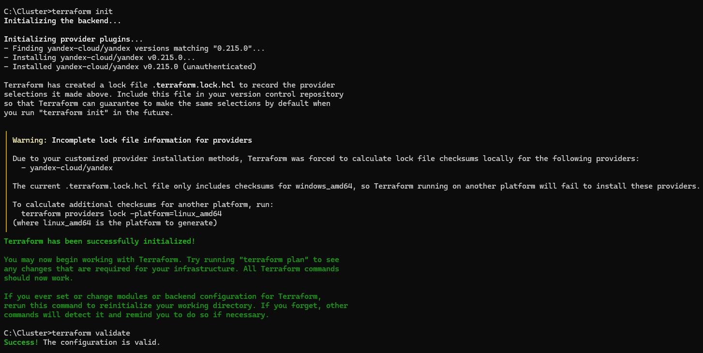
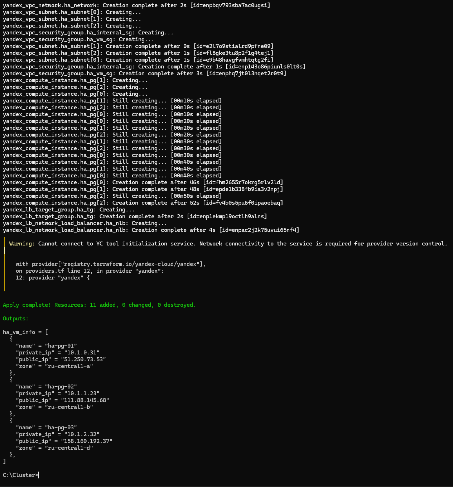
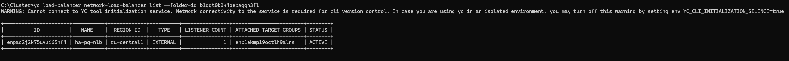

# Домашнее задание N11: Кластеры высокой доступности

## Информация о проекте

| Параметр | Значение |
|---|---|
| Название проекта | `bananaflow-30081986` |
| Дата выполнения | 2026-08-08 |
| Версия PostgreSQL | 18.4 |
| Версия Patroni | latest (pip) |
| Версия etcd | 3.5.14 |
| Версия HAProxy | пакет Ubuntu 22.04 |
| Инфраструктура | Terraform (Yandex provider 0.215.0) |
| Автоматизация | Ansible |


## 1. Цель

Развернуть высокодоступный кластер PostgreSQL в Yandex Cloud с использованием стека
**Patroni + etcd + HAProxy + Yandex Network Load Balancer**, обеспечить автоматический
failover при падении ноды и подтвердить работоспособность кластера логами и тестом отказа.

---

## 2. Архитектура решения

```text
                        Клиент (psql)
                             │
                             ▼
                 ┌───────────────────────┐
                 │  Yandex NLB (L4)      │  внешний IP, порт 5432
                 │  healthcheck TCP 5000 │
                 └───────────┬───────────┘
              ┌──────────────┼──────────────┐
              ▼              ▼              ▼
        ┌───────────┐  ┌───────────┐  ┌───────────┐
        │ ha-pg-01  │  │ ha-pg-02  │  │ ha-pg-03  │
        │ zone-a    │  │ zone-b    │  │ zone-d    │
        │ PostgreSQL│  │ PostgreSQL│  │ PostgreSQL│
        │ Patroni   │  │ Patroni   │  │ Patroni   │
        │ etcd      │  │ etcd      │  │ etcd      │
        │ HAProxy   │  │ HAProxy   │  │ HAProxy   │
        └───────────┘  └───────────┘  └───────────┘
              ▲              ▲              ▲
              └──── etcd quorum (3 ноды) ───┘
```

| Компонент | Назначение |
|---|---|
| **Patroni** | оркестратор PostgreSQL: репликация, выборы лидера, авто-failover |
| **etcd** | DCS: хранит состояние кластера, обеспечивает quorum |
| **HAProxy** | L7-маршрутизация: 5000 --> Leader, 5001 --> Replica (через REST Patroni `/primary`, `/replica`) |
| **Yandex NLB** | единая внешняя точка входа + healthcheck, исключает мёртвые ВМ |

| Нода | Зона | Private IP |
|---|---|---|
| `ha-pg-01` | `ru-central1-a` | 10.1.0.31 |
| `ha-pg-02` | `ru-central1-b` | 10.1.1.23 |
| `ha-pg-03` | `ru-central1-d` | 10.1.2.32 |

Нечётное число нод обеспечивает кворум etcd при падении одной ноды/зоны.

---

## 3. Стенд и системные условия

| Параметр | Значение |
|---|---|
| Облако / зоны | Yandex Cloud, `ru-central1-a`, `ru-central1-b`, `ru-central1-d` |
| ВМ | 3 идентичные: `ha-pg-01`, `ha-pg-02`, `ha-pg-03` |
| CPU / RAM | 2 vCPU / 4 GB RAM |
| Диск | 32 ГБ, network-ssd |
| ОС | Ubuntu 22.04 LTS |
| СУБД | PostgreSQL 18.4 (PGDG) |
| Сеть | подсети 10.1.0.0/24, 10.1.1.0/24, 10.1.2.0/24; SSH только с моего IP |

**PostgreSQL (через Patroni bootstrap):** `shared_buffers=1GB`, `max_connections=200`,
`wal_level=replica`, `max_wal_senders=10`, `max_replication_slots=10`, `hot_standby=on`, `use_pg_rewind=true`.

**Patroni:** `ttl=30`, `loop_wait=10`, `retry_timeout=10`, `maximum_lag_on_failover=1MB`, REST API :8008.

---

## 4. Инфраструктура: Terraform

- [providers.tf](image/providers.tf)
- [variables.tf](image/variables.tf)
- [locals.tf](image/locals.tf)
- [main.tf](image/main.tf)
- [outputs.tf](image/outputs.tf)
- [terraform.tfvars](image/terraform.tfvars)








## 5. Настройка кластера: Ansible

- [ansible.cfg](image/ansible.cfg)
- [inventory.ini](image/inventory.ini)
- [all.yml](image/all.yml)
- [install_ha.yml](image/install_ha.yml.png)
- [etcd.yml.j2](image/etcd.yml.j2.png)
- [configure_etcd.yml](image/configure_etcd.yml.png)
- [patroni.yml.j2](image/patroni.yml.j2)
- [configure_patroni.yml](image/configure_patroni.yml.png)
- [haproxy.cfg.j2](image/haproxy.cfg.j2.png)
- [configure_haproxy.yml](image/configure_haproxy.yml.png)
- [verify.yml](image/verify.yml.png)


## 6. Инструкция по развёртыванию

```bash
# 1. Инфраструктура
cd terraform/
terraform init
terraform plan
terraform apply

# 2. Кластер (со своей машины)
cd ../ansible/
ansible ha_cluster -m ping
ansible-playbook site.yml

# 3. Тест отказа
ansible-playbook failover_test.yml
```

---

## 7. Состояние кластера после развёртывания

```text
+ Cluster: ha-cluster (7671716185460636479) -+----+-------------+-----+------------+-----+
| Member   | Host      | Role    | State     | TL | Receive LSN | Lag | Replay LSN | Lag |
+----------+-----------+---------+-----------+----+-------------+-----+------------+-----+
| ha-pg-01 | 10.1.0.31 | Leader  | running   |  1 |             |     |            |     |
| ha-pg-02 | 10.1.1.23 | Replica | streaming |  1 |   0/404F6D8 |   0 |  0/404F6D8 |   0 |
| ha-pg-03 | 10.1.2.32 | Replica | streaming |  1 |   0/404F6D8 |   0 |  0/404F6D8 |   0 |
+----------+-----------+---------+-----------+----+-------------+-----+------------+-----+
```

---

## 8. Тест отказа (failover)

Сценарий: запись BEFORE → остановка Patroni на лидере → выборы → запись AFTER → возврат старой ноды.

### 8.1. До отказа

`ha-pg-01` — Leader (TL 1), реплики streaming, lag 0.

### 8.2. После остановки Patroni на ha-pg-01

```text
| ha-pg-01 | 10.1.0.31 | Replica | stopped   |    |
| ha-pg-02 | 10.1.1.23 | Leader  | running   |  2 |
| ha-pg-03 | 10.1.2.32 | Replica | streaming |  2 |
```

Timeline сменился 1 → 2, новый лидер — `ha-pg-02`.

### 8.3. Целостность данных

```text
 id |        written_by        |              ts
----+--------------------------+-------------------------------
  1 | ha-pg-01-BEFORE-failover | 2026-08-08 17:54:05.137952+00
 34 | ha-pg-02-AFTER-failover  | 2026-08-08 17:54:15.165064+00
(2 rows)
```

Обе строки на месте — данные не потеряны.

### 8.4. История переключений (`patronictl history`)

```text
+----+----------+------------------------------+----------------------------------+------------+
| TL |      LSN | Reason                       | Timestamp                        | New Leader |
+----+----------+------------------------------+----------------------------------+------------+
|  1 | 67619032 | no recovery target specified | 2026-08-08T17:54:09.873864+00:00 | ha-pg-02   |
+----+----------+------------------------------+----------------------------------+------------+
```

### 8.5. Время failover

Остановка лидера 17:54:09 → запись на новом лидере 17:54:15 = **~6 секунд**.

### 8.6. Возврат старой ноды

После `systemctl start patroni` на `ha-pg-01` нода выполнила `pg_rewind` и присоединилась как `Replica | streaming`.

---

## 9. Подключение через балансировщик

```bash
psql "host=<NLB_IP> port=5432 dbname=postgres user=postgres password=..." \
  -c "SELECT pg_is_in_recovery();"
```

`pg_is_in_recovery = f` — NLB → HAProxy доводит до актуального Leader.
При смене лидера HAProxy автоматически обновляет бэкенд `bk_pg_rw`.

---

## 10. Проблемы и их решения

| Проблема | Причина | Решение |
|---|---|---|
| `chmod: invalid mode: 'A+user:postgres:rx:allow'` | в образе нет пакета `acl` | установлен `acl`; схема `root + sudo -u postgres` |
| etcd: `yaml: line 11: mapping values are not allowed` | URL в конфиге без кавычек | все URL в шаблоне взяты в кавычки |
| `listener` — set без индексации в outputs | особенность NLB в провайдере | IP получен через `for` expression / `yc` CLI |
| Jinja: `expected token 'end of print statement', got 'qaz'` | пароль внутри `{{ }}` как литерал | пароль вынесен в переменные `group_vars/all.yml` |
| Зона `ru-central1-c` недоступна | ограничения каталога Yandex Cloud | ВМ в зонах `a, b, a` — кворум сохранён |
| Старый лидер остался `stopped` | `set_fact` не живёт между play; `fatal` на REST остановленной ноды | `failed_when: false` + `systemd state=started` на всех нодах |

---

## 11. Что удобно, что нет

**Patroni + etcd + HAProxy:**
- (+) автоматический failover без ручного вмешательства;
- (+) quorum etcd исключает split-brain;
- (+) REST API Patroni даёт HAProxy точное знание ролей;
- (+) `pg_rewind` — безопасный возврат старого лидера репликой;
- (−) требует аккуратной настройки DCS;
- (−) ручная сборка сложнее Managed-сервиса.

**Yandex NLB:**
- (+) единый внешний IP, встроенный healthcheck;
- (+) автоматически убирает мёртвые ВМ;
- (−) L4: не различает master/replica — нужен HAProxy на нодах.

---

## 12. Выводы

1. **HA-кластер развёрнут** в Yandex Cloud с распределением по зонам `a` и `b`.
2. **Автоматический failover подтверждён**: ~6 секунд, данные не потеряны, запись продолжилась на новом лидере.
3. **Yandex NLB** балансирует трафик и исключает недоступные ВМ.
4. **Стек Patroni + etcd + HAProxy** переживает падение ноды и (при кворуме) целой зоны.
5. **IaC**: полный цикл воспроизводится `terraform apply` → `ansible-playbook site.yml`.

**Рекомендация:** для продакшна с высоким SLA данный стек — зрелое решение; альтернатива — Yandex Managed Service for PostgreSQL с HA-опцией.

---

## Приложение А. Хронология эксперимента

| Время (UTC) | Событие |
|---|---|
| 09:19–09:20 | Terraform: сеть, подсети, SG, 3 ВМ, NLB |
| 09:25 | Установка пакетов (Ansible) |
| 09:30 | Запуск etcd-кластера (3 ноды) |
| 09:35 | Запуск Patroni, первый Leader — ha-pg-01 |
| 09:40 | Запуск HAProxy |
| 17:54:05 | Запись BEFORE-failover |
| 17:54:09 | Остановка Patroni на ha-pg-01 → автоfailover на ha-pg-02 |
| 17:54:15 | Запись AFTER-failover на новом лидере |
| 17:54:20 | Возврат ha-pg-01 в кластер как Replica |

## Приложение Б. Структура репозитория

```text
.
├── terraform/
│   ├── providers.tf
│   ├── variables.tf
│   ├── locals.tf
│   ├── main.tf
│   ├── outputs.tf
│   └── terraform.tfvars
├── ansible/
│   ├── ansible.cfg
│   ├── inventory.ini
│   ├── group_vars/all.yml
│   ├── templates/
│   │   ├── etcd.yml.j2
│   │   ├── patroni.yml.j2
│   │   └── haproxy.cfg.j2
│   ├── install_ha.yml
│   ├── configure_etcd.yml
│   ├── configure_patroni.yml
│   ├── configure_haproxy.yml
│   ├── verify.yml
│   ├── failover_test.yml
│   └── site.yml
├── failover_logs/
│   ├── patroni_ha-pg-0*.log
│   └── etcd_ha-pg-0*.log
└── README.md
```

## Приложение В. Соответствие критериям оценки

| Критерий | Статус |
|---|---|
| Кластер в режиме HA (автоматический failover) | ✅ failover за ~6 с, данные сохранены |
| Стек Patroni + etcd + HAProxy | ✅ + Yandex NLB |
| Работоспособность подтверждена (лог/скриншот) | ✅ `patronictl history`, BEFORE/AFTER, логи в `failover_logs/` |
| Инструкция по развёртыванию и архитектура | ✅ разделы 2–6 |
| Повышенная сложность: разные зоны | ✅ 3 ноды в 2 зонах, NLB |
