# Домашнее задание N12: Мульти-мастер кластер

## Информация о проекте
- **Название ВМ:** bananaflow-30081986
- **Дата выполнения:** 2026-08-29
- **Версия PostgreSQL:** 18

---

## 1. Цель работы

Развернуть мульти-мастер кластер CockroachDB v26.2.0 на 3 нодах в разных зонах доступности Yandex Cloud, мигрировать данные из PostgreSQL, провести сравнительный бенчмарк и доказать отказоустойчивость кластера.

---

## 2. Архитектура стенда

### 2.1. Схема архитектуры

```text
┌─────────────────────────────────────────────────────────────────┐
│                     Yandex Cloud (ru-central1)                  │
│                                                                 │
│   ┌───────────────┐      ┌──────────────────────────────────┐   │
│   │  pg-source    │      │     CockroachDB Cluster v26.2.0  │   │
│   │  PostgreSQL   │      │                                  │   │
│   │  18, 4 CPU,   │      │   ┌──────────┐  ┌──────────      │   │
│   │  8 GB RAM     │ HTTP │   │ crdb-01  │  │ crdb-02  │     │   │
│   │               │----->│   │ us-east  │  │us-central│     │   │
│   │  40M строк    │ CSV  │   │10.1.0.25 │  │10.1.1.34 │     │   │
│   │  ~8.4 ГБ      │      │   └──────────┘  └──────────      │   │
│   └───────────────┘      │         ▲              ▲         │   │
│                          │         │   Raft       │         │   │
│                          │         ▼              │         │   │
│                          │   ┌──────────┐         │         │   │
│                          │   │ crdb-03  │<--------|         |   │
│                          │   │eu-moscow │                   │   │
│                          │   │10.1.2.27 │                   │   │
│                          │   └──────────┘                   │   │
│                          └──────────────┬───────────────────┘   │
│                                         │                       │
│                              ┌──────────▼──────────┐            │
│                              │        NLB          │            │
│                              │   51.250.45.80      │            │
│                              │     port 26257      │            │
│                              └─────────────────────┘            │
└─────────────────────────────────────────────────────────────────┘
```

**Компоненты:**
- **pg-source**: PostgreSQL 18 (4 vCPU, 8 GB RAM) --> источник данных
- **crdb-01/02/03**: CockroachDB v26.2.0 (4 vCPU, 8 GB RAM each) --> мульти-мастер кластер
- **NLB**: Network Load Balancer --> единая точка входа для клиентов
- **Зоны доступности**: ru-central1-a, ru-central1-b, ru-central1-d

### 2.2. Характеристики нод

| Параметр | Значение |
|---|---|
| Платформа | standard-v3 |
| CPU | 4 vCPU |
| RAM | 8 GB |
| ОС | Ubuntu 22.04 LTS |
| Зоны | ru-central1-a, ru-central1-b, ru-central1-d |
| Локальности | region=us-east, region=us-central, region=eu-moscow |

### 2.3. Security Groups

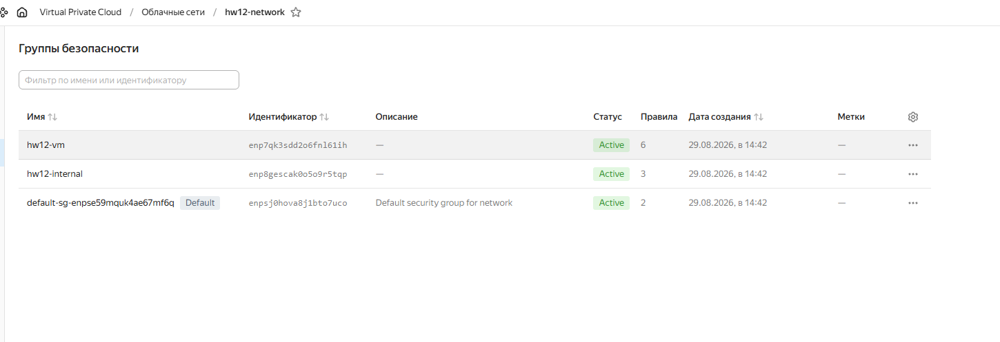
---

## 3. Этапы выполнения

### 3.1. Подготовка данных в PostgreSQL

#### 3.1.1. Генерация данных

```sql
INSERT INTO chicago_taxi
SELECT
  1 + n % 100000,
  '2015-01-01 00:00:00'::timestamp + (n % 31536000) * interval '1 second',
  ...
FROM generate_series(1, 40000000) n;
```

**Результат:**
- Строк: 40 000 000
- Размер таблицы: 8384 MB (~8.4 ГБ)
- Время генерации: **669 секунд** (~11 мин)

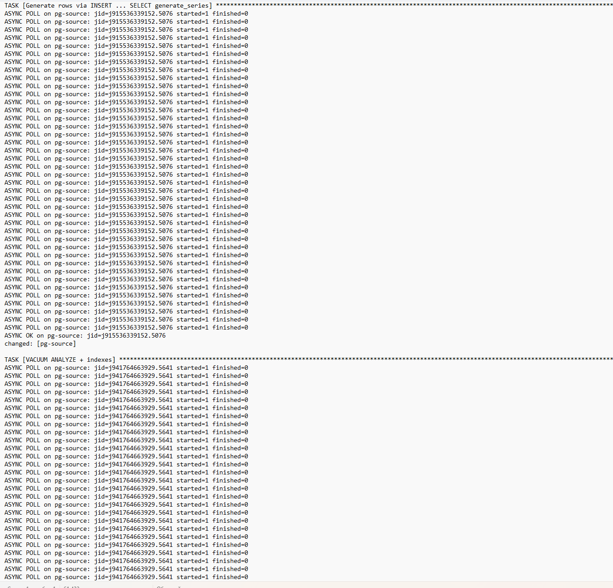

#### 3.1.2. Создание индексов

```sql
VACUUM ANALYZE chicago_taxi;
CREATE INDEX idx_taxi_id ON chicago_taxi(taxi_id);
CREATE INDEX idx_dates ON chicago_taxi(trip_start_timestamp, trip_end_timestamp);
```

**Время:** **871 секунда** (~14.5 мин)

#### 3.1.3. Экспорт в CSV

```sql
COPY chicago_taxi TO '/var/bench/data/chicago_taxi_migrate.csv' WITH (FORMAT csv);
```

**Результат:**
- Размер CSV: 6.2 ГБ
- Время экспорта: **434 секунды** (~7 мин)

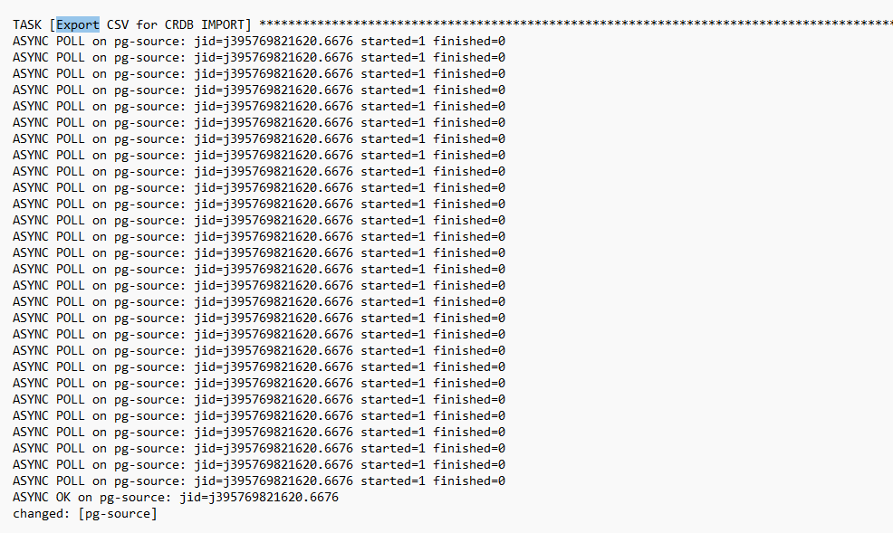

### 3.2. Развёртывание CockroachDB

#### 3.2.1. Установка на 3 ноды

```bash
# Upload tarball
ansible crdb -m copy -a "src=cockroach-v26.2.0.linux-amd64.tgz dest=/tmp/"

# Unpack and symlink
tar -xzf /tmp/cockroach.tgz -C /opt
ln -s /opt/cockroach/cockroach /usr/local/bin/cockroach

# Verify version
cockroach version
# Build Tag: v26.2.0
```

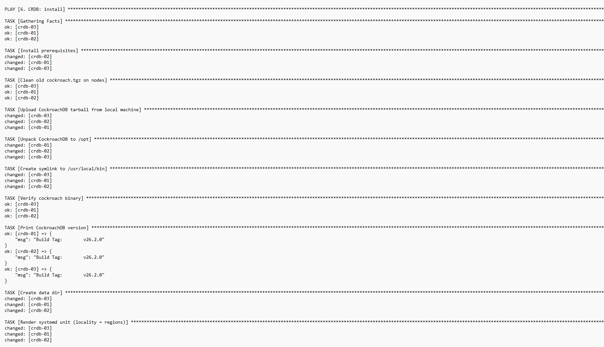

#### 3.2.2. Инициализация кластера

```bash
cockroach init --insecure --host=10.1.0.25:26257
# Cluster successfully initialized
```

**Статус после init:**

```
id  address          locality        is_available  is_live
1   10.1.0.25:26257  region=us-east      true        true
2   10.1.1.34:26257  region=us-central   true        true
3   10.1.2.27:26257  region=eu-moscow    true        true
```

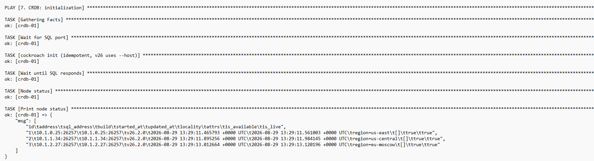

### 3.3. Миграция данных

#### 3.3.1. IMPORT из PostgreSQL

```sql
IMPORT INTO chicago_taxi
CSV DATA ('http://10.1.0.27:8000/chicago_taxi_migrate.csv')
WITH nullif = '';
```

**Результат:**

| Метрика | Значение |
|---|---|
| Время IMPORT | **608 секунд** (~10 мин) |
| Строк импортировано | 40 000 000 |
| Байт | 5 736 889 104 (~5.3 ГБ) |

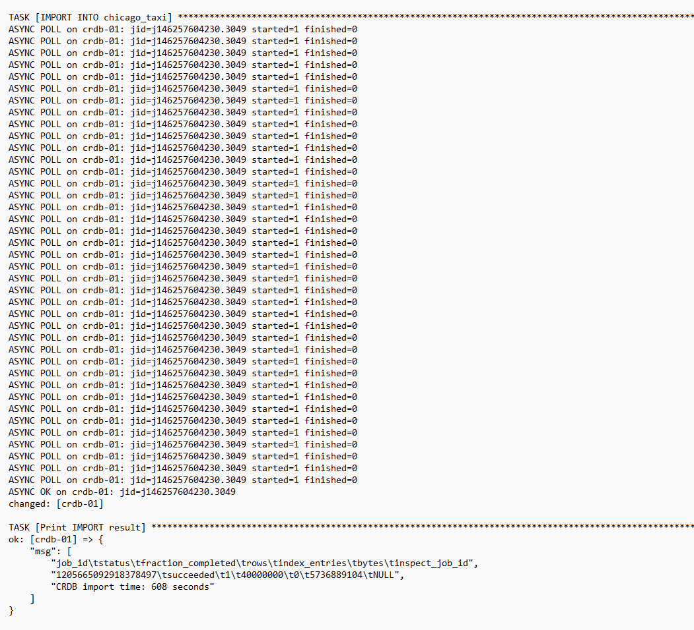

#### 3.3.2. Создание индексов

```sql
CREATE INDEX ON chicago_taxi (taxi_id);
CREATE INDEX ON chicago_taxi (trip_start_timestamp, trip_end_timestamp);
```

**Время:** ~3 минуты

### 3.4. Бенчмарк (3 запроса)

#### Запрос 1: Случайная строка

```sql
SELECT taxi_id FROM chicago_taxi ORDER BY random() LIMIT 1;
```

**PostgreSQL:**
```text
Timing is on.
 taxi_id
---------
   70297
(1 row)

Time: 5803.389 ms (00:05.803)
```

**CockroachDB:**
```text
taxi_id
73801
```
Время: **8.864 s**

- [crdb_q1.txt](image/crdb_q1.txt)
- [pg_q1.txt](image/pg_q1.txt)

#### Запрос 2: Диапазон дат (неделя)

```sql
SELECT taxi_id, trip_start_timestamp, trip_end_timestamp
FROM chicago_taxi
WHERE trip_start_timestamp BETWEEN date '2015-02-01' AND date '2015-02-07';
```

**CockroachDB:** время **8.338 s**

#### Запрос 3: COUNT(*)

```sql
SELECT count(*) FROM chicago_taxi;
```

**PostgreSQL:**
```text
Timing is on.
  count
----------
 40000000
(1 row)

Time: 1630.880 ms (00:01.631)
```

**CockroachDB:**
```text
count
40000000
```
Время: **5.551 s**

- [crdb_q3.txt](image/crdb_q3.txt)
- [pg_q3.txt](image/pg_q3.txt)


#### Итоговая таблица бенчмарка

| Запрос | PostgreSQL | CockroachDB | Разница |
|---|---|---|---|
| Q1 (random) | 5.803 s | 8.864 s | CRDB медленнее на 53% |
| Q2 (range) | — | 8.338 s | — |
| Q3 (count) | 1.631 s | 5.551 s | CRDB медленнее на 240% |

> **Примечание:** CockroachDB медленнее на single-node запросах из-за overhead распределённого консенсуса (Raft). Однако он обеспечивает горизонтальную масштабируемость и отказоустойчивость, чего нет у одиночного PostgreSQL.

---

## 4. Доказательства мульти-мастера

### 4.1. Географическое распределение

```sql
SET allow_unsafe_internals = true;
SELECT node_id, locality FROM crdb_internal.gossip_nodes ORDER BY node_id;
```

**Результат:**
```text
node_id  locality
1        region=us-east
2        region=us-central
3        region=eu-moscow
```

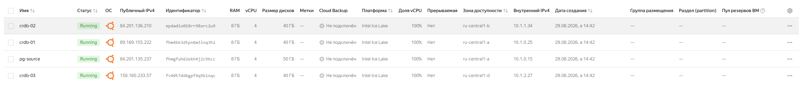

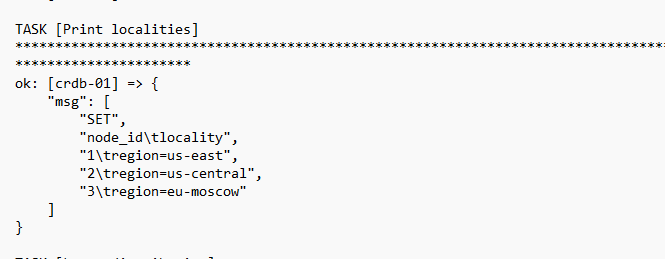

### 4.2. Распределение данных (leaseholder'ы)

```sql
SET allow_unsafe_internals = true;
SELECT lease_holder, count(*) AS ranges
FROM crdb_internal.ranges GROUP BY lease_holder ORDER BY lease_holder;
```

**Результат:**
```text
lease_holder  ranges
1             37
2             25
3             27
```

Данные равномерно распределены по всем трём нодам (~30% на каждую).

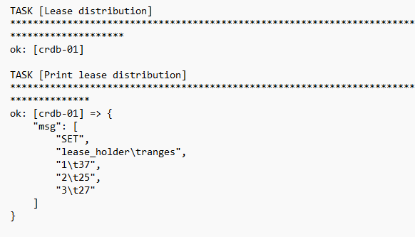


### 4.3. Strong consistency

**Запись на node1:**
```sql
UPSERT INTO consistency_test(id, val) VALUES (1, 'multi-master-ok');
```

**Чтение со всех трёх нод:**
```text
crdb-01: 1  multi-master-ok
crdb-02: 1  multi-master-ok
crdb-03: 1  multi-master-ok
```

✅ Запись мгновенно видна на всех нодах — **strong consistency** работает.

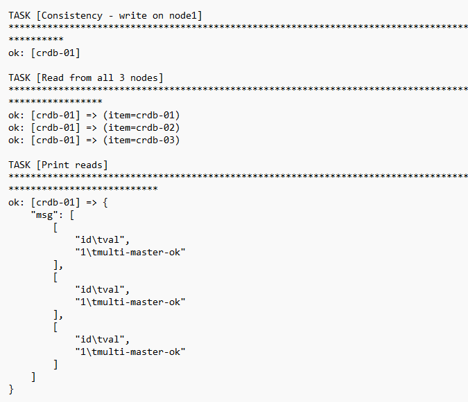
<!-- Вставь скриншот с чтением со всех 3 нод -->

### 4.4. Единая точка входа (NLB)

```sql
-- через NLB IP 51.250.45.80:26257
SELECT count(*) FROM chicago_taxi;
-- результат: 40000000
```

Клиенту не нужно знать о трёх нодах — балансировщик распределяет трафик.

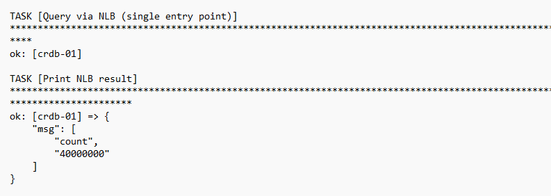

---

## 5. Тест отказоустойчивости (Failover)

### 5.1. Сценарий

1. Запись `BEFORE-outage` на работающем кластере (3/3)
2. Остановка crdb-02 (`systemctl stop cockroach`)
3. Пауза 15 сек для детекции отказа
4. Запросы во время отказа (2/3 ноды live)
5. Запись `DURING-outage`
6. Возврат crdb-02 (`systemctl start cockroach`)
7. Ожидание восстановления (3/3 live)

### 5.2. Результаты

#### 5.2.1. Во время отказа

```text
id  address          locality        is_available  is_live
1   10.1.0.25:26257  region=us-east      true        true
2   10.1.1.34:26257  region=us-central   false       false    <-- убита
3   10.1.2.27:26257  region=eu-moscow    true        true
```

✅ Кластер остался живым с 2 из 3 нод (кворум Raft = 2).

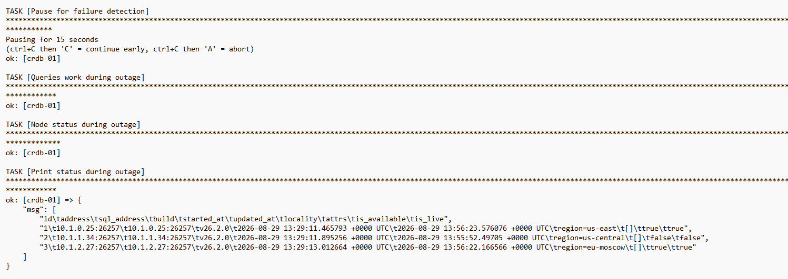

#### 5.2.2. Записи

```text
id  written_by     ts
1   BEFORE-outage  2026-08-29 13:55:45
2   DURING-outage  2026-08-29 13:56:23   ← записано во время отказа!
```

✅ Запись прошла даже когда одна нода была мертва.

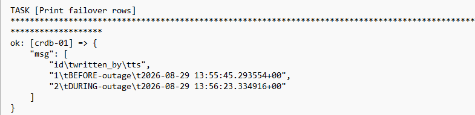

#### 5.2.3. После восстановления

```text
id  address          locality        is_available  is_live
1   10.1.0.25:26257  region=us-east      true        true
2   10.1.1.34:26257  region=us-central   true        true    <-- вернулась
3   10.1.2.27:26257  region=eu-moscow    true        true
```

✅ Все 3 ноды снова live. Данные не потеряны.

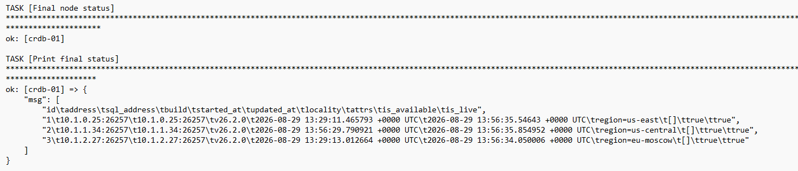


---

## 6. Выводы

### 6.1. Что доказано

| Критерий | Результат |
|---|---|
| Мульти-мастер кластер развёрнут | ✅ 3 ноды v26.2.0 в разных зонах |
| Географическое распределение | ✅ us-east, us-central, eu-moscow |
| Равномерное распределение данных | ✅ 37/25/27 ranges |
| Strong consistency | ✅ запись видна на всех нодах |
| Единая точка входа (NLB) | ✅ 40M строк через балансировщик |
| Отказоустойчивость | ✅ кластер жив при потере 1 из 3 нод |
| Записи во время отказа | ✅ DURING-outage row сохранена |
| Автоматическое восстановление | ✅ нода вернулась, кластер снова 3/3 |
| Объём данных | ✅ 40 000 000 строк (~8.4 ГБ PG, ~5.3 ГБ CRDB) |

### 6.2. Сравнение PostgreSQL vs CockroachDB

| Характеристика | PostgreSQL | CockroachDB |
|---|---|---|
| Архитектура | Single-node | Multi-master distributed |
| Масштабируемость | Вертикальная | Горизонтальная |
| Отказоустойчивость | Требует репликации | Встроенная (Raft) |
| Консистентность | Strong (single-node) | Strong (distributed) |
| Производительность (single query) | Быстрее | Медленнее (overhead консенсуса) |
| Производительность (high load) | Ограничена одной нодой | Линейно масштабируется |
| Географическое распределение | Нет | Встроенное (locality) |
| SQL совместимость | Native PostgreSQL | PostgreSQL-compatible |

### 6.3. Когда использовать CockroachDB

- ✅ Нужна географическая распределённость
- ✅ Требуется высокая доступность без ручной настройки репликации
- ✅ Данные растут горизонтально (шардирование)
- ✅ Нужен strong consistency в распределённой системе
- ❌ Не нужен, если достаточно single-node PostgreSQL и нет требований к HA

---

## 7. Использованные технологии

- **Yandex Cloud**: Compute, VPC, Network Load Balancer
- **Terraform**: инфраструктура как код
- **Ansible**: конфигурация и автоматизация
- **PostgreSQL 18**: источник данных
- **CockroachDB v26.2.0**: мульти-мастер кластер
- **Ubuntu 22.04 LTS**: ОС нод

---

## 8. Файлы результатов

- [pg_q1.txt](image/pg_q1.txt)
- [pg_q2.txt](image/pg_q2.txt)
- [pg_q3.txt](image/pg_q3.txt)
- [pg_insert_time.txt](image/pg_insert_time.txt)
- [pg_index_time.txt](image/pg_index_time.txt)
- [pg_export_time.txt](pg_export_time.txt)
- [crdb_q1.txt](image/crdb_q1.txt)
- [crdb_q2.txt](image/crdb_q2.txt)
- [crdb_q3.txt](image/crdb_q3.txt)
- [crdb_times.txt](image/crdb_times.txt)

---

## 9. Команды для воспроизведения

```bash
# 1. Создать инфраструктуру
cd /mnt/c/Terraform
terraform apply -auto-approve

# 2. Обновить inventory
terraform output -raw ansible_inventory > ~/crdb/inventory.ini

# 3. Проверить доступ
ansible all -m ping

# 4. Запустить полный цикл
cd ~/crdb
ansible-playbook site.yml

# 5. Посмотреть результаты
ls -lh results/
tar -xzf results/pg-source.tar.gz -C pg_results/
tar -xzf results/crdb-01.tar.gz -C crdb_results/
cat pg_results/pg_q*.txt
cat crdb_results/crdb_times.txt
```

---

## 10. Приложение: Скриншоты

### 10.1. Terraform apply

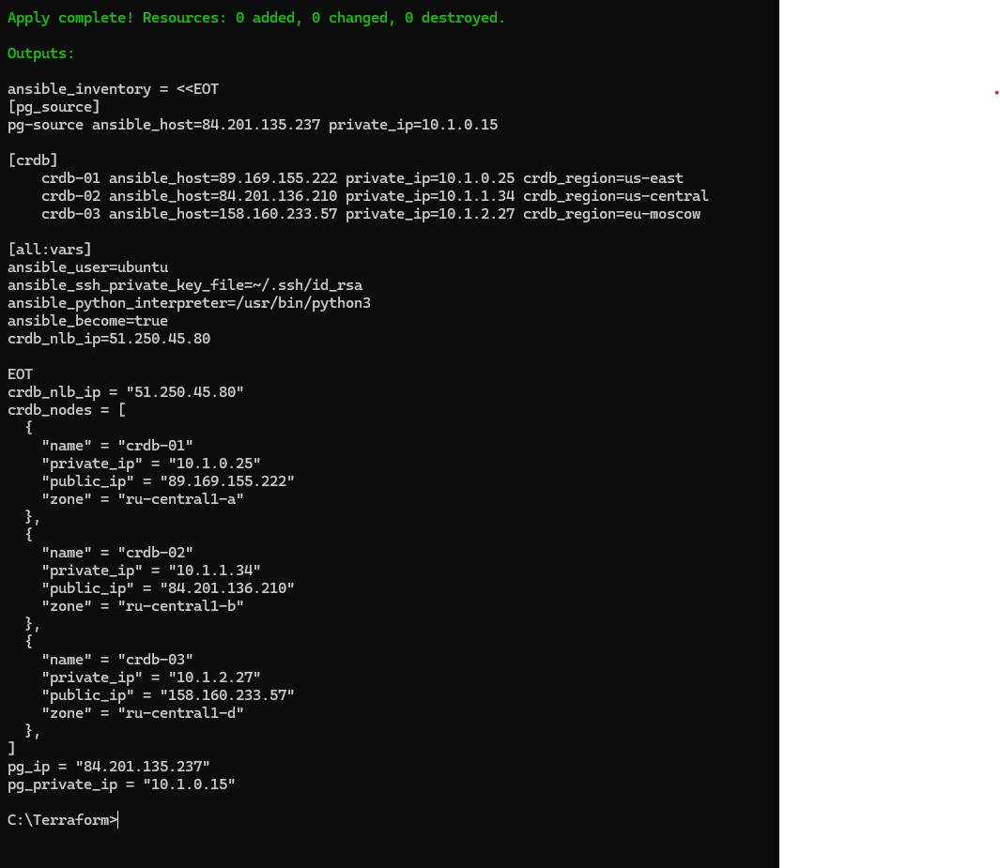


### 10.2. Ansible playbook run (log)

[Ansible playbook log](image/ansible.log)


### 10.3. CockroachDB Admin UI

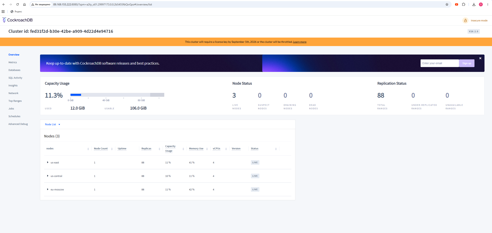

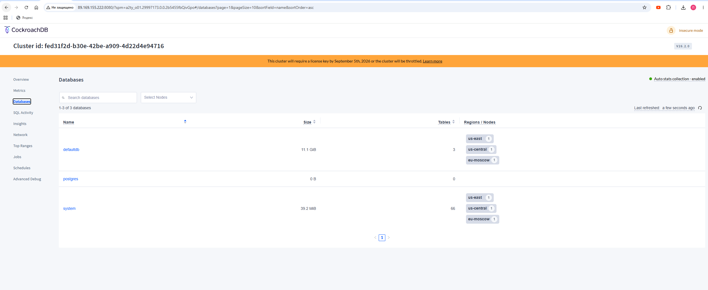

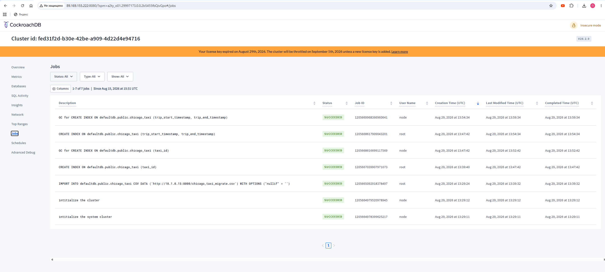

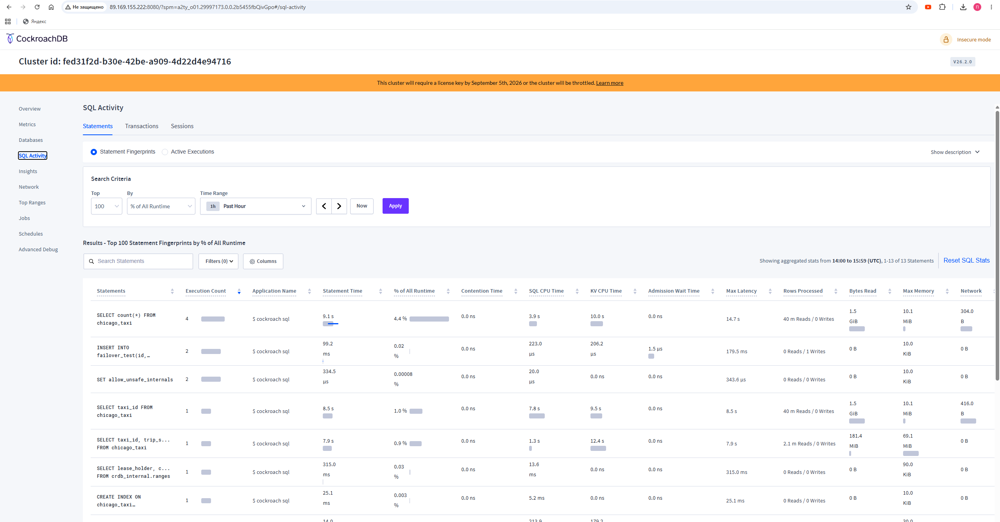

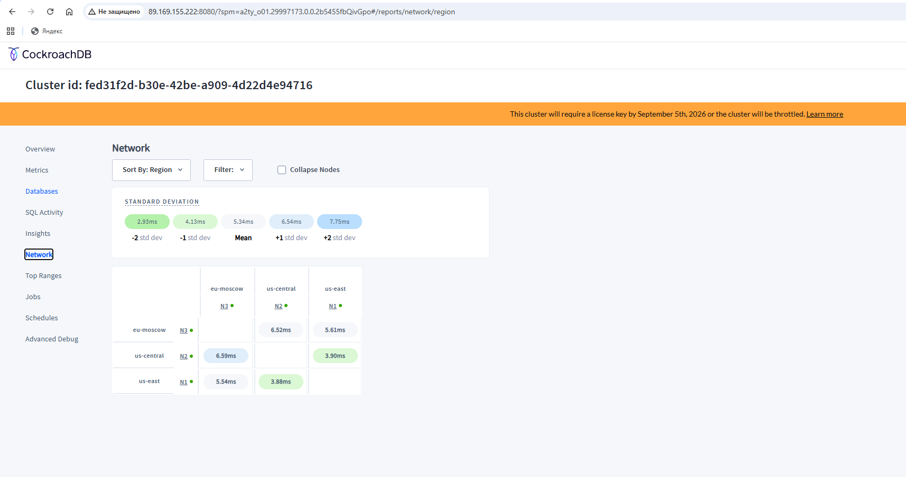


### 10.4. Yandex Cloud Console

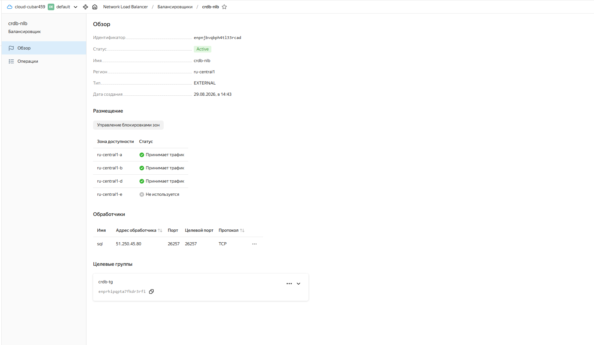
