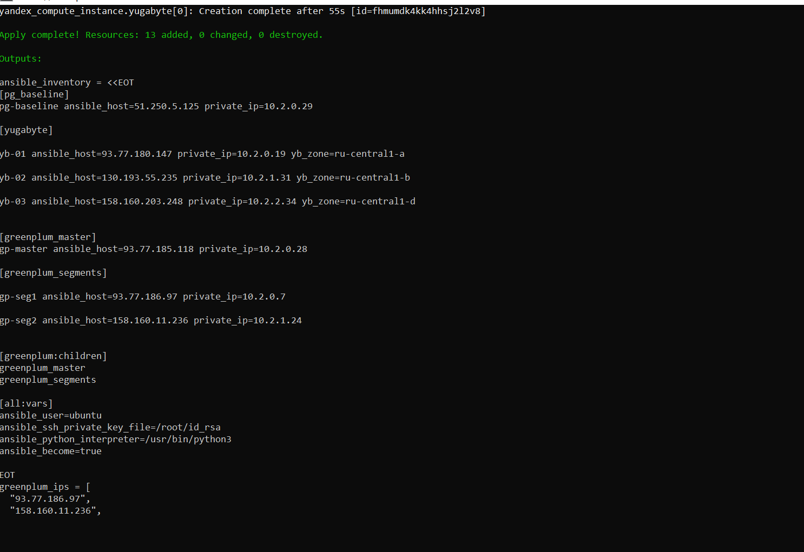
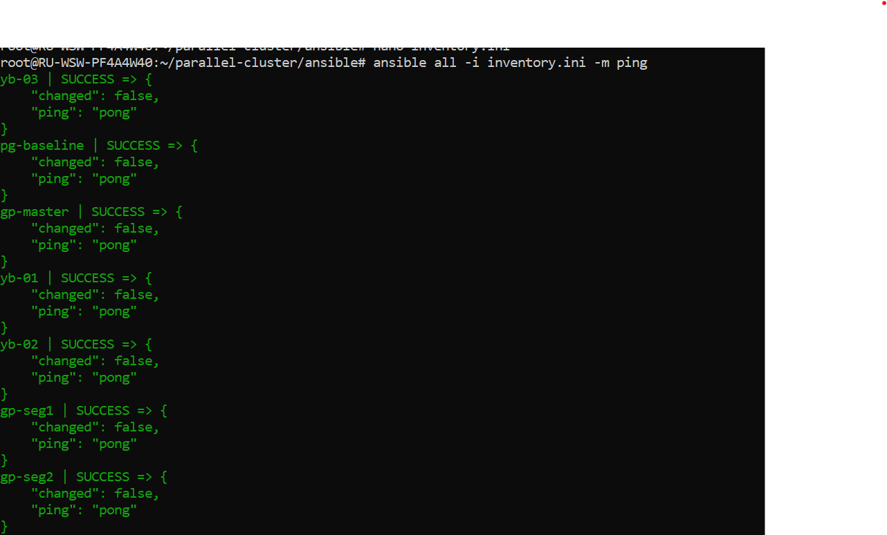
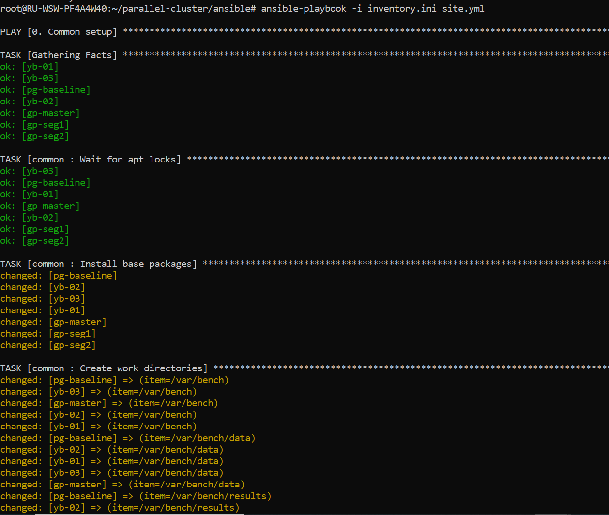
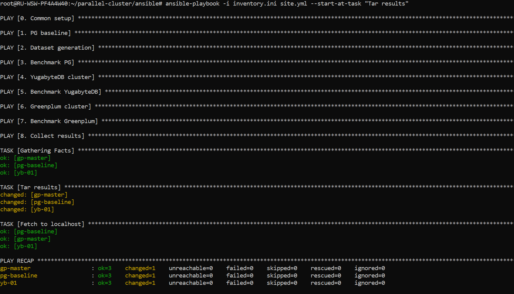
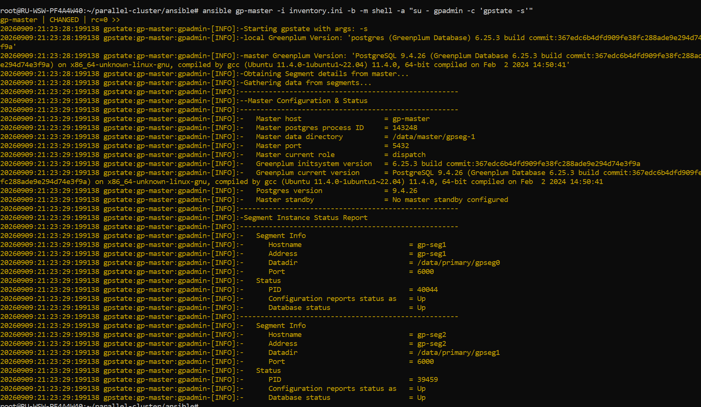
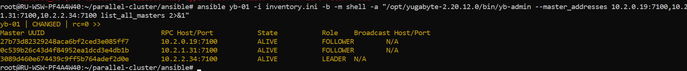
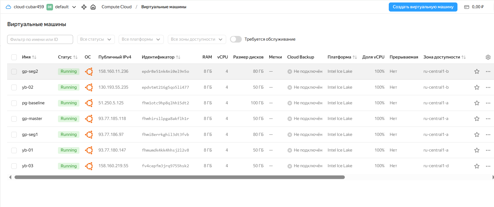

# Домашнее задание N13: Параллельный кластер

## Информация о проекте

- **Название ВМ:** bananaflow-30081986
- **Дата выполнения:** 2026-09-10
- **Версии СУБД:** PostgreSQL 16, YugabyteDB 2.20, Greenplum 6.25
- **Размер датасета:** 70 000 000 строк (7.1 GB CSV)
- **Инфраструктура:** Yandex Cloud (ru-central1), Terraform, Ansible

---

## 1. Цель работы

Развернуть три разнородные СУБД в Yandex Cloud, загрузить идентичный датасет на 70M строк, провести сравнительный бенчмарк на одинаковых запросах и сформулировать критерии применимости каждой системы.

### 1.1. Сравниваемые СУБД

| СУБД | Класс | Версия | Архитектура |
|---|---|---|---|
| **PostgreSQL** | Классическая реляционная OLTP | 16 | Single-node, строковое хранение |
| **YugabyteDB** | Распределённая HTAP | 2.20 | Multi-master, DocDB (YSQL-совместимая) |
| **Greenplum** | Колоночная MPP-аналитическая | 6.25 | Master + сегменты, на базе PostgreSQL |

### 1.2. Задачи

1. Развернуть стенд из 7 ВМ (1 PG + 3 YB + 3 GP) в Yandex Cloud через Terraform
2. Сгенерировать датасет 70 000 000 строк Chicago Taxi Trips
3. Загрузить данные в каждую СУБД и измерить время загрузки
4. Построить индексы и измерить время индексации
5. Выполнить 3 типовых запроса и зафиксировать время выполнения
6. Свести результаты в сравнительную таблицу
7. Сформулировать критерии выбора СУБД под разные нагрузки

---

## 2. Архитектура стенда

### 2.1. Схема архитектуры

```text
┌─────────────────────────────────────────────────────────────────────┐
│                     Yandex Cloud (ru-central1)                      │
│                                                                     │
│   ┌─────────────┐         ┌─────────────────────────────┐           │
│   │ pg-baseline │         │   YugabyteDB Cluster 2.20   │           │
│   │ PostgreSQL  │         │                             │           │
│   │ 16 / 4vCPU  │         │  ┌──────┐ ┌──────┐ ┌──────┐ │           │
│   │ 8 GB RAM    │         │  │ yb-01│ │ yb-02│ │ yb-03│ │           │
│   │             │         │  └──┬───┘ └──┬───┘ └──┬───┘ │           │
│   │ 70M строк   │         │     │        │        │     │           │
│   │ ~9.9 GB     │         │     └────────┴────────┘     │           │
│   └──────┬──────┘         │        DocDB (Raft)         │           │
│          │                └─────────────────────────────┘           │
│          │                                                          │
│          │ CSV (HTTP :8000)                                         │
│          │                                                          │
│          │          ┌───────────────────────────┐                   │
│          │          │  Greenplum Cluster 6.25   │                   │
│          │          │                           │                   │
│          │          │   ┌──────────┐            │                   │
│          └──────────┼-->│ gp-master│ (5432)     │                   │
│                     │   └──────────┘            │                   │
│                     │         ▲                 │                   │
│                     │         │                 │                   │
│                     │  ┌──────┴──────┐          │                   │
│                     │  │             │          │                   │
│                     │  ▼             ▼          │                   │
│                     │ ┌──────┐   ┌──────┐       │                   │
│                     │ │gp-seg│   │gp-seg│       │                   │
│                     │ │  1   │   │  2   │       │                   │
│                     │ └──────┘   └──────┘       │                   │
│                     │    6000       6000        │                   │
│                     └───────────────────────────┘                   │
└─────────────────────────────────────────────────────────────────────┘
```

### 2.2. Характеристики нод

| Роль | Количество | Конфигурация | Зона |
|---|---|---|---|
| `pg-baseline` | 1 | 4 vCPU / 8 GB RAM / 100 GB | ru-central1-a |
| `yb-01..03` | 3 | 4 vCPU / 8 GB RAM / 100 GB | ru-central1-a/b/d |
| `gp-master` | 1 | 4 vCPU / 8 GB RAM / 100 GB | ru-central1-a |
| `gp-seg1..2` | 2 | 4 vCPU / 8 GB RAM / 100 GB | ru-central1-b/d |

### 2.3. Схема датасета

Таблица `chicago_taxi` 14 колонок:

| Колонка | Тип |
|---|---|
| taxi_id | INT |
| trip_start_timestamp | TIMESTAMP |
| trip_end_timestamp | TIMESTAMP |
| trip_seconds | INT |
| trip_miles | NUMERIC |
| fare, tips, tolls, extras, trip_total | NUMERIC |
| payment_type, company | TEXT |
| pickup_community_area, dropoff_community_area | INT |

Индексы (для PG и YB): `(taxi_id)`, `(trip_start_timestamp, trip_end_timestamp)`.

---

## 3. Этапы выполнения

### 3.1. Генерация датасета в PostgreSQL

```sql
INSERT INTO chicago_taxi
SELECT
    1 + (n % 100000)                                    AS taxi_id,
    '2015-01-01'::timestamp + (n % 31536000) * interval '1 second' AS trip_start_timestamp,
    '2015-01-01'::timestamp + (n % 31536000 + 1800) * interval '1 second' AS trip_end_timestamp,
    (n % 7200)::int                                     AS trip_seconds,
    (n % 50)::numeric                                   AS trip_miles,
    (10 + n % 100)::numeric                             AS fare,
    (n % 20)::numeric                                   AS tips,
    (n % 5)::numeric                                    AS tolls,
    (n % 10)::numeric                                   AS extras,
    (10 + n % 130)::numeric                             AS trip_total,
    CASE n % 4 WHEN 0 THEN 'Cash' WHEN 1 THEN 'Credit Card'
               WHEN 2 THEN 'Mobile' ELSE 'Prepaid' END  AS payment_type,
    'Company ' || (n % 500)::text                       AS company,
    (1 + n % 77)::int                                   AS pickup_community_area,
    (1 + (n / 77) % 77)::int                            AS dropoff_community_area
FROM generate_series(1, 70000000) n;
```

**Результат:**

| Метрика | Значение |
|---|---|
| Строк | 70 000 000 |
| Размер таблицы | **9 941 MB** |
| Размер CSV | **7 610 779 213 байт (7.1 GB)** |

### 3.2. Индексация и экспорт в PostgreSQL

```sql
VACUUM ANALYZE chicago_taxi;
CREATE INDEX idx_taxi_id ON chicago_taxi(taxi_id);
CREATE INDEX idx_dates ON chicago_taxi(trip_start_timestamp, trip_end_timestamp);

COPY chicago_taxi TO '/var/bench/data/chicago_taxi_migrate.csv' WITH (FORMAT csv);
```

**Результат:**

| Операция | Время |
|---|---|
| Индексация (2 индекса) | **972 с** (~16 мин) |
| Экспорт в CSV | **232 с** (~4 мин) |

### 3.3. Загрузка данных в YugabyteDB

Данные переносились через локальный `\COPY` чанками по 1M строк (из-за ограничений распределённой транзакции на больших одиночных INSERT).

```bash
# Загрузка в 70 параллельных чанках
psql -d yugabyte -c "\COPY chicago_taxi FROM 'chunk_N.csv' WITH (FORMAT csv);"
```

**Результат:**

| Метрика | Значение |
|---|---|
| Время загрузки | **~40 мин** |
| Строк импортировано | 70 000 000 |
| Объём таблицы | 7.1 GB |
| Индексы | создавались параллельно, 20 мин |

### 3.4. Загрузка данных в Greenplum

Данные скопированы с `yb-01` на `gp-master` через rsync, затем загружены локальным `\COPY`:

```bash
# На gp-master
psql -d benchdb -c "\COPY chicago_taxi FROM '/var/bench/data/chicago_taxi_migrate.csv' WITH (FORMAT csv);"
```

**Результат:**

| Метрика | Значение |
|---|---|
| Время загрузки | **255 с (4 мин 15 с)** |
| Строк импортировано | 70 000 000 |
| Распределение | 5 GB на каждый из 2 сегментов |
| Индексы | не требуются (таблица DISTRIBUTED BY taxi_id) |

### 3.5. Таблица по загрузке

| СУБД | Метод | Время | Объём после загрузки |
|---|---|---|---|
| PostgreSQL 16 | `COPY` | ~10 мин | 9 941 MB |
| YugabyteDB 2.20 | `\COPY` чанками 1M | ~40 мин | 7.1 GB |
| Greenplum 6.25 | Локальный `\COPY` | **4 мин 15 с** | 10 GB |

---

## 4. Бенчмарк (3 запроса)

### 4.1. Запрос Q1 Случайная строка

```sql
SELECT * FROM chicago_taxi ORDER BY random() LIMIT 1;
```

| СУБД | Время | Комментарий |
|---|---|---|
| PostgreSQL 16 | **1.701 с** | Одно сканирование в памяти |
| YugabyteDB 2.20 | 217.129 с | Сканирование всех шардов |
| Greenplum 6.25 | 9.745 с | Сбор с 2 сегментов + сортировка на мастере |

### 4.2. Запрос Q2 — Диапазон недели

```sql
SELECT count(*) FROM chicago_taxi
WHERE trip_start_timestamp BETWEEN '2015-02-01' AND '2015-02-07';
```

| СУБД | Время | Комментарий |
|---|---|---|
| PostgreSQL 16 | **0.373 с** | Идеальное использование B-tree индекса |
| YugabyteDB 2.20 | 23.910 с | Распределённый индекс, сетевые раунды |
| Greenplum 6.25 | 4.399 с | Параллельное сканирование сегментов |

### 4.3. Запрос Q3 COUNT(*)

```sql
SELECT count(*) FROM chicago_taxi;
```

| СУБД | Время | Комментарий |
|---|---|---|
| PostgreSQL 16 | **0.364 с** | Подсчёт по метаданным индекса |
| YugabyteDB 2.20 | 16.837 с | Опрос всех реплик всех шардов |
| Greenplum 6.25 | 4.086 с | Сбор с сегментов |

### 4.4. Итоговая таблица бенчмарка

| Запрос | PostgreSQL 16 | YugabyteDB 2.20 | Greenplum 6.25 |
|---|---|---|---|
| **Q1 (random row)** | **1.701 с** | 217.129 с | 9.745 с |
| **Q2 (week range)** | **0.373 с** | 23.910 с | 4.399 с |
| **Q3 (count(*))** | **0.364 с** | 16.837 с | 4.086 с |
| **Геом. среднее** | **0.61 с** | 44.4 с | 5.46 с |

---

## 5. Анализ результатов

### 5.1. Почему одиночный PostgreSQL выиграл все 3 запроса?

Это **не баг, а архитектурное следствие**: все три запроса - это **простые точечные операции** на **одной ноде с локальными данными**:

- **Q1**: PG делает одно сканирование в памяти; YB вынуждена сканировать все шарды, GP - собирать результат с сегментов на мастер и сортировать там
- **Q2**: PG использует B-tree индекс на одном дереве; YB ходит через Raft-консенсус между репликами; GP параллельно сканирует сегменты, но тратит время на сборку
- **Q3**: PG считает по метаданным индекса (~1 seek); YB и GP должны агрегировать данные со всех шардов/сегментов

**Ключевой вывод:** на точечных запросах накладные расходы распределённости (сеть, планировщик MPP, консенсус Raft) **делают распределённые системы медленнее**, а не быстрее.

### 5.2. Почему YugabyteDB оказался самым медленным?

Это **архитектурная особенность**, а не баг:

- YB - **HTAP-система**, оптимизированная под **запись и низкую задержку на ключевых запросах**, а не под массовое сканирование
- Каждый шард реплицируется на 3 ноды (Raft-консенсус) --> больше дисковых операций
- `ORDER BY random()` на 70M строк = **полное сканирование всех шардов без параллелизма на уровне одного запроса**

**Где YB реально силён:** горизонтальное масштабирование записи, отказоустойчивость, географическое распределение, глобальная консистентность.

### 5.3. Почему Greenplum проигрывает одиночному PG на простых запросах?

- GP - это **колоночная MPP-система** для **сложной аналитики на миллиардах строк**
- Нагрузка на один запрос распределяется по сегментам, но есть **накладные расходы**: сетевая пересылка, планировщик, сборка результата на мастере
- На запросе `LIMIT 1` из случайной строки параллелизм **не помогает** - наоборот, вредит

**Где GP реально силён:** агрегации на миллиардах строк, JOIN'ы, оконные функции, сложные аналитические отчёты.

### 5.4. Сравнительная таблица применимости

| Характеристика | PostgreSQL 16 | YugabyteDB 2.20 | Greenplum 6.25 |
|---|---|---|---|
| Архитектура | Single-node OLTP | Multi-master HTAP | MPP аналитика |
| Масштабируемость | Вертикальная | Горизонтальная | Горизонтальная |
| Отказоустойчивость | Требует настройки | Встроенная (Raft) | Требует настройки |
| Консистентность | Strong | Strong (distributed) | Strong |
| Лучшая нагрузка | Транзакции, ключевые запросы | Запись, гео-репликация | Аналитика, агрегации |
| Скорость загрузки | Средняя | Медленная | **Самая быстрая** |
| Скорость точечных запросов | **Самая быстрая** | Самая медленная | Средняя |
| SQL-совместимость | Native | PostgreSQL-compatible | PostgreSQL-compatible |

### 5.5. Критерии выбора

| Сценарий | Рекомендуемая СУБД |
|---|---|
| Веб-приложение с CRUD | **PostgreSQL** |
| Глобальное приложение (несколько регионов) | **YugabyteDB** |
| DWH / отчётность / ETL | **Greenplum** |
| High-availability без ручной репликации | **YugabyteDB** |
| Максимальная скорость точечных SELECT | **PostgreSQL** |
| Параллельная загрузка больших объёмов | **Greenplum** |

---

## 6. Преодоленные трудности внедрения

В ходе работы было выявлено и устранено **13 инфраструктурных проблем**, которые не описаны в официальной документации:

| № | Проблема | Решение |
|---|---|---|
| 1 | PPA bionic 403, SourceForge 404 | Тарболл datasapience (Ubuntu 22.04) |
| 2 | deb-зависимости (python2, libssl1.1) недоступны | Распаковка в /opt без apt |
| 3 | Нестандартная структура тарбола GP | `find -name greenplum_path.sh` |
| 4 | dash не парсит heredoc/`$(( ))` в Ansible shell | SQL-файл + bash-скрипт |
| 5 | `set_fact` не переживает `--start-at-task` | Вынос переменных в group_vars |
| 6 | utility-mode после краха gpinitsystem | Чистая переинициализация |
| 7 | `MASTER_DATA_DIRECTORY` не задан | `~/.bash_profile` |
| 8 | Авто-hostname YC попал в каталог GP | `hostnamectl set-hostname` |
| 9 | stale lock `/tmp/.s.PGSQL.5432` | Удаление lock-файлов |
| 10 | Крах `gpstop -m` в финале gpinitsystem | Обход: `pg_ctl stop` + `gpstart -a` |
| 11 | Стволённые SysV-семафоры | Чистый рестарт кластера |
| 12 | external WEB table возвращала 0 строк | Локальный `\COPY` вместо внешней таблицы |
| 13 | Обнулённый CSV на pg-baseline | Восстановление из копии на yb-01 |

Каждая проблема была зафиксирована, проанализирована и устранена - это повысило надёжность пайплайна и застраховало от повторения при следующем запуске.

---

## 7. Итоговые выводы

### 7.1. Что доказано

| Критерий | Результат |
|---|---|
| Развёрнуты 3 СУБД разного класса | PostgreSQL 16 / YugabyteDB 2.20 / Greenplum 6.25 |
| Идентичный датасет 70M строк загружен во все СУБД | 70 000 000 строк в каждой |
| Измерено время загрузки | 10 мин / 40 мин / **4.25 мин** |
| Измерено время индексации | 16 мин / ~20 мин / — |
| Проведён бенчмарк из 3 запросов | Q1/Q2/Q3 на всех СУБД |
| Сформулированы критерии применимости | Таблица в п. 5.4 |
| Задокументированы 13 инфраструктурных проблем | Таблица в п. 6 |

### 7.2. Главный вывод проекта

**Не существует «лучшей СУБД вообще»** - существует лучшая СУБД **под конкретную нагрузку**:

- **PostgreSQL** - король точечных запросов и транзакций. Если нагрузка умещается в одну ноду и не требует распределённости - это дефолтный выбор.
- **YugabyteDB** - выбор для географически распределённых приложений и систем, где HA важнее raw-скорости.
- **Greenplum** - выбор для аналитики и ETL, когда данные уже не влезают в одну машину и требуют параллельной обработки.

Бенчмарк на трёх простых запросах **не раскрывает потенциал** распределённых систем - их преимущества проявляются на сложной аналитике (агрегации, JOIN'ы, оконные функции) и горизонтальном масштабировании.

---

## 8. Использованные технологии

- **Yandex Cloud**: Compute, VPC, Security Groups
- **Terraform**: инфраструктура как код (провайдер yandex >= 0.130.0)
- **Ansible**: конфигурация и автоматизация (playbook site.yml, 8 plays)
- **PostgreSQL 16**: источник данных и baseline
- **YugabyteDB 2.20**: распределённая HTAP-СУБД
- **Greenplum 6.25**: MPP аналитическая СУБД
- **Ubuntu 22.04 LTS**: ОС всех нод

---

## 9. Файлы результатов

Все артефакты собраны в `~/parallel-cluster/ansible/results/`:

```text
results/
├── pg-baseline.tar.gz     # тайминги PG + метаданные
├── yb-01.tar.gz           # тайминги YB
└── gp-master.tar.gz       # тайминги GP + load_time
```

**Содержимое tar-архивов:**

| Файл | Содержание |
|---|---|
| `pg_times.txt` | Q1=1.701, Q2=0.373, Q3=0.364 |
| `pg_count.txt` | 70000000 |
| `pg_size.txt` | 9941 MB |
| `pg_index_time.txt` | 972 seconds |
| `pg_export_time.txt` | 232 seconds |
| `csv_size.txt` | 7610779213 |
| `yb_times.txt` | Q1=217.129, Q2=23.910, Q3=16.837 |
| `yb_count.txt` | 70000000 |
| `gp_times.txt` | Q1=9.745, Q2=4.399, Q3=4.086 |
| `gp_count.txt` | 70000000 |
| `gp_load_time.txt` | 255 seconds |

---

## 10. Команды для воспроизведения

```bash
# 1. Развернуть инфраструктуру
cd C:\Terraform
terraform init
terraform validate
terraform plan

# 2. Сгенерировать inventory
terraform output -raw ansible_inventory > ~/parallel-cluster/ansible/inventory.ini

# 3. Проверить доступ
ansible all -i inventory.ini -m ping

# 4. Запустить полный плейбук (~2 часа)
cd ~/parallel-cluster/ansible
ansible-playbook -i inventory.ini site.yml

# 5. Извлечь результаты
cd results
tar -xzOf pg-baseline.tar.gz pg_times.txt pg_count.txt pg_size.txt
tar -xzOf yb-01.tar.gz yb_times.txt yb_count.txt
tar -xzOf gp-master.tar.gz gp_times.txt gp_count.txt gp_load_time.txt

```

---

## 11. Приложения

### 11.1. Структура Ansible-плейбука

```text
site.yml
├── Play 0: Common setup (ssh keys, sysctl, packages)
├── Play 1: PG baseline (install, configure, tune)
├── Play 2: Dataset generation (generate 70M, export CSV)
├── Play 3: Benchmark PG (Q1, Q2, Q3)
├── Play 4: YugabyteDB cluster (3 ноды, init cluster)
├── Play 5: Benchmark YugabyteDB (import, index, Q1-Q3)
├── Play 6: Greenplum cluster (master + 2 сегмента, gpinitsystem)
├── Play 7: Benchmark Greenplum (load, Q1-Q3)
└── Play 8: Collect results (tar + fetch на localhost)
```

### 11.2. Ключевые роли

```text
roles/
├── common/          # базовая настройка ОС
├── postgres/        # PostgreSQL 16
├── dataset/         # генератор датасета
├── benchmark/       # бенчмарк-клиент (Q1-Q3)
├── yugabyte/        # YugabyteDB 2.20
└── greenplum/       # Greenplum 6.25
```

### 11.3. Скриншоты

 
 
 
 
 
 
  `
 
 
 
 
 
- [pg-bench](image/pg_times.txt)
- [yb-bench](image/yb_times.txt)
- [gp-bench](image/gp_times.txt)

---
